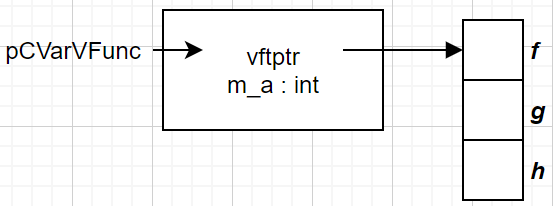

## 基础

#### 命名空间

命名空间的定义：

```c++
namespace space_name {
    //代码
}
```

命名空间的使用：

```c++
space_name::xxx;//调用"space_name"里的 xxx 函数或者变量
    
using namespace space_name//声明后面使用的 xxx 是 "space_name" 空间里的
xxx
```


#### explicit 修饰构造函数

关键字只能用于类内部的构造函数声明上。被修饰的构造函数的类，不能发生相应的隐式类型转换，只能以显示的方式进行类型转换。所以只用于修饰单参构造函数。因为无参构造函数和多参构造函数本身就是显示调用的。

```c++
#include<cstring>
#include<string>
#include<iostream>

class Explicit
{
    private:

    public:
        Explicit(int size)
        {
            std::cout << " the size is " << size << std::endl;
        }
        Explicit(const char* str)
        {
            std::string _str = str;
            std::cout << " the str is " << _str << std::endl;
        }

        Explicit(const Explicit& ins)
        {
            std::cout << " The Explicit is ins" << std::endl;
        }

        Explicit(int a,int b)
        {
            std::cout << " the a is " << a  << " the b is " << b << std::endl;
        }
};

int main()
{
    Explicit test0(15);
    Explicit test1 = 10;// 隐式调用Explicit(int size)

    Explicit test2("RIGHTRIGHT");
    Explicit test3 = "BUGBUGBUG";// 隐式调用Explicit(const char* str)

    Explicit test4(1, 10);
    Explicit test5 = test1;
}
```

上面示例中 `Explicit(int size)` 和 `Explicit(const char* str)` 前添加 `explicit` 修饰的话，下面的隐式调用便会报错；


"#"字符串预处理：直接把参数转为字符串，并且可以同前后字符串相连；

"##" 符号连接：把前后符号拼接起来，只是符号；（比如把前后符号同参数拼接为函数）

"#" 和 "##" 用到的地方都不能宏展开


预编译阶段 #if 可以判断宏的大小


原子操作：所谓原子操作是指不会被[线程调度](https://baike.baidu.com/item/线程调度/10226112)机制打断的操作；这种操作一旦开始，就一直运行到结束，中间不会有任何 context switch。

原子操作可以是一个步骤，也可以是多个操作步骤，但是其顺序不可以被打乱，也不可以被切割而只执行其中的一部分。

将整个操作视作一个整体是原子性的核心特征。


const 修饰的全局变量可见范围限于当前文件，即使使用 extern 其他文件也看不到该变量，所以得放在头文件中。

用 const 定义常量，编译器会进行类型检查。不用 #define 

```c++
e.g. const int kMaxSize = 10;
```


inline 内联函数，会在编译阶段用函数体替换函数，类似宏展开。

inline 关键字要用在函数定义处，不需要声明。

```c++
e.g.
inline int Add (int a, int b)
{
    return a + b;
}
```

内联函数可以定义在头文件中（不用加 static 修饰），即使头文件被多次包含也不会引发重复定义的错误，因为编译时候就用函数体替换了。

发生函数调用时候，编译器先对实参进行计算，将结果传递给内联函数形参，函数执行完返回一个值，而不是一个表达式；


宏函数仅在预处理阶段进行文本替换，正确宏函数需要加以限制。

```c++
e.g. #define Add(a + b) ((a) + (b))
```


C++规定，默认参数只能放在形参列表的最后，而且一旦为某个形参指定了默认值，那么它后面的所有形参都必须有默认值。

编译器禁止函数定义和函数声明同时使用默认参数。由于函数声明是暴露在外，用户是可以看到，所以默认参数最好在函数声明中使用。

```c++
e.g.
#include <iostream>
int wula(int a, int b = 3);
int wula(int a, int b)
{
    return a * b + a - b;
}
int main()
{
    std::cout << wula(3) << std::endl;
    return 0;
}
```


函数重载规则：

- 函数名称必须相同。
- 参数列表必须不同（个数不同、类型不同、参数排列顺序不同等）。
- 函数的返回类型可以相同也可以不相同。
- 仅仅返回类型不同不足以成为函数的重载。

参数列表又叫参数签名，包括参数的类型、参数的个数和参数的顺序，只要有一个不同就叫做参数列表不同。

重载决议：

在编译时会根据参数列表对函数进行重命名，当发生函数调用时，编译器会根据传入的实参去逐个匹配，以选择对应的函数，如果匹配失败，编译器就会报错。

函数重载仅仅是语法层面的，本质上它们还是不同的函数，占用不同的内存，入口地址也不一样。


成员函数必须先在类体中作原型声明，然后在类外定义，也就是说类体的位置应在函数定义之前。

类体中和类体外定义成员函数的区别：

在类体中定义的成员函数会自动成为内联函数，在类体外定义的不会。内联函数一般不是我们所期望的，它会将函数调用处用函数体替代。

根据C++软件设计规范，实际项目开发中的成员变量以及只在类内部使用的成员函数（只被成员函数调用的成员函数）都建议声明为 private，而只将允许通过对象调用的成员函数声明为 public。声明为 protected 的成员在类外也不能通过对象访问，但是在它的派生类内部可以访问。


类对象的内存数据结构：


在C++类对象模型中，类的所有普通成员函数都被放在一个特殊的位置，所有这个类的对象都共用这份成员函数。虽然调用不同对象的成员函数时都是执行同一段函数代码，但是执行结果一般是不相同的。原来C++为此专门设立了一个名为this的指针，用来指向不同的对象。虚函数：子类在初始化时会复制父类的虚函数表，如果子类中有同名函数，则会覆盖复制过来的虚函数表，而且当子类对象通过父类指针调用虚函数时，会用虚函数调用子类自己的函数产生多态。调用普通函数不会经过虚函数表，是静态绑定的（在编译期便决定了调用地址偏移量)


构造函数的调用是强制性的，一旦在类中定义了构造函数，那么创建对象时就一定要调用，不调用是错误的。如果有多个重载的构造函数，那么创建对象时提供的实参必须和其中的一个构造函数匹配；反过来说，创建对象时只有一个构造函数会被调用。一个类必须有构造函数，要么用户自己定义，要么编译器自动生成。一旦用户自己定义了构造函数，不管有几个，也不管形参如何，编译器都不再自动生成。最后需要注意的一点是，调用没有参数的构造函数也可以省略括号。

```c++
ClassA a();ClassA a;

ClassA *pa = new ClassA(); ClassA *pa = new ClassA;
```


构造函数初始化列表并没有效率上的优势，仅仅是书写方便。成员变量的初始化顺序与初始化列表中列出的变量的顺序无关，它只与成员变量在类中声明的顺序有关。

初始化 const 成员变量的唯一方法就是使用初始化列表。

```c++
class A{
public:
  int m_a;
  const int m_b;
};

A::A(int b):m_b(b){
  m_a = 233;
}

A::~A(){
  delete(this);
}
```


析构函数（Destructor）也是一种特殊的成员函数，没有返回值，不需要程序员显式调用（程序员也没法显式调用），而是在销毁对象时自动执行。析构函数没有参数，不能被重载，因此一个类只能有一个析构函数。


C++ 中的 new 和 delete 分别用来分配和释放内存，它们与C语言中 malloc()、free() 最大的一个不同之处在于：用 new 分配内存时会调用构造函数，用 delete 释放内存时会调用析构函数。构造函数和析构函数对于类来说是不可或缺的。

析构函数的执行时机：

在所有函数之外创建的对象是全局对象，它和全局变量类似，位于内存分区中的全局数据区，程序在结束执行时会调用这些对象的析构函数。

在函数内部创建的对象是局部对象，它和局部变量类似，位于栈区，函数执行结束时会调用这些对象的析构函数。

new 创建的对象位于堆区，通过 delete 删除时才会调用析构函数；如果没有 delete，析构函数就不会被执行。


new 和 malloc 区别：

- new 和 delete 是 C++ 关键字，需要编译器支持；malloc 和 free 是库函数，需要头文件支持。

- new 申请内存不需要指定内存大小，编译器自行计算；malloc 则需要显式说明内存大小。

- new 返回对象类型的指针，会自行调用构造函数，销毁时候调用析构函数。

- malloc 内存分配成功返回 void* 类型，需要强制类型转换为需要的类型。

- new 先调用 operator new 函数，申请足够的内存(底层通常是 malloc 实现)。然后调用类的构造函数初始化成员变量，返回类的类型指针。delete 先调用析构函数，然后调用 operator delete 函数释放内存(底层通常是 free 实现)。

- malloc 和 free 只能动态申请内存和释放内存。

C++ 允许重载 operator new 和 operator delete 函数。

new 从 自由存储区分配内存，自由存储区是 C++ 基于 new 操作的抽象概念。malloc 是从堆分配内存。如果 new 的 operator new 函数是通过 malloc 实现的，那么自由存储区是堆。如果 new 的 operator new 函数重载了从其他地方分配内存，那么自由存储区就不是堆了。


成员对象：一个类的成员变量是另一个类的对象。

封闭类：包含成员对象的类叫封闭类。

生成封闭类时候，先执行成员对象的构造函数，再执行封闭类的构造函数。

销毁封闭类时候，先执行封闭了的析构函数，再执行成员对象的析构函数。


this 是成员函数的隐式形参，编译阶段添加到参数列表中。只有通过对象调用成员函数时候才给 this 赋值。成员函数最终会编译为和对象无关的普通函数，除了成员变量会丢失所有信息，所以需要额外参数(this)来关联成员函数和成员变量。


静态成员变量：

static 修饰的成员变量是静态成员变量，是该类的众多个对象共享的变量。静态成员变量只能在声明时候加 static ，定义是不能加 static 。

static 成员变量的内存既不是在声明类时分配，也不是在创建对象时分配，而是在（类外）初始化时分配。static 成员变量不占用对象的内存，而是在所有对象之外的全局数据区开辟内存，即使不创建对象也可以访问。镜头成员变量只有在程序结束时才释放内存。而在堆和栈的变量出初始值是不确定的，全局数据区变量的初始值是0。

静态成员变量既可以通过对象访问也可以通过类访问：

```c++
Student::m_total = 10;
Student stu();stu.m_total = 10;
```


静态成员函数：

static 修饰的成员函数是静态成员函数，没有隐式参数 this，所以不能访问成员变量，只能访问静态成员变量和静态成员函数。静态成员函数只能在声明时候加 static ，定义是不能加 static 。


常成员变量：const 修饰的成员变量，只能通过构造函数的初始化列表来初始化

```c++
class Student{
public:
    Student(char *name, int age, float score);
private:
    const char *m_name;
    const int m_age;
    const int score;
};

Student::Student(char *name, int age, int score) : 
                 m_name(name), m_age(age), m_score(score){
}
```


常成员函数：const 修饰的成员函数，可以使用所有成员变量，但不能修改他们的值以保护数据，声明和定义处都必须添加 const

```c++
char *getname() const;//常成员函数，不能修改成员变量const char* gettitle();//返回值是 const，不能修改
```


常对象：const 修饰的对象。只能调用 const 成员（常成员变量和常成员函数）


友元函数：friend 修饰的函数，友元函数可以访问当前类中所有成员

```c++
void ShowStudent(Student *p_stu){    cout << p_stu->m_name << "年龄" << p_stu->m_age << "分数" << p_stu->m_score << endl;}class Student{public:    friend void ShowStudent(Student *p_stu);    Student(char *name, int age, float score);private:    const char *m_name;    const int m_age;    const int score;};Student::Student(char *name, int age, int score) :                  m_name(name), m_age(age), m_score(score){}
```


友元类：friend 修饰的类，友元类可以访问当前类中所有成员


引用：可以看作数据的别名，通过别名找到这个数据。必须在定义时候初始化，之后不能再引用其他数据。

```c++
int a = 233;int &r = a;r = 666;
```

引用和指针的区别：

指针本质是存放变量地址的变量，逻辑上独立。可以改变指针指向的地址和指向地址中的数据。

引用是别名，逻辑上不独立，具有依附性，所以初始化需要指明依赖，在整个生命周期中不可改变依赖对象。

引用和指针常用户函数参数传递

指针传递参数本质是值传递，传递的是地址值。函数开辟内存空间，把地址存放到临时变量中。

引用传递参数中，函数开辟内存空间，但存放的是实参变量的地址，对形参的任何操作都会被处理成简介寻址。

sizeof (引用)得到的是引用变量(对象)的大小，sizeof (指针)得到的是指针变量的大小。

引用比指针安全，多了类型检查。


??????????????? 引用和临时变量的问题 ???????????????????????????


protected 成员和 private 成员类似，不能通过对象访问，但存在继承关系时，父类的 protected 成员可以在子类中使用，而父类的 private 成员不能再子类中使用。

三种继承方式 public , protected , private 指明父类成员在子类中的最高访问权限：

public 继承：

父类 public 成员在子类中为 public 属性；

父类 protected 成员在子类中为 protected 属性；

父类 private 成员在子类中为 private 属性；

protected 继承：

父类 public 成员在子类中为 protected 属性；

父类 protected 成员在子类中为 protected 属性；

父类 private 成员在子类中为 private 属性；

private 继承：

父类 public 成员在子类中为 private 属性；

父类 protected 成员在子类中为 private 属性；

父类 private 成员在子类中为 private 属性；

不管如何继承，父类的 private 成员在子类中始终不能访问或者调用。实际上父类的 private 成员有被子类继承，父类的 private 成员变量还会占用子类的内存，但是在子类中不可见，导致无法使用。


子类成员函数和父类成员函数同名不构成重载，子类成员函数的参数列表即使和父类不同，也会遮蔽所有同名的父类成员函数。


继承时，子类的作用域嵌套在父类的作用域中，部分父类的成员可以通过父类的作用域来访问


!!!!! 对象内存模型 !!!!! ：详细内容查看 https://blog.csdn.net/sunpengshanda/article/details/85061932

类中元素：成员变量，成员函数，静态成员变量，静态成员函数，虚函数，纯虚函数

影响对象大小的因素：成员变量，虚函数表指针 (_vftptr)，虚基类表指针 (__vbtptr)，内存对齐

虚函数表指针和虚基类表指针由构造函数完成，由析构函数销毁

虚继承：在继承定义中包含了 virtual 关键字的继承关系；

虚基类：在虚继承中通过 virtual 继承来的基类。下面中 CBase 是 CDerive 的虚基类。

```c++
class CDerive : public virtual CBase {};
```

虚函数被继承后仍是虚函数。

下面类图中 ***加粗*** ***斜体*** 表示虚函数

1.空类：sizeof(ClassNull) = 1 (用于标识对象)


2.只有成员变量的类：sizeof(ClassVar) = 12


   内存分布： ClassVar *pCVar = &ClassVar，pCVar 的指向：


3.只有虚函数的类：sizeof(ClassVFunc) = 4 (虚函数指针)


内存分布：ClassVFunc *pCVFunc = &ClassVFunc，pCVFunc 的指向


4.有成员变量，虚函数的类：sizeof(ClassVarVFunc) = 8


内存分布：ClassVarVFunc *pCVarVFunc = &ClassVarVFunc，pCVarVFunc 的指向



5.单一继承的类：(含成员变量，虚函数，虚函数的覆盖（红底表示）)，sizeof(ClassChild) = 12


内存分布：ClassChild *pCChild = &ClassChild，pCChild 的指向


类的构造函数不能被继承，但父类的构造函数可以在子类的构造函数头部处调用，而不能再函数体内

```c++
class People{protected:    char *m_name;    int  m_age;public:    People(char*,int);};People::People(char *name,int age):m_name(name),m_age(age){}class Student : public People{private:    float m_score;public:    Student(char *name,int age,float score);};Student::Student(char *name,int age,float score) : People(name,age),m_score(score){}
```

子类的构造函数总是先调用父类的构造函数，再执行其他代码。

子类构造函数只能调用直接父类的构造函数，不能调用间接父类的。


创建派生类对象时候，先执行基类构造函数，在执行派生类构造函数；

销毁派生类对象时候，先执行派生类析构函数，再执行基类析构函数；


借助指针可以访问对象的 protected 和 private 成员


菱形继承可能导致派生类保留多分基类的同名成员


```c++
//间接基类Aclass A{protected:    int m_a;};//直接基类Bclass B: public A{protected:    int m_b;};//直接基类Cclass C: public A{protected:    int m_c;};//派生类Dclass D: public B, public C{public:    //void seta(int a){ m_a = a; }  //命名冲突    void seta(int a){ B::m_a = a; }    void seta(int a){ C::m_a = a; }    void setb(int b){ m_b = b; }  //正确    void setc(int c){ m_c = c; }  //正确    void setd(int d){ m_d = d; }  //正确private:    int m_d;};int main(){    D d;    return 0;}
```


虚继承可以解决命名冲突和冗余数据问题，派生类只保留一份间接基类的成员。虚继承是让类做出声明，可以共享基类，被共享的基类被称为虚基类。

```c++
//间接基类Aclass A{protected:    int m_a;};//直接基类Bclass B: virtual public A{  //虚继承protected:    int m_b;};//直接基类Cclass C: virtual public A{  //虚继承protected:    int m_c;};//派生类Dclass D: public B, public C{public:    void seta(int a){ m_a = a; }  //正确    void setb(int b){ m_b = b; }  //正确    void setc(int c){ m_c = c; }  //正确    void setd(int d){ m_d = d; }  //正确private:    int m_d;};int main(){    D d;    return 0;}
```

虚继承的最终派生类中只保留了一份虚基类的成员，所以该成员可以被直接访问，不会产生二义性。此外，如果虚基类的成员只被一条派生路径覆盖，那么仍然可以直接访问这个被覆盖的成员。但是如果该成员被两条或多条路径覆盖了，那就不能直接访问了，此时必须指明该成员属于哪个类。

以菱形继承为例，假设 A 定义了一个名为 x 的成员变量，当我们在 D 中直接访问 x 会有三种可能性：

- 如果 B 和 C 中都没有 x 的定义，那么 x 将被解析为 A 的成员，此时不存在二义性。
- 如果 B 或 C 其中的一个类定义了 x，也不会有二义性，派生类的 x 比虚基类的 x 优先级更高。
- 如果 B 和 C 中都定义了 x，那么直接访问 x 将产生二义性问题。


另外虚派生类的构造函数初始化间接基类成员，必须调用间接基类的构造函数，调用直接基类的构造函数对间接基类成员的初始化是无效的。


类其实也是一种数据类型，也可以发生数据类型转换，不过这种转换只有在基类和派生类之间才有意义，并且只能将派生类赋值给基类，包括将派生类对象赋值给基类对象、将派生类[指针](http://c.biancheng.net/c/80/)赋值给基类指针、将派生类引用赋值给基类引用，这在 C++ 中称为向上转型（Upcasting）。相应地，将基类赋值给派生类称为向下转型（Downcasting）。

 向上转型非常安全，可以由编译器自动完成；向下转型有风险，需要程序员手动干预。

将派生类对象赋值给基类对象：成员变量可以赋值，基类成员变量的内存值变为了派生类的成员变量值；成员函数不存在赋值，基类对象仍然调用基类的成员函数。

将派生类指针赋值给基类指针：指针的赋值没有拷贝对象成员，只是改变了指针指向。基类只能使用派生类的成员变量，而成员函数仍然时调用基类的。编译器通过指针来访问成员变量，指针指向哪个对象就使用哪个对象的数据；编译器通过指针的类型来访问成员函数，指针属于哪个类的类型就使用哪个类的函数。


有了虚函数，基类指针指向基类对象时就使用基类的成员（包括成员函数和成员变量），指向派生类对象时就使用派生类的成员。换句话说，基类指针可以按照基类的方式来做事，也可以按照派生类的方式来做事，它有多种形态，或者说有多种表现方式，我们将这种现象称为多态

C++提供多态的目的是：可以通过基类指针对所有派生类（包括直接派生和间接派生）的成员变量和成员函数进行“全方位”的访问，尤其是成员函数。如果没有多态，我们只能访问成员变量。


构造函数不能是虚函数，析构函数有必要是虚函数


纯虚函数和抽象类：

纯虚函数没有函数体，只有函数声明，在虚函数声明的结尾加上“=0“，表明此函数为纯虚函数。

包含纯虚函数的类称为抽象类（Abstract Class）抽象类通常是作为基类，让派生类去实现纯虚函数。派生类必须实现纯虚函数才能被实例化。抽象基类除了约束派生类的功能，还可以实现多态。这样基类指针指向派生类后，就可以调用派生类的成员函数了。


typid 可以获取基本类型，还有对象的类，包含的成员，所在的继承关系。

dynamic_cast 可以将基类类型的指针或引用安全地转换为派生类类型的指针或引用。只能用于含有虚函数的类


对象静态类型：声明的类型，在编译期确定；

对象动态类型：目前所指对象的类型，运行时指针或者引用的实际类型；

静态绑定：编译期数据的静态类型绑定；

动态绑定：运行时数据的类型绑定；

```c++
class B{    void DoSomething();    virtual void vfun();}class C : public B{    void DoSomething();    virtual void vfun();}class D : public B{    void DoSomething();    virtual void vfun();}D* pD = new D();B* pB = pD;pD -> DoSomething();//D::DoSomething()pB -> DoSomething();//B::DoSomething()pD -> vfun();//D::vfun()pB -> vfun();//D::vfun()
```


运算符重载的格式为：

```c++
返回值类型 operator 运算符名称 (形参表列){   //TODO: }
```

运算符重载是通过函数实现的，它本质上是函数重载。


可重载的运算符：

\+ - * / % ^ & | ~ ! = < > += -= *= /= %= ^=  &= |=  << >> <<= >>= == != <=  >= && || ++ -- , ->* -> () []  new new[]  delete delete[]；

重载不会改变运算符的优先级和结合性；

重载不会改变运算符的用法（操作数在左边/右边，有几个操作数等）；


数学运算符的重载：

```c++
#include <iostream>#include <cmath>using namespace std;//复数类class Complex{public:  //构造函数    Complex(double real = 0.0, double imag = 0.0): m_real(real), m_imag(imag){ }public:  //运算符重载    //以全局函数的形式重载    friend Complex operator+(const Complex &c1, const Complex &c2);    friend Complex operator-(const Complex &c1, const Complex &c2);    friend Complex operator*(const Complex &c1, const Complex &c2);    friend Complex operator/(const Complex &c1, const Complex &c2);    friend bool operator==(const Complex &c1, const Complex &c2);    friend bool operator!=(const Complex &c1, const Complex &c2);    //以成员函数的形式重载    Complex & operator+=(const Complex &c);    Complex & operator-=(const Complex &c);    Complex & operator*=(const Complex &c);    Complex & operator/=(const Complex &c);public:  //成员函数    double real() const{ return m_real; }    double imag() const{ return m_imag; }private:    double m_real;  //实部    double m_imag;  //虚部};//重载+运算符Complex operator+(const Complex &c1, const Complex &c2){    Complex c;    c.m_real = c1.m_real + c2.m_real;    c.m_imag = c1.m_imag + c2.m_imag;    return c;}//重载-运算符Complex operator-(const Complex &c1, const Complex &c2){    Complex c;    c.m_real = c1.m_real - c2.m_real;    c.m_imag = c1.m_imag - c2.m_imag;    return c;}//重载*运算符  (a+bi) * (c+di) = (ac-bd) + (bc+ad)iComplex operator*(const Complex &c1, const Complex &c2){    Complex c;    c.m_real = c1.m_real * c2.m_real - c1.m_imag * c2.m_imag;    c.m_imag = c1.m_imag * c2.m_real + c1.m_real * c2.m_imag;    return c;}//重载/运算符  (a+bi) / (c+di) = [(ac+bd) / (c²+d²)] + [(bc-ad) / (c²+d²)]iComplex operator/(const Complex &c1, const Complex &c2){    Complex c;    c.m_real = (c1.m_real*c2.m_real + c1.m_imag*c2.m_imag) / (pow(c2.m_real, 2) + pow(c2.m_imag, 2));    c.m_imag = (c1.m_imag*c2.m_real - c1.m_real*c2.m_imag) / (pow(c2.m_real, 2) + pow(c2.m_imag, 2));    return c;}//重载==运算符bool operator==(const Complex &c1, const Complex &c2){    if( c1.m_real == c2.m_real && c1.m_imag == c2.m_imag ){        return true;    }else{        return false;    }}//重载!=运算符bool operator!=(const Complex &c1, const Complex &c2){    if( c1.m_real != c2.m_real || c1.m_imag != c2.m_imag ){        return true;    }else{        return false;    }}//重载+=运算符Complex & Complex::operator+=(const Complex &c){    this->m_real += c.m_real;    this->m_imag += c.m_imag;    return *this;}//重载-=运算符Complex & Complex::operator-=(const Complex &c){    this->m_real -= c.m_real;    this->m_imag -= c.m_imag;    return *this;}//重载*=运算符Complex & Complex::operator*=(const Complex &c){    this->m_real = this->m_real * c.m_real - this->m_imag * c.m_imag;    this->m_imag = this->m_imag * c.m_real + this->m_real * c.m_imag;    return *this;}//重载/=运算符Complex & Complex::operator/=(const Complex &c){    this->m_real = (this->m_real*c.m_real + this->m_imag*c.m_imag) / (pow(c.m_real, 2) + pow(c.m_imag, 2));    this->m_imag = (this->m_imag*c.m_real - this->m_real*c.m_imag) / (pow(c.m_real, 2) + pow(c.m_imag, 2));    return *this;}int main(){    Complex c1(25, 35);    Complex c2(10, 20);    Complex c3(1, 2);    Complex c4(4, 9);    Complex c5(34, 6);    Complex c6(80, 90);       Complex c7 = c1 + c2;    Complex c8 = c1 - c2;    Complex c9 = c1 * c2;    Complex c10 = c1 / c2;    cout<<"c7 = "<<c7.real()<<" + "<<c7.imag()<<"i"<<endl;    cout<<"c8 = "<<c8.real()<<" + "<<c8.imag()<<"i"<<endl;    cout<<"c9 = "<<c9.real()<<" + "<<c9.imag()<<"i"<<endl;    cout<<"c10 = "<<c10.real()<<" + "<<c10.imag()<<"i"<<endl;       c3 += c1;    c4 -= c2;    c5 *= c2;    c6 /= c2;    cout<<"c3 = "<<c3.real()<<" + "<<c3.imag()<<"i"<<endl;    cout<<"c4 = "<<c4.real()<<" + "<<c4.imag()<<"i"<<endl;    cout<<"c5 = "<<c5.real()<<" + "<<c5.imag()<<"i"<<endl;    cout<<"c6 = "<<c6.real()<<" + "<<c6.imag()<<"i"<<endl;       if(c1 == c2){        cout<<"c1 == c2"<<endl;    }    if(c1 != c2){        cout<<"c1 != c2"<<endl;    }       return 0;}
```


">>" 和 "<<" 的重载：

```c++
#include <iostream>using namespace std;class complex{public:    complex(double real = 0.0, double imag = 0.0): m_real(real), m_imag(imag){ };public:    friend complex operator+(const complex & A, const complex & B);    friend complex operator-(const complex & A, const complex & B);    friend complex operator*(const complex & A, const complex & B);    friend complex operator/(const complex & A, const complex & B);    friend istream & operator>>(istream & in, complex & A);    friend ostream & operator<<(ostream & out, complex & A);private:    double m_real;  //实部    double m_imag;  //虚部};//重载加法运算符complex operator+(const complex & A, const complex &B){    complex C;    C.m_real = A.m_real + B.m_real;    C.m_imag = A.m_imag + B.m_imag;    return C;}//重载减法运算符complex operator-(const complex & A, const complex &B){    complex C;    C.m_real = A.m_real - B.m_real;    C.m_imag = A.m_imag - B.m_imag;    return C;}//重载乘法运算符complex operator*(const complex & A, const complex &B){    complex C;    C.m_real = A.m_real * B.m_real - A.m_imag * B.m_imag;    C.m_imag = A.m_imag * B.m_real + A.m_real * B.m_imag;    return C;}//重载除法运算符complex operator/(const complex & A, const complex & B){    complex C;    double square = A.m_real * A.m_real + A.m_imag * A.m_imag;    C.m_real = (A.m_real * B.m_real + A.m_imag * B.m_imag)/square;    C.m_imag = (A.m_imag * B.m_real - A.m_real * B.m_imag)/square;    return C;}//重载输入运算符istream & operator>>(istream & in, complex & A){    in >> A.m_real >> A.m_imag;    return in;}//重载输出运算符ostream & operator<<(ostream & out, complex & A){    out << A.m_real <<" + "<< A.m_imag <<" i ";;    return out;}int main(){    complex c1, c2, c3;    cin>>c1>>c2;     c3 = c1 + c2;    cout<<"c1 + c2 = "<<c3<<endl;    c3 = c1 - c2;    cout<<"c1 - c2 = "<<c3<<endl;    c3 = c1 * c2;    cout<<"c1 * c2 = "<<c3<<endl;    c3 = c1 / c2;    cout<<"c1 / c2 = "<<c3<<endl;    return 0;}
```


"[]" 的重载：

下标运算符`[ ]`必须以成员函数的形式进行重载。该重载函数在类中的声明格式如下：

```c++
返回值类型 & operator[ ] (参数);//可以访问元素，还可以修改元素。
```

或者：

```c++
const 返回值类型 & operator[ ] (参数) const;//只能访问而不能修改元素。
```

```c++
#include <iostream>using namespace std;class Array{public:    Array(int length = 0);    ~Array();public:    int & operator[](int i);    const int & operator[](int i) const;public:    int length() const { return m_length; }    void display() const;private:    int m_length;  //数组长度    int *m_p;  //指向数组内存的指针};Array::Array(int length): m_length(length){    if(length == 0){        m_p = NULL;    }else{        m_p = new int[length];    }}Array::~Array(){    delete[] m_p;}int& Array::operator[](int i){    return m_p[i];}const int & Array::operator[](int i) const{    return m_p[i];}void Array::display() const{    for(int i = 0; i < m_length; i++){        if(i == m_length - 1){            cout<<m_p[i]<<endl;        }else{            cout<<m_p[i]<<", ";        }    }}int main(){    int n;    cin>>n;    Array A(n);    for(int i = 0, len = A.length(); i < len; i++){        A[i] = i * 5;    }    A.display();       const Array B(n);    cout<<B[n-1]<<endl;  //访问最后一个元素       return 0;}
```


"++" 和 “--” 的重载

```c++
#include <iostream>#include <iomanip>using namespace std;//秒表类class stopwatch{public:    stopwatch(): m_min(0), m_sec(0){ }public:    void setzero(){ m_min = 0; m_sec = 0; }    stopwatch run();  // 运行    stopwatch operator++();  //++i，前置形式    stopwatch operator++(int);  //i++，后置形式    friend ostream & operator<<( ostream &, const stopwatch &);private:    int m_min;  //分钟    int m_sec;  //秒钟};stopwatch stopwatch::run(){    ++m_sec;    if(m_sec == 60){        m_min++;        m_sec = 0;    }    return *this;}stopwatch stopwatch::operator++(){    return run();}stopwatch stopwatch::operator++(int n){    stopwatch s = *this;    run();    return s;}ostream &operator<<( ostream & out, const stopwatch & s){    out<<setfill('0')<<setw(2)<<s.m_min<<":"<<setw(2)<<s.m_sec;    return out;}int main(){    stopwatch s1, s2;    s1 = s2++;    cout << "s1: "<< s1 <<endl;    cout << "s2: "<< s2 <<endl;    s1.setzero();    s2.setzero();    s1 = ++s2;    cout << "s1: "<< s1 <<endl;    cout << "s2: "<< s2 <<endl;    return 0;}
```


new 和 delete 的重载：

以成员函数的形式重载 new 运算符：

```c++
void * className::operator new( size_t size ){   //TODO: }
```

以全局函数的形式重载 new 运算符：

```c++
void * operator new( size_t size ){   //TODO: }
```

两种重载形式的返回值相同，都是`void *`类型，并且都有一个参数，为`size_t`类型。在重载 new 或 new[] 时，无论是作为成员函数还是作为全局函数，它的第一个参数必须是 size_t 类型。size_t 表示的是要分配空间的大小，对于 new[] 的重载函数而言，size_t 则表示所需要分配的所有空间的总和。

> size_t 在头文件 <cstdio> 中被定义为`typedef unsigned int size_t;`，也就是无符号整型。

当然，重载函数也可以有其他参数，但都必须有默认值，并且第一个参数的类型必须是 size_t。

delete 运算符也有两种重载形式。以类的成员函数的形式进行重载：

```c++
void className::operator delete( void *ptr){   //TODO: }
```

以全局函数的形式进行重载：

```c++
void operator delete( void *ptr){   //TODO: }
```

两种重载形式的返回值都是 void 类型，并且都必须有一个 void 类型的[指针](http://c.biancheng.net/c/80/)作为参数，该指针指向需要释放的内存空间。


"()" 的重载：

类型强制转换运算符是单目运算符，也可以被重载，但只能重载为成员函数，不能重载为全局函数。

```c++
#include <iostream>using namespace std;class Complex{    double real, imag;public:    Complex(double r = 0, double i = 0) :real(r), imag(i) {};    operator double() { return real; }  //重载强制类型转换运算符 double};int main(){    Complex c(1.2, 3.4);    cout << (double)c << endl;  //输出 1.2    double n = 2 + c;  //等价于 double n = 2 + c. operator double()    cout << n;  //输出 3.2}
```


重载运算符`()`、`[]`、`->`、或者赋值运算符`=`时，只能将它们重载为成员函数，不能重载为全局函数。

运算符重载的实质是将运算符重载为一个函数，使用运算符的表达式就被解释为对重载函数的调用。

此时函数的参数个数就是运算符的操作数个数，运算符的操作数就成为函数的实参。

运算符也可以重载为成员函数。此时函数的参数个数就是运算符的操作数个数减一，运算符的操作数有一个成为函数作用的对象，其余的成为函数的实参。

必要时需要重载赋值运算符=，以避免两个对象内部的[指针](http://c.biancheng.net/c/80/)指向同一片存储空间。


函数模板，实际上是建立一个通用函数，它所用到的数据的类型（包括返回值类型、形参类型、局部变量类型）用一个虚拟的类型来代替（实际上是用一个标识符来占位），等发生函数调用时再根据传入的实参来逆推出真正的类型。这个通用函数就称为函数模板（Function Template）。

函数模板的语法：

```c++
template <typename 类型参数1 , typename 类型参数2 , ...> 返回值类型  函数名(形参列表){   //在函数体中可以使用类型参数 }
```

`typename`关键字也可以使用`class`关键字替代，它们没有任何区别。

```c++
#include <iostream>using namespace std;template<typename T> void Swap(T *a, T *b){    T temp = *a;    *a = *b;    *b = temp;}int main(){    //交换 int 变量的值    int n1 = 100, n2 = 200;    Swap(&n1, &n2);    cout<<n1<<", "<<n2<<endl;       //交换 float 变量的值    float f1 = 12.5, f2 = 56.93;    Swap(&f1, &f2);    cout<<f1<<", "<<f2<<endl;       //交换 char 变量的值    char c1 = 'A', c2 = 'B';    Swap(&c1, &c2);    cout<<c1<<", "<<c2<<endl;       //交换 bool 变量的值    bool b1 = false, b2 = true;    Swap(&b1, &b2);    cout<<b1<<", "<<b2<<endl;    return 0;}
```


声明类模板的语法为：

```c++
template<typename 类型参数1 , typename 类型参数2 , …> class 类名{   //TODO: };
```

在类外定义成员函数时仍然需要带上模板头，格式为：

```c++
template<typename 类型参数1 , typename 类型参数2 , …> 返回值类型 类名<类型参数1 , 类型参数2, ...>::函数名(形参列表){   //TODO: }
```

```c++
#include <iostream>using namespace std;template<class T1, class T2>  //这里不能有分号class Point{public:    Point(T1 x, T2 y): m_x(x), m_y(y){ }public:    T1 getX() const;  //获取x坐标    void setX(T1 x);  //设置x坐标    T2 getY() const;  //获取y坐标    void setY(T2 y);  //设置y坐标private:    T1 m_x;  //x坐标    T2 m_y;  //y坐标};template<class T1, class T2>  //模板头T1 Point<T1, T2>::getX() const /*函数头*/ {    return m_x;}template<class T1, class T2>void Point<T1, T2>::setX(T1 x){    m_x = x;}template<class T1, class T2>T2 Point<T1, T2>::getY() const{    return m_y;}template<class T1, class T2>void Point<T1, T2>::setY(T2 y){    m_y = y;}int main(){    Point<int, int> p1(10, 20);    cout<<"x="<<p1.getX()<<", y="<<p1.getY()<<endl;     Point<int, char*> p2(10, "东经180度");    cout<<"x="<<p2.getX()<<", y="<<p2.getY()<<endl;     Point<char*, char*> *p3 = new Point<char*, char*>("东经180度", "北纬210度");    cout<<"x="<<p3->getX()<<", y="<<p3->getY()<<endl;    return 0;}
```

```c++
#include <iostream>#include <cstring>using namespace std;template <class T>class CArray{    int size; //数组元素的个数    T *ptr; //指向动态分配的数组public:    CArray(int s = 0);  //s代表数组元素的个数    CArray(CArray & a);    ~CArray();    void push_back(const T & v); //用于在数组尾部添加一个元素v    CArray & operator=(const CArray & a); //用于数组对象间的赋值    T length() { return size; }    T & operator[](int i)    {//用以支持根据下标访问数组元素，如a[i] = 4;和n = a[i]这样的语句        return ptr[i];    }};template<class T>CArray<T>::CArray(int s):size(s){     if(s == 0)         ptr = NULL;    else        ptr = new T[s];}template<class T>CArray<T>::CArray(CArray & a){    if(!a.ptr) {        ptr = NULL;        size = 0;        return;    }    ptr = new T[a.size];    memcpy(ptr, a.ptr, sizeof(T ) * a.size);    size = a.size;}template <class T>CArray<T>::~CArray(){     if(ptr) delete [] ptr;}template <class T>CArray<T> & CArray<T>::operator=(const CArray & a){ //赋值号的作用是使"="左边对象里存放的数组，大小和内容都和右边的对象一样    if(this == & a) //防止a=a这样的赋值导致出错    return * this;    if(a.ptr == NULL) {  //如果a里面的数组是空的        if( ptr )            delete [] ptr;        ptr = NULL;        size = 0;        return * this;    }     if(size < a.size) { //如果原有空间够大，就不用分配新的空间         if(ptr)            delete [] ptr;        ptr = new T[a.size];    }    memcpy(ptr,a.ptr,sizeof(T)*a.size);       size = a.size;     return *this;}template <class T>void CArray<T>::push_back(const T & v){  //在数组尾部添加一个元素    if(ptr) {        T *tmpPtr = new T[size+1]; //重新分配空间    memcpy(tmpPtr,ptr,sizeof(T)*size); //拷贝原数组内容    delete []ptr;    ptr = tmpPtr;}    else  //数组本来是空的        ptr = new T[1];    ptr[size++] = v; //加入新的数组元素}int main(){    CArray<int> a;    for(int i = 0;i < 5;++i)        a.push_back(i);    for(int i = 0; i < a.length(); ++i)        cout << a[i] << " ";       return 0;}
```


！！！！！函数模板的重载 ！！！！！

！！！！！函数模板的实参推断 ！！！！！

！！！！！模板的显示具体化 ！！！！！

！！！！！模板的非类型参数 ！！！！！

！！！！！模板的实例化 ！！！！！

！！！！！模板的显式实例化 ！！！！！

！！！！！类模板与继承 ！！！！！

！！！！！类模板与友元 ！！！！！

！！！！！类模板的静态成员 ！！！！！


异常处理：捕获运行时错误

抛出(Throw) -> 检测(Try) -> 捕获(Catch)

```c++
try {    //可能抛出异常的语句} catch(exceptionType variable){    //处理异常的语句}
```

exceptionType 异常类型，指明了 catch 可以处理的异常类型， variable 用来接收异常信息。异常类型可以是 int char float 等基本类型，也可以是指针，数组，类等聚合类型。 只有跟 exceptionType 类型匹配的异常数据才会被传递给 variable，否则 catch 不会处理。

不希望 catch 处理异常，可以把 variable 略去：

```c++
try {    //可能抛出异常的语句} catch(exceptionType){    //处理异常的语句}
```

一个 try 可以带多个 catch：

```c++
try {    //可能抛出异常的语句} catch(exceptionType_1 e){    //处理异常的语句}catch(exceptionType_1 e){    //处理异常的语句}catch(exceptionType_1 e){    //处理异常的语句}
```


经典动态数组例子：

```c++
#include <iostream>#include <cstdlib>using namespace std;//自定义的异常类型class OutOfRange{public:    OutOfRange(): m_flag(1){ };    OutOfRange(int len, int index): m_len(len), m_index(index), m_flag(2){ }public:    void what() const;  //获取具体的错误信息private:    int m_flag;  //不同的flag表示不同的错误    int m_len;  //当前数组的长度    int m_index;  //当前使用的数组下标};void OutOfRange::what() const {    if(m_flag == 1){        cout<<"Error: empty array, no elements to pop."<<endl;    }else if(m_flag == 2){        cout<<"Error: out of range( array length "<<m_len<<", access index "<<m_index<<" )"<<endl;    }else{        cout<<"Unknown exception."<<endl;    }}//实现动态数组class Array{public:    Array();    ~Array(){ free(m_p); };public:    int operator[](int i) const;  //获取数组元素    int push(int ele);  //在末尾插入数组元素    int pop();  //在末尾删除数组元素    int length() const{ return m_len; };  //获取数组长度private:    int m_len;  //数组长度    int m_capacity;  //当前的内存能容纳多少个元素    int *m_p;  //内存指针private:    static const int m_stepSize = 50;  //每次扩容的步长};Array::Array(){    m_p = (int*)malloc( sizeof(int) * m_stepSize );    m_capacity = m_stepSize;    m_len = 0;}int Array::operator[](int index) const {    if( index<0 || index>=m_len ){  //判断是否越界        throw OutOfRange(m_len, index);  //抛出异常（创建一个匿名对象）    }    return *(m_p + index);}int Array::push(int ele){    if(m_len >= m_capacity){  //如果容量不足就扩容        m_capacity += m_stepSize;        m_p = (int*)realloc( m_p, sizeof(int) * m_capacity );  //扩容    }    *(m_p + m_len) = ele;    m_len++;    return m_len-1;}int Array::pop(){    if(m_len == 0){         throw OutOfRange();  //抛出异常（创建一个匿名对象）    }    m_len--;    return *(m_p + m_len);}//打印数组元素void printArray(Array &arr){    int len = arr.length();    //判断数组是否为空    if(len == 0){        cout<<"Empty array! No elements to print."<<endl;        return;    }    for(int i=0; i<len; i++){        if(i == len-1){            cout<<arr[i]<<endl;        }else{            cout<<arr[i]<<", ";        }    }}int main(){    Array nums;    //向数组中添加十个元素    for(int i=0; i<10; i++){        nums.push(i);    }    printArray(nums);    //尝试访问第20个元素    try{        cout<<nums[20]<<endl;    }catch(OutOfRange &e){        e.what();    }    //尝试弹出20个元素    try{        for(int i=0; i<20; i++){            nums.pop();        }    }catch(OutOfRange &e){        e.what();    }    printArray(nums);    return 0;}
```


拷贝构造函数：拷贝是在初始化阶段进行的，也就是用其它对象的数据来初始化新对象的内存。

```c++
#include <iostream>#include <string>using namespace std;class Student{public:    Student(string name = "", int age = 0, float score = 0.0f);  //普通构造函数    Student(const Student &stu);  //拷贝构造函数（声明）public:    void display();private:    string m_name;    int m_age;    float m_score;};Student::Student(string name, int age, float score): m_name(name), m_age(age), m_score(score){ }//拷贝构造函数（定义）Student::Student(const Student &stu){    this->m_name = stu.m_name;    this->m_age = stu.m_age;    this->m_score = stu.m_score;       cout<<"Copy constructor was called."<<endl;}void Student::display(){    cout<<m_name<<"的年龄是"<<m_age<<"，成绩是"<<m_score<<endl;}int main(){    Student stu1("小明", 16, 90.5);    Student stu2 = stu1;  //调用拷贝构造函数    Student stu3(stu1);  //调用拷贝构造函数    stu1.display();    stu2.display();    stu3.display();       return 0;}
```

拷贝构造函数形参必须使用当前类的 const 引用，如果是直接传值，这本身就是一种拷贝，陷入死循环。const 用于限制对原本对象数据的修改。同时非 const 类型可以转为 const 类型传入，而 const 类型不能转为非 const 类型传入。


拷贝构造函数被条用的 3 个情况：

1.用对象是初始化同类

2.函数形参；

3.函数返回值；


浅拷贝：内存中数据按二进制位(bit)拷贝是浅拷贝。

深拷贝：将对象所有资源拷贝(动态分配的内存，指针指向的数据，文件，网络连接等)

类似拷贝构造函数，赋值运算发“=”在需要深拷贝的时候也需要重载。


拷贝控制操作（三/五法则）

当定义一个类时，我们显式地或隐式地指定了此类型的对象在拷贝、赋值和销毁时做什么。一个类通过定义三种特殊的成员函数来控制这些操作，分别是拷贝构造函数、赋值运算符和析构函数。

拷贝构造函数定义了当用同类型的另一个对象初始化新对象时做什么，赋值运算符定义了将一个对象赋予同类型的另一个对象时做什么，析构函数定义了此类型的对象销毁时做什么。我们将这些操作称为拷贝控制操作。


转换构造函数：将其它类型转换为当前类类型需要借助转换构造函数。转换构造函数也是一种构造函数，它遵循构造函数的一般规则。<u>转换构造函数只有一个参数</u>。

```c++
#include <iostream>using namespace std;//复数类class Complex{public:    Complex(): m_real(0.0), m_imag(0.0){ }    Complex(double real, double imag): m_real(real), m_imag(imag){ }    Complex(double real): m_real(real), m_imag(0.0){ }  //转换构造函数public:    friend ostream & operator<<(ostream &out, Complex &c);  //友元函数private:    double m_real;  //实部    double m_imag;  //虚部};//重载>>运算符ostream & operator<<(ostream &out, Complex &c){    out << c.m_real <<" + "<< c.m_imag <<"i";;    return out;}int main(){    Complex a(10.0, 20.0);    cout<<a<<endl;    a = 25.5;  //调用转换构造函数    cout<<a<<endl;    return 0;}
```

`Complex(double real);`就是转换构造函数，它的作用是将 double 类型的参数 real 转换成 Complex 类的对象。`a = 25.5;`整体上的效果相当于：`a.Complex(25.5);`

转换构造函数也是构造函数的一种，它除了可以用来将其它类型转换为当前类类型，还可以用来初始化对象，这是构造函数本来的意义。


类型转换函数：作用就是将当前类类型转换为其它类型，它只能以成员函数的形式出现

```c++
operator type(){   //TODO:   return data; }
```

因为要转换的目标类型是 type，所以返回值 data 也必须是 type 类型。既然已经知道了要返回 type  类型的数据，所以没有必要再像普通函数一样明确地给出返回值类型。这样做导致的结果是：类型转换函数看起来没有返回值类型，其实是隐式地指明了返回值类型。

```c++
#include <iostream>using namespace std;//复数类class Complex{public:    Complex(): m_real(0.0), m_imag(0.0){ }    Complex(double real, double imag): m_real(real), m_imag(imag){ }public:    friend ostream & operator<<(ostream &out, Complex &c);    friend Complex operator+(const Complex &c1, const Complex &c2);    operator double() const { return m_real; }  //类型转换函数private:    double m_real;  //实部    double m_imag;  //虚部};//重载>>运算符ostream & operator<<(ostream &out, Complex &c){    out << c.m_real <<" + "<< c.m_imag <<"i";;    return out;}//重载+运算符Complex operator+(const Complex &c1, const Complex &c2){    Complex c;    c.m_real = c1.m_real + c2.m_real;    c.m_imag = c1.m_imag + c2.m_imag;    return c;}int main(){    Complex c1(24.6, 100);    double f = c1;  //相当于 double f = Complex::operator double(&c1);    cout<<"f = "<<f<<endl;     f = 12.5 + c1 + 6;  //相当于 f = 12.5 + Complex::operator double(&c1) + 6;    cout<<"f = "<<f<<endl;     int n = Complex(43.2, 9.3);  //先转换为 double，再转换为 int    cout<<"n = "<<n<<endl;    return 0;}
```


type 可以是内置类型、类类型以及由 typedef 定义的类型别名，任何可作为函数返回类型的类型（void 除外）都能够被支持。一般而言，不允许转换为数组或函数类型，转换为指针类型或引用类型是可以的。

类型转换函数一般不会更改被转换的对象，所以通常被定义为 const 成员。

类型转换函数可以被继承，可以是虚函数。

一个类虽然可以有多个类型转换函数（类似于函数重载），但是如果多个类型转换函数要转换的目标类型本身又可以相互转换（类型相近），那么有时候就会产生二义性。


| 关键字           | 说明                                                         |
| ---------------- | ------------------------------------------------------------ |
| static_cast      | 用于良性转换，一般不会导致意外发生，风险很低。               |
| const_cast       | 用于 const 与非 const、volatile 与非 volatile 之间的转换。   |
| reinterpret_cast | 高度危险的转换，这种转换仅仅是对二进制位的重新解释，不会借助已有的转换规则对数据进行调整，但是可以实现最灵活的 C++ 类型转换。 |
| dynamic_cast     | 借助 RTTI，用于类型安全的向下转型（Downcasting）。           |

这四个关键字的语法格式都是一样的，具体为：

```c++
xxx_cast<newType>(data)
```


static_cast 在编译期转换，只能用于良性转换，这样的转换风险较低。例如 short 转 int、int 转 double、const 转非 const、向上转型等。不能用于无关类型之间的转换，因为这些转换都是有风险的。例如不同类型的指针的转换。


const_cast 用来将 const/volatile 类型转换为非 const/volatile 类型。


reinterpret_cast 是 static_cast 的一种补充，这种转换仅仅是对二进制位的重新解释，不会借助已有的转换规则对数据进行调整，非常简单粗暴，所以风险很高。可以完成 static_cast 不能完成的转换。例如两个具体类型指针之间的转换、int 和指针之间的转换。


dynamic_cast  用于在类的继承层次之间进行类型转换，它既允许向上转型（Upcasting），也允许向下转型（Downcasting）。向上转型是无条件的，不会进行任何检测，所以都能成功；向下转型的前提必须是安全的，要借助 RTTI 进行检测，所有只有一部分能成功。dynamic_cast 会在程序运行期间借助 RTTI 进行类型转换，这就要求基类必须包含虚函数。

```c++
#include <iostream>using namespace std;class A{public:    virtual void func() const { cout<<"Class A"<<endl; }private:    int m_a;};class B: public A{public:    virtual void func() const { cout<<"Class B"<<endl; }private:    int m_b;};class C: public B{public:    virtual void func() const { cout<<"Class C"<<endl; }private:    int m_c;};class D: public C{public:    virtual void func() const { cout<<"Class D"<<endl; }private:    int m_d;};int main(){    A *pa = new A();    B *pb;    C *pc;       //情况①    pb = dynamic_cast<B*>(pa);  //向下转型失败    if(pb == NULL){        cout<<"Downcasting failed: A* to B*"<<endl;    }else{        cout<<"Downcasting successfully: A* to B*"<<endl;        pb -> func();    }    pc = dynamic_cast<C*>(pa);  //向下转型失败    if(pc == NULL){        cout<<"Downcasting failed: A* to C*"<<endl;    }else{        cout<<"Downcasting successfully: A* to C*"<<endl;        pc -> func();    }       cout<<"-------------------------"<<endl;       //情况②    pa = new D();  //向上转型都是允许的    pb = dynamic_cast<B*>(pa);  //向下转型成功    if(pb == NULL){        cout<<"Downcasting failed: A* to B*"<<endl;    }else{        cout<<"Downcasting successfully: A* to B*"<<endl;        pb -> func();    }    pc = dynamic_cast<C*>(pa);  //向下转型成功    if(pc == NULL){        cout<<"Downcasting failed: A* to C*"<<endl;    }else{        cout<<"Downcasting successfully: A* to C*"<<endl;        pc -> func();    }       return 0;}
```

当使用 dynamic_cast  对指针进行类型转换时，程序会先找到该指针指向的对象，再根据对象找到当前类（指针指向的对象所属的类）的类型信息，并从此节点开始沿着继承链向上遍历，如果找到了要转化的目标类型，那么说明这种转换是安全的，就能够转换成功，如果没有找到要转换的目标类型，那么说明这种转换存在较大的风险，就不能转换。

从本质上讲，dynamic_cast 还是只允许向上转型，因为它只会向上遍历继承链。造成这种假象的根本原因在于，派生类对象可以用任何一个基类的指针指向它，这样做始终是安全的。


C++ 的输入输出流

cout、cerr 和 clog 之间的区别如下：

1. cout 除了可以将数据输出到屏幕上，通过重定向（后续会讲），还可以实现将数据输出到指定文件中；而 cerr 和 clog 都不支持重定向，它们只能将数据输出到屏幕上；
2. cout 和 clog 都设有缓冲区，即它们在输出数据时，会先将要数据放到缓冲区，等缓冲区满或者手动换行（使用换行符 '\n' 或者 endl）时，才会将数据全部显示到屏幕上；而 cerr 则不设缓冲区，它会直接将数据输出到屏幕上。


auto 是一个占位符，在编译期间会被真正类型代替。由编译器自行推导，需要马上初始化。

auto 不能用于函数参数；不能作为类的非静态成员变量；不能定义数组；不能用于模板。


decltype 也是自动推导类型关键字，但是和 auto 使用场景不同。

```c++
auto varname = value;decltype(exp) varname = value;decltype(exp) varname;
```

auto 是根据右侧初始值来推导，而 decltype 是根据 exp 表达式来推导类型，跟 value 没有关系。另外 decltype 的变量不要求必须初始化。exp 表达式返回值不能是 void。

三条规则推导类型：

- 如果 exp 是一个不被括号`( )`包围的表达式，或者是一个类成员访问表达式，或者是一个单独的变量，那么 decltype(exp) 的类型就和 exp 一致，这是最普遍最常见的情况。
- 如果 exp 是函数调用，那么 decltype(exp) 的类型就和函数返回值的类型一致。
- 如果 exp 是一个左值，或者被括号`( )`包围，那么 decltype(exp) 的类型就是 exp 的引用；假设 exp 的类型为 T，那么 decltype(exp) 的类型就是 T&。


左值和右值：左值是指那些在表达式执行结束后依然存在的数据，也就是持久性的数据；右值是指那些在表达式执行结束后不再存在的数据，也就是临时性的数据。有一种很简单的方法来区分左值和右值，对表达式取地址，如果编译器不报错就为左值，否则为右值。

```c++
using namespace std;class Base{public:    int x;};int main(){    const Base obj;    //带有括号的表达式    decltype(obj.x) a = 0;  //obj.x 为类的成员访问表达式，符合推导规则一，a 的类型为 int    decltype((obj.x)) b = a;  //obj.x 带有括号，符合推导规则三，b 的类型为 int&。    //加法表达式    int n = 0, m = 0;    decltype(n + m) c = 0;  //n+m 得到一个右值，符合推导规则一，所以推导结果为 int    decltype(n = n + m) d = c;  //n=n+m 得到一个左值，符号推导规则三，所以推导结果为 int&    return 0;}
```

auto 只能用于类的静态成员，不能用于类的非静态成员（普通成员），如果我们想推导非静态成员的类型，这个时候就必须使用 decltype 了

```c++
#include <vector>using namespace std;template <typename T>class Base {public:    void func(T& container) {        m_it = container.begin();    }private:    decltype(T().begin()) m_it;  //注意这里};int main(){    const vector<int> v;    Base<const vector<int>> obj;    obj.func(v);    return 0;}
```


返回类型后置：在函数定义时候，把返回值后置

```c++
template <typename T, typename U>auto add(T t, U u) -> decltype(t + u){    return t + u;}
```

```c++
int& foo(int& i);float foo(float& f);template <typename T>auto func(T& val) -> decltype(foo(val)){    return foo(val);}
```


using 来定义别名：

```c++
// 重定义unsigned inttypedef unsigned int uint_t;using uint_t = unsigned int;// 重定义std::maptypedef std::map<std::string, int> map_int_t;using map_int_t = std::map<std::string, int>;/* C++98/03 */template <typename T>struct func_t{    typedef void (*type)(T, T);};// 使用 func_t 模板func_t<int>::type xx_1;/* C++11 */template <typename T>using func_t = void (*)(T, T);// 使用 func_t 模板func_t<int> xx_2;
```


模板的默认参数：

```c++
template <typename R = int, typename U>R func(U val){    return val;}int main(){    func(97);               // R=int, U=int    func<char>(97);         // R=char, U=int    func<double, int>(97);  // R=double, U=int    return 0;}
```

当默认模板参数和自行推导的模板参数同时使用时，若无法推导出函数模板参数的类型，编译器会选择使用默认模板参数；如果模板参数即无法推导出来，又未设置其默认值，则编译器直接报错。

```c++
template <typename T, typename U = double>void func(T val1 = 0, U val2 = 0){    //...}int main(){    func('c'); //T=char, U=double    func();    //编译报错    return 0;}
```


可变参数函数模板：

模板参数中， typename（或者 class）后跟 ... 就表明 T 是一个可变模板参数，它可以接收多种数据类型，又称模板参数包。vair_fun() 函数中，args 参数的类型用 T... 表示，表示 args 参数可以接收任意个参数，又称函数参数包。

```c++
template<typename... T>void vair_fun(T...args) {    //函数体}
```

递归方式解包：以递归方式解包，一定要设置递归结束的出口。

```c++
#include <iostream>using namespace std;//模板函数递归的出口void vir_fun() {}template <typename T, typename... args>void vir_fun(T argc, args... argv){    cout << argc << endl;    //开始递归，将第一个参数外的 argv 参数包重新传递给 vir_fun    vir_fun(argv...);}int main(){    vir_fun(1, "http://www.biancheng.net", 2.34);    return 0;}
```

非递归方法解包：借助逗号表达式和初始化列表，也可以解开参数包。

```c++
#include <iostream>using namespace std;template <typename T>void dispaly(T t) {    cout << t << endl;}template <typename... args>void vir_fun(args... argv){    //逗号表达式+初始化列表    int arr[] = { (dispaly(argv),0)... };}int main(){    vir_fun(1, "http://www.biancheng.net", 2.34);    return 0;}
```

这里重点分析一下第 13 行代码，我们以`{ }`初始化列表的方式对数组 arr 进行了初始化，  (display(argv),0)...  会依次展开为 (display(1),0)、(display("http://www.biancheng.net"),0)  和 (display(2.34),0)。也就是说，第 13 行代码和如下代码是等价的：

```c++
 int arr[] = { (dispaly(1),0), (dispaly("http://www.biancheng.net"),0), (dispaly(2.34),0) };
```

可以看到，每个元素都是一个逗号表达式，以 (display(1), 0) 为例，它会先计算 display(1)，然后将 0 作为整个表达式的值返回给数组，因此 arr 数组最终存储的都是 0。arr 数组纯粹是为了将参数包展开，没有发挥其它作用。


可变参数类模板：

```c++
template <typename... Types>class tuple;
```

和固定模板参数的类不同，typle 模板类实例化时，可以接收任意数量、任意类型的模板参数，例如：

```c++
std:tuple<> tp0;std::tuple<int> tp1 = std::make_tuple(1);std::tuple<int, double> tp2 = std::make_tuple(1, 2.34);std::tuple<int, double, string> tp3 = std::make_tuple(1, 2.34, "http://www.biancheng.net");
```

```c++
#include <iostream>//声明模板类demotemplate<typename... Values> class demo;//继承式递归的出口template<> class demo<> {};//以继承的方式解包template<typename Head, typename... Tail>class demo<Head, Tail...>    : private demo<Tail...>{public:    demo(Head v, Tail... vtail) : m_head(v), demo<Tail...>(vtail...) {        dis_head();    }    void dis_head() { std::cout << m_head << std::endl; }protected:    Head m_head;};int main() {    demo<int, float, std::string> t(1, 2.34, "http://www.biancheng.net");    return 0;}
```

程序中，demo 模板参数中的 Tail 就是一个参数包，解包的方式是以“递归+继承”的方式实现的。具体来讲，demo<Head,  Tail...> 类实例化时，由于其继承自 demo<Tail...> 类，因此父类也会实例化，一直递归至 Tail  参数包为空，此时会调用模板参数列表为空的 demo 模板类。


tuple 元组（类模板）：实例化的对象可以存储任意数量、任意类型的数据。

。。。


统一的初始化：

```c++
int i_arr[3] = { 1, 2, 3 };long l_arr[] = { 1, 3, 2, 4 };struct A{    int x;    int y;} a = { 1, 2 };class Foo{public:    Foo(int) {}private:    Foo(const Foo &);};int main(void){    Foo a1(123);    Foo a2 = 123;  //error: 'Foo::Foo(const Foo &)' is private    Foo a3 = { 123 };    Foo a4 { 123 };    int a5 = { 3 };    int a6 { 3 };    return 0;}int i_arr[3] { 1, 2, 3 };  //普通数组struct A{    int x;    struct B    {        int i;        int j;    } b;} a { 1, { 2, 3 } };  //POD类型int* a = new int { 123 };double b = double { 12.12 };int* arr = new int[3] { 1, 2, 3 };struct Foo{    Foo(int, double) {}};Foo func(void){    return { 123, 321.0 };}
```


lambda 匿名函数：

```c++
[外部变量访问方式说明符] (参数) mutable noexcept/throw() -> 返回值类型{  函数体;};
```

[外部变量方位方式说明符]：向编译器表明当前是一个 lambda 表达式，其不能被省略。在方括号内部，可以注明当前 lambda 函数的函数体中可以使用哪些“外部变量”。所谓外部变量，指的是和当前 lambda 表达式位于同一作用域内的所有局部变量；

| 外部变量格式      | 功能                                                         |
| ----------------- | ------------------------------------------------------------ |
| []                | 空方括号表示当前 lambda 匿名函数中不导入任何外部变量。       |
| [=]               | 只有一个 = 等号，表示以值传递的方式导入所有外部变量；        |
| [&]               | 只有一个 & 符号，表示以引用传递的方式导入所有外部变量；      |
| [val1,val2,...]   | 表示以值传递的方式导入 val1、val2 等指定的外部变量，同时多个变量之间没有先后次序； |
| [&val1,&val2,...] | 表示以引用传递的方式导入 val1、val2等指定的外部变量，多个变量之间没有前后次序； |
| [val,&val2,...]   | 以上 2 种方式还可以混合使用，变量之间没有前后次序。          |
| [=,&val1,...]     | 表示除 val1 以引用传递的方式导入外，其它外部变量都以值传递的方式导入。 |
| [this]            | 表示以值传递的方式导入当前的 this 指针。                     |

(参数)：接收外部传递的多个参数。和普通函数不同的是，如果不需要传递参数，可以连同 () 小括号一起省略；

mutable：此关键字可以省略，如果使用则之前的 () 小括号将不能省略（参数个数可以为 0）。默认情况下，对于以值传递方式引入的外部变量，不允许在  lambda 表达式内部修改它们的值（可以理解为这部分变量都是 const 常量）。而如果想修改它们，就必须使用 mutable 关键字。以值传递方式引入的外部变量，lambda 表达式修改的是拷贝的那一份，并不会修改真正的外部变量；

noexcept/throw()：如果使用，在之前的 () 小括号将不能省略（参数个数可以为 0）。默认情况下，lambda 函数的函数体中可以抛出任何类型的异常。而标注  noexcept 关键字，则表示函数体内不会抛出任何异常；使用 throw() 可以指定 lambda 函数内部可以抛出的异常类型。如果 lambda 函数标有 noexcept 而函数体内抛出了异常，又或者使用 throw() 限定了异常类型而函数体内抛出了非指定类型的异常，这些异常无法使用 try-catch 捕获，会导致程序执行失败；

-> 返回值类型：指明 lambda 匿名函数的返回值类型。值得一提的是，如果 lambda 函数体内只有一个 return 语句，或者该函数返回 void，则编译器可以自行推断出返回值类型，此情况下可以直接省略；

 函数体：内部代码都放置在函数体中，除了可以使用指定传递进来的参数之外，还可以使用指定的外部变量以及全局范围内的所有全局变量；

```c++
#include <iostream>using namespace std;//全局变量int all_num = 0;int main(){    //局部变量    int num_1 = 1;    int num_2 = 2;    int num_3 = 3;    cout << "lambda1:\n";    auto lambda1 = [=]{        //全局变量可以访问甚至修改        all_num = 10;        //函数体内只能使用外部变量，而无法对它们进行修改        cout << num_1 << " "             << num_2 << " "             << num_3 << endl;    };    lambda1();    cout << all_num <<endl;    cout << "lambda2:\n";    auto lambda2 = [&]{        all_num = 100;        num_1 = 10;        num_2 = 20;        num_3 = 30;        cout << num_1 << " "             << num_2 << " "             << num_3 << endl;    };    lambda2();    cout << all_num << endl;    return 0;}
```

```c++
#include <iostream>using namespace std;int main(){    auto except1 = []()noexcept{        throw 100;    };    auto except2 = []()throw(char){        throw 10;    };    try{        except1();//except1 匿名函数指定了函数体中不发生任何异常，程序崩溃        except2();    }catch(int){        cout << "捕获到了整形异常"<< endl;    }    return 0;}
```


新的 for 循环遍历：

```c++
for (declaration : expression){   //循环体 }
```

declaration：表示此处要定义一个变量，该变量的类型为要遍历序列中存储元素的类型。可以用 auto 关键字表示，该关键字可以使编译器自行推导该变量的数据类型。

expression：表示要遍历的序列，常见的可以为事先定义好的普通数组或者容器，还可以是用 {} 大括号初始化的序列。

```c++
#include <iostream>#include <vector>using namespace std;int main() {    char arc[] = "abcde";    vector<char>myvector(arc, arc + 5);    //for循环遍历并修改容器中各个字符的值    for (auto &ch : myvector) {        ch++;    }    //for循环遍历输出容器中各个字符    for (auto ch : myvector) {        cout << ch;    }    return 0;}
```


常量表达式：表达式中的成员都是常量，这也意味着，常量表达式一旦确定，其值将无法修改。常量表达式的计算往往发生在程序的编译阶段，这可以极大提高程序的执行效率，因为表达式只需要在编译阶段计算一次，节省了每次程序运行时都需要计算一次的时间。

constexpr 使指定的常量表达式获得在程序编译阶段计算出结果的能力，而不必等到程序运行阶段。获得在编译阶段计算出结果的能力，并不代表 constexpr 修饰的表达式一定会在程序编译阶段被执行，具体的计算时机还是编译器说了算。

constexpr 修改普通变量时，变量必须经过初始化且初始值必须是一个常量表达式。

```c++
#include <iostream>using namespace std;int main(){    constexpr int num = 1 + 2 + 3;    int url[num] = {1,2,3,4,5,6};//上面去掉 constexpr 此处会报错，num 不是常量    couts<< url[1] << endl;    return 0;}
```


constexpr 还可以用于修饰函数的返回值，这样的函数又称为“常量表达式函数”，但有4个条件：

整个函数的函数体中，除了可以包含 using 指令、typedef 语句以及 static_assert 断言外，只能包含一条 return 返回语句；

```c++
constexpr int display(int x) {    //可以添加 using 执行、typedef 语句以及 static_assert 断言    return 1 + 2 + x;}
```

该函数必须有返回值，即函数的返回值类型不能是 void；

return 返回的表达式必须是常量表达式；

函数在使用之前，必须有对应的定义语句；

```c++
#include <iostream>using namespace std;//普通函数的声明int noconst_dis(int x);//常量表达式函数的声明constexpr int display(int x);//常量表达式函数的定义，定义必须出现在使用之前constexpr int display(int x){    return 1 + 2 + x;}int main(){    //调用常量表达式函数    int a[display(3)] = { 1,2,3,4 };    cout << a[2] << endl;    //调用普通函数    cout << noconst_dis(3) << endl;    return 0;}//普通函数的定义int noconst_dis(int x) {    return 1 + 2 + x;}
```


constexpr 可以修饰模板函数，但由于模板中类型的不确定性，因此模板函数实例化后的函数是否符合常量表达式函数的要求也是不确定的。如果 constexpr 修饰的模板函数实例化结果不满足常量表达式函数的要求，则 constexpr 会被自动忽略，即该函数就等同于一个普通函数。


const 表示“只读”的语义，而将“常量”的语义划分给了新添加的 constexpr 关键字。

```c++
#include <iostream>using namespace std;int main(){    int a = 10;    const int & con_b = a;    cout << con_b << endl;    a = 20;    cout << con_b << endl;}
```

程序中用 const 修饰了 con_b 变量，表示该变量“只读”，即无法通过变量自身去修改自己的值。但这并不意味着 con_b 的值不能借助其它变量间接改变，通过改变 a 的值就可以使 con_b 的值发生变化。

大部分实际场景中，const 和 constexpr 是可以混用的，但在某些场景中，必须明确使用 constexpr：

```c++
#include <iostream>#include <array>using namespace std;constexpr int sqr1(int arg){    return arg*arg;}const int sqr2(int arg){    return arg*arg;}int main(){    array<int,sqr1(10)> mylist1;//可以，因为sqr1时constexpr函数    array<int,sqr2(10)> mylist1;//不可以，因为sqr2不是constexpr函数    return 0;}
```


C++ 的左值和右值：

左值的英文简写为“lvalue”，右值的英文简写为“rvalue”。很多人认为它们分别是"left value"、"right value"  的缩写，其实不然。lvalue 是“loactor value”的缩写，可意为存储在内存中、有明确存储地址（可寻址）的数据，而 rvalue  译为 "read value"，指的是那些可以提供数据值的数据（不一定可以寻址，例如存储于寄存器中的数据）。

大部分场景下，判断某个表达式是左值还是右值，最常用的有以下 2 种方法。

可位于赋值号（=）左侧的表达式就是左值；反之，只能位于赋值号右侧的表达式就是右值。

有名称的、可以获取到存储地址的表达式即为左值；反之则是右值。


 C++98/03 标准中就有引用，使用 "&" 表示。正常情况下只能操作 C++ 中的左值，无法对右值添加引用。因此，C++98/03 标准中的引用又称为左值引用。

虽然 C++98/03 标准不支持为右值建立非常量左值引用，但允许使用常量左值引用操作右值。也就是说，常量左值引用既可以操作左值，也可以操作右值，例如：

```c++
int n = 10;int &b = n; //正确int &c = 10; //错误int num = 10;const int &b = num;const int &c = 10;
```

C++11 标准新引入了另一种引用方式，称为右值引用，用 "&&" 表示。右值引用也必须立即进行初始化操作，且只能使用右值进行初始化。和常量左值引用不同的是，右值引用还可以对右值进行修改：

```c++
int num = 10;//int && a = num;  //右值引用不能初始化为左值int && a = 10;int && a = 10;a = 100;cout << a << endl;
```


移动构造函数（移动语义）：

以移动而非深拷贝的方式初始化含有指针成员的类对象。

事实上，对于程序执行过程中产生的临时对象，往往只用于传递数据（没有其它的用处），并且会很快会被销毁。因此在使用临时对象初始化新对象时，我们可以将其包含的指针成员指向的内存资源直接移给新对象所有，无需再新拷贝一份，这大大提高了初始化的执行效率。

```c++
#include <iostream>using namespace std;class demo{public:    demo():num(new int(0)){        cout<<"construct!"<<endl;    }    demo(const demo &d):num(new int(*d.num)){        cout<<"copy construct!"<<endl;    }    //添加移动构造函数    demo(demo &&d):num(d.num){        d.num = NULL;//避免了同一块对空间被释放多次        cout<<"move construct!"<<endl;    }    ~demo(){        cout<<"class destruct!"<<endl;    }private:    int *num;};demo get_demo(){    return demo();}int main(){    demo a = get_demo();    return 0;}
```

非 const 右值引用只能操作右值，程序执行结果中产生的临时对象（例如函数返回值、lambda 表达式等）既无名称也无法获取其存储地址，所以属于右值。当类中同时包含拷贝构造函数和移动构造函数时，如果使用临时对象初始化当前类的对象，编译器会优先调用移动构造函数来完成此操作。只有当类中没有合适的移动构造函数时，编译器才会退而求其次，调用拷贝构造函数。

通常在类中自定义移动构造函数的同时，会再为其自定义一个适当的拷贝构造函数，由此当用户利用右值初始化类对象时，会调用移动构造函数；使用左值（非右值）初始化类对象时，会调用拷贝构造函数。

C++11 标准中为了满足用户使用左值初始化同类对象时也通过移动构造函数完成的需求，新引入了 std::move() 函数，它可以将左值强制转换成对应的右值，由此便可以使用移动构造函数。


std::move() 函数：将某个左值强制转化为右值。的用法也很简单，其语法格式如下：

```c++
move( arg );
```

```c++
#include <iostream>using namespace std;class first {public:    first() :num(new int(0)) {        cout << "construct!" << endl;    }    //移动构造函数    first(first &&d) :num(d.num) {        d.num = NULL;        cout << "first move construct!" << endl;    }public:    //这里应该是 private，使用 public 是为了更方便说明问题    int *num;};class second {public:    second() :fir() {}    //用 first 类的移动构造函数初始化 fir    second(second && sec) :fir(move(sec.fir)) {        cout << "second move construct" << endl;    }public:    //这里也应该是 private，使用 public 是为了更方便说明问题    first fir;};int main() {    second oth;    second oth2 = move(oth);    //cout << *oth.fir.num << endl;   //程序报运行时错误    return 0;}
```


引用限定符：限制调用成员函数的对象的类型（左值还是右值）

在成员函数的后面添加 "&" 或者 "&&"，从而限制调用者的类型（左值还是右值）。

当 const && 修饰类的成员函数时，调用它的对象只能是右值对象；当 const &  修饰类的成员函数时，调用它的对象既可以是左值对象，也可以是右值对象。无论是 const && 还是 const &  限定的成员函数，内部都不允许对当前对象做修改操作。

引用限定符不适用于静态成员函数和友元函数。

```c++
#include <iostream>using namespace std;class demo {public:    demo(int num):num(num){}    int get_num()&{        return this->num;    }private:    int num;};int main() {    demo a(10);    cout << a.get_num() << endl;          // 正确    //cout << move(a).get_num() << endl;  // 错误    return 0;}
```

```c++
#include <iostream>using namespace std;class demo {public:    demo(int num):num(num){}    int get_num()&&{        return this->num;    }private:    int num;};int main() {    demo a(10);    //cout << a.get_num() << endl;      // 错误    cout << move(a).get_num() << endl;  // 正确    return 0;}
```

```c++
#include <iostream>using namespace std;class demo {public:    demo(int num,int num2) :num(num),num2(num2) {}    //左值和右值对象都可以调用    int get_num() const &{        return this->num;    }    //仅供右值对象调用    int get_num2() const && {        return this->num2;    }private:    int num;    int num2;};int main() {    demo a(10,20);    cout << a.get_num() << endl;        // 正确    cout << move(a).get_num() << endl;  // 正确       //cout << a.get_num2() << endl;     // 错误     cout << move(a).get_num2() << endl; // 正确    return 0;}
```


完美转发：

指的是函数模板可以将自己的参数“完美”地转发给内部调用的其它函数。所谓完美，即不仅能准确地转发参数的值，还能保证被转发参数的左、右值属性不变。

C++ 98/03 以前的问题如下：

```c++
template<typename T>void function(T t) {    otherdef(t);}
```

function() 函数模板并没有实现完美转发。一方面，参数 t 为非引用类型，这意味着在调用 function()  函数时，实参将值传递给形参的过程就需要额外进行一次拷贝操作；另一方面，无论调用 function() 函数模板时传递给参数 t  的是左值还是右值，对于函数内部的参数 t 来说，它有自己的名称，也可以获取它的存储地址，因此它永远都是左值，也就是说，传递给  otherdef() 函数的参数 t 永远都是左值。总之，无论从那个角度看，function() 函数的定义都不“完美”。

形参既有名称又能寻址，因此它都是左值。新标准还引入了一个模板函数 forword< T >() 来解决这个问题：

```c++
#include <iostream>using namespace std;//重载被调用函数，查看完美转发的效果void otherdef(int & t) {    cout << "lvalue\n";}void otherdef(const int & t) {    cout << "rvalue\n";}//实现完美转发的函数模板template <typename T>void function(T&& t) {    otherdef(forward<T>(t));}int main(){    function(5);    int  x = 1;    function(x);    return 0;}
```


nullptr 初始化空指针；


shared_ptr 智能指针：

智能指针和普通指针的用法是相似的，不同之处在于，智能指针可以在适当时机自动释放分配的内存。

C++ 智能指针底层是采用引用计数的方式实现的。简单的理解，智能指针在申请堆内存空间的同时，会为其配备一个整形值（初始值为 1），每当有新对象使用此堆内存时，该整形值 +1；反之，每当使用此堆内存的对象被释放时，该整形值减 1。当堆空间对应的整形值为 0  时，即表明不再有对象使用它，该堆空间就会被释放掉。

多个 shared_ptr  智能指针可以共同使用同一块堆内存。并且，由于该类型智能指针在实现上采用的是引用计数机制，即便有一个 shared_ptr  指针放弃了堆内存的“使用权”（引用计数减 1），也不会影响其他指向同一堆内存的 shared_ptr 指针（只有引用计数为 0  时，堆内存才会被自动释放）。

创建 shared_ptr ：

```c++
std::shared_ptr<int> p1;             //不传入任何实参std::shared_ptr<int> p2(nullptr);    //传入空指针 nullptr，初始引用计数为 0std::shared_ptr<int> p3(new int(10));//明确指针指向std::shared_ptr<int> p3 = std::make_shared<int>(10);
```

同一普通指针不能同时为多个 shared_ptr 对象赋值，否则会导致程序发生异常。例如：

```c++
int* ptr = new int;std::shared_ptr<int> p1(ptr);std::shared_ptr<int> p2(ptr);//错误
```

在初始化 shared_ptr 智能指针时，还可以自定义所指堆内存的释放规则，这样当堆内存的引用计数为 0 时，会优先调用我们自定义的释放规则。

```c++
//指定 default_delete 作为释放规则std::shared_ptr<int> p6(new int[10], std::default_delete<int[]>());//自定义释放规则void deleteInt(int*p) {    delete []p;}//初始化智能指针，并自定义释放规则std::shared_ptr<int> p7(new int[10], deleteInt);//或者std::shared_ptr<int> p7(new int[10], [](int* p) {delete[]p; });
```

```c++
#include <iostream>#include <memory>using namespace std;int main(){    //构建 2 个智能指针    std::shared_ptr<int> p1(new int(10));    std::shared_ptr<int> p2(p1);    //输出 p2 指向的数据    cout << *p2 << endl;    p1.reset();//引用计数减 1,p1为空指针    if (p1) {        cout << "p1 不为空" << endl;    }    else {        cout << "p1 为空" << endl;    }    //以上操作，并不会影响 p2    cout << *p2 << endl;    //判断当前和 p2 同指向的智能指针有多少个    cout << p2.use_count() << endl;    return 0;}
```


unique_ptr 智能指针：

unique_ptr 指针指向的堆内存无法同其它 unique_ptr 共享，也就是说，每个 unique_ptr 指针都独自拥有对其所指堆内存空间的所有权。

每个 unique_ptr 指针指向的堆内存空间的引用计数，都只能为 1，一旦该 unique_ptr 指针放弃对所指堆内存空间的所有权，则该空间会被立即释放回收。

```c++
#include <iostream>#include <memory>using namespace std;int main(){    std::unique_ptr<int> p5(new int);    *p5 = 10;    // p 接收 p5 释放的堆内存    int * p = p5.release();    cout << *p << endl;    //判断 p5 是否为空指针    if (p5) {        cout << "p5 is not nullptr" << endl;    }    else {        cout << "p5 is nullptr" << endl;    }    std::unique_ptr<int> p6;    //p6 获取 p 的所有权    p6.reset(p);    cout << *p6 << endl;;    return 0;}
```


weak_ptr 智能指针：

该类型指针通常不单独使用（没有实际用处），只能和 shared_ptr 类型指针搭配使用，借助 weak_ptr 类型指针， 我们可以获取 shared_ptr 指针的一些状态信息。

```c++
    #include <iostream>    #include <memory>    using namespace std;    int main()    {        std::shared_ptr<int> sp1(new int(10));        std::shared_ptr<int> sp2(sp1);        std::weak_ptr<int> wp(sp2);        //输出和 wp 同指向的 shared_ptr 类型指针的数量        cout << wp.use_count() << endl;        //释放 sp2        sp2.reset();        cout << wp.use_count() << endl;        //借助 lock() 函数，返回一个和 wp 同指向的 shared_ptr 类型指针，获取其存储的数据        cout << *(wp.lock()) << endl;        return 0;    }
```


time_t：1970 年 1 月 1 日开始计时的秒数；

struct tm：年月日时分秒等数据，年份是 1900 年起至今多少年；月份是 0 开始，0 就是 1 月份；星期是 0 开始，0 就是星期日；


## 高效编程守则


#### C++ 是 C 、面向对象 C++ 、模板 C++ 和 STL 组成

守则视情况变化，取决你用 C++ 哪部分


#### 尽量用 const、enum、inline 替换 #define

也可称为“宁用编译器也不用预处理器”

对于常量，最好用 const 或者 enum；

对于宏函数，最好使用 inline；


```c++
#define PI 3.14156
```

"PI" 可能被预处理器移走，编译器发现不到它，也就不会进入到”记号表“中，导致出错时候的错误信息提示 “3.14156”，而不是 "PI"。

```c++
const double kPi = 3.14156
```

常量替换宏的好处：减少代码量（因为宏会替换），编译期间出错可以指明错误的地方；

常量经常被定义在头文件被其他文件包含，所以和指针结合时候最好是把指针声明为 const；

```c++
const std::string authorName("LMR");
const char* const authorName("LMR");
```

类的专属常量作用域在类内，为确保此常量只有一份，需要声明为 static 类型（多个类对象只有一个常量定义）：

```c++
class GamePlayer{
private:
    static const int numTurns = 5;
    int scores[numTurns];
}
```


枚举类型数值可权充 int 使用，且取枚举变量的地址不合法，并且不占用内存分配，这后面这两点同 #define 一样；

```c++
class GamePlayer{
private:
    enum{numTurns = 5};
    int scores[numTurns];
}
```


模板 inline 函数可以同宏函数一样插入在编辑的代码处，不限制参数类型，又完全保留函数的性质；

```c++
#define MAX(a,b) (a > b ? a : b)

int a = 5, b = 0;
MAX(++a,b);// a 累加两次
Max(++a,b+10);// a 累加一次
```

为避免上面问题，改写用模板 inline

```c++
template<typename T>
inline T Max(const T& a, const T& b)
{
    a > b ? a : b;
}
```


#### 尽可能使用 const

如果某个变量应该保持不变，就要尽可能用 const 约束；


const 修饰指针：

const 在 * 左侧表示被指变量是常量，如果在 * 右侧表示指针本身是常量；


const 修饰 STL 迭代器：

```c++
std::vector<int> vec;
...
const std::vector<int>::iterator iter = vec.begin();//类似 int* const
*iter = 10;                                         //可以
++iter;                                             //不可以

std::vector<int>::const_iterator cIter = vec.begin();//类似 int* const
*cIter = 10;                                         //不可以
++cIter;                                             //可以
```


const 修饰成员函数：

const 在函数开头，表示返回值不能被修改；

const 在函数结尾，该函数只能使用类成员，不能修改成员；


const 成员函数可以访问非 const 对象的非 const 成员、const 成员、也可以访问 const 对象的所有成员；

非 const 成员函数可以访问非 const 对象的非 const 成员、const 成员、但不能访问 const 对象的任意成员；

```c++
class Name{
public:
    char* GetName() const;
    void SetName(const string& s) const;
private:
    char* name_;
}

char* Name::GetName() const
{
    return name_;
}

void Name::SetName(const string& s) const
{
    name_ = s.c_str();//错误
    for (int i = 0; i < s.size(); ++i)
    {
        name_[i] = s[i];//虽然正常，但是风格不好
    }
}
```


#### 确定对象使用前已初始化

为内置对象进行手工初始化，编辑器不一定初始化它们。永远在使用变量/对象前初始化它们；

构造函数最好用初始化列表，而不要在构造函数内赋值，初始化列表列值次序应该同声明次序；

为避免“跨编译单元的初始化次序”问题，用 loacl static 对象替换 non-local static 对象；


初始化不同于赋值，初始化发生在类的 default 构造函数自动调用时，发生在用户构造函数前。要用初始化列表来初始化类；

**类成员的初始化是以声明中的顺序进行的，但在初始化列表中乱序初始化却又是合法的，所以初始化顺序最好同声明顺序一致**；


C++ 对“定义于不同编译单元（源文件）的 non-local staic 对象”的初始化次序并无定义（因为很难，简直无解，且可能无意义），如果一个类的初始化调用了另一个源文件中定义的对象，那么这个对象是否已经初始化并不确定。应该尽力避免这种情况，或则改为调用 local static 对象。因为 C++ 可以保证 local static 对象在被调用，使用前初始化；


#### C++ 自动生成和调用的函数

如果用户不声明，编译器会自动声明 copy 构造函数、copy assignment 操作符、 default 构造函数和析构函数，而且都是 public 和 inline ；

```c++
class Empty
{
public:
    Empty(){...}//default 构造函数
    Empty(const Empty& rhs){...}//copy 构造函数
    ~Empty(){...}//析构函数，non-virtual
    Empty& operator=(const Empty& rhs){...}//copy assignment 操作符
}
```

当这些函数被调用时候，编译器便会定义这些函数。

要阻止编译器自动生成函数可以，用户可以将函数声明为 private。


#### 为多态基类声明 virtual 析构函数

如果一个类要做基类，就要声明 virtual 析构函数；如果不做基类，就不要声明 virtual 析构函数；

一个类具有 virtual 函数，那么它也需要一个 virtual 析构函数；


#### 别让异常逃离析构函数

一个对象在析构时候如果抛出异常，就应该终止程序，防止异常传播出去导致隐藏后果；

```c++
DBConn:~DBConn
{
    try {db.close();}
    catch (...)
    {
        //记录对 close 调用失败；
        std::abort();
    }
}
```


如果客户需要对一个操作抛出的异常进行处理，那么应该提供一个普通函数（接口）来实现，而不是在析构函数中

```c++
class DBConn{
public:
    ...
    void close()
    {
        db.close();
        closed = true;
    }
    ~DBConn()
    {
        if (~closed){
        	try {db.close();}
            catch (...){
                //记录对 close 调用失败
                std::abort();
            }
        }
    }
private:
    DBConnection db;
    bool closed;
}
```


#### 绝不在构造和析构函数中调用 virtual 函数


#### 令赋值操作符返回 reference to *this

需要留意自我赋值，语句顺序；


连续赋值

```c++
int x, y, z;
x = y = z = 15;//x = (y = (z = 15));
```

```c++
class Widget{
public:
    ...
	Widget& operator=(const Widget& rhs)
    {
        if (this == &rhs) return *this;//增加自我赋值检测
        ...
        return *this;
    }
    
    Widget& operator+=(const Widget& rhs)
    {
        ...
        return *this;
    }
}
```


#### 复制对象时候勿忘记复制每个成分

除了 class 自身定义的成员，还有指针指向的内容（深拷贝），以及检查父类的拷贝；

不该在赋值拷贝函数中调用拷贝构造函数，要消除赋值拷贝函数和拷贝构造函数的重复代码，需要新建函数来执行重复的工作；


#### 以对象管理资源

资源在构造期间获得，在析构期间释放；


share_ptr，引用数为 0 时候释放资源；share_ptr 可自定义删除函数；

new & delete 和 new[ ] & delete[ ] 要成对使用；

单独语句把 new 获取的对象存入 share_ptr 管理；

```c++
std::shared_ptr<Widget> pw(new Widget);
processWidget(pw, priority());
```


#### 让接口被正确使用，不易被误用

接口与内置类型行为兼容；

新建类型，限制类型操作，检查参数值等；


#### 设计 class 的考虑事项

- 如何创建、销毁：构造函数、析构函数、内存分配和释放
- 初始化和赋值：构造函数、拷贝构造函数和赋值操作符
- class 的合法值范围：错误检查
- 是否继承和被继承：virtual 函数设计
- 如何转换：隐式转换和显示转换
- 哪些操作符和函数对 class 合理：
- 不对外暴露哪些内容和操作：public、protect 和 private 的设计
- 是否需要一般化：是否采用模板
- 是否需要这个新 class：需求、功能和应用场景的考虑


#### 用 pass-by-reference-to-const 替代 pass-by-value

C++ 默认用 pass-by-value 来传值进函数，返回也是如此。其中发生的拷贝是用过对象的拷贝构造函数来实现；

如果是体积小的类型，可以用 pass-by-value 传值，体积大的用 pass-by-reference-to-const


#### 成员变量应为 private

只通过成员函数来访问成员变量，可以实现接口的一致性，甚至可以对成员变量进行调整（滤波等）再返回给客户。

protect 和 protect 成员一旦被大量使用，后期想取消该变量将付出大量代价，而通过接口封装的代价则相对较小。


#### non-member 、non-friend 替代 member 函数

如果某些数据被封装，他就对外不可见。那么有愈大的弹性取调整它。愈多的封装，就能有愈多的自由操作数据；

能访问 private 成员变量的函数只有 class 的成员函数和 friend 函数而已。要提高对数据的封装性，就要减少对数据操作的可能性（接口函数），而一个 non-member 函数可以实现相同的性能，同时提升封装性（不增加 class 的接口函数）

```c++
namespace WebBrowser{
class WebBrowser{
public:
    ...
    void clearCache();
    void clearHistory();
    void removeCookies();
    ...
    void clearEverything();//执行上面一系列清除工作
};

//non-member 函数比上面的 clearEverything 更佳，要处于同一命名空间
void clearBrowser(WebBrowser& wb)
{
    wb.clearCache();
    wb.clearHistory();
    wb.removeCookies();
}
}//namespace maga
```

更好的组织方式，C++库的组织方式：

webbrowser.h 的声明

```c++
namespace WebBrowser{
class WabBrowser{...};
...//所有客户都需要的 non-member 函数
}
```

webbrowserbookmarks.h 的声明

```c++
namespace WebBrowserStuff{
...//与书签相关的 non-member 函数
}
```

webbrowsercookies.h 的声明

```c++
namespace WebBrowserStuff{
...//与 cookies 相关的 non-member 函数
}
```


#### 如果函数的所有参数需要类型转换，那么这个函数必须是 non-member


#### 尽量延后变量定义出现的时间

提高程序清晰性，改善程序效率


#### 减少转型动作

如果转型是必要的，那么将转型隐藏在函数中，而不需要客户去转换；

尽量用 C++ 方式的转换；


C 的转型：

```c++
(T)expression
T(expression)
```

C++ 增加的转型：

```c++
const_cast<T>(expression)//可移除常量性，将 const 转为 non-const
dynamic_cast<T>(expression)//执行“安全性向下”的继承体系中某个类型的转型，效率较低
reinterpret_cast<T>(expression)
static_cast<T>(expression)//强迫隐式转换
```


#### 避免返回 handles 指向对象成分

避免返回指针，引用，迭代器等指向对象内部，这可提高 class 的封装性。


#### “异常安全”的设计

但发生异常时候，异常安全函数需要做到

- 不泄露任何资源
- 不允许数据败坏
- 异常抛出后能将程序状态恢复到异常抛出前


#### inline 函数

inline 函数一般体积小，调用频繁，方便后期升级优化，可使潜在的代码膨胀问题最小化，程序提升速度最大化；

inline 函数可以免除函数调用的开销（用函数体替换函数调用），同时编辑器会优化 inline 函数的代码。过多的 inline 函数会导致程序体积增大，如果是在虚空间导致了换页行为，反而可能降低效率。

virtual 函数是运行时候才确定是哪个函数，编辑器不知道调用哪个函数，所以 virtual 不能 inline。


#### 降低文件编译依赖

能用“引用”和“指针”，就不用“定义”；

依赖声明式，而不依赖定义式；

采用 handle class 或者 interface class；


#### public 继承

public 继承表示父类上的每件事都使用于子类；

如果 class D 以 public 形式继承 class B，即使告诉编译器，每个 class D 对象也是 class B 对象。class B 是 class D 的一般化，class D 是 class B 的特殊化。主张 class B 用的上的地方，class D 也能用上，但反之却不正确；


#### 接口继承和实现继承

pure virtual 函数必须要子类继承函数接口；如果 pure virtual 有实现，子类可以通过显示声明父类名的方法来调用父类的函数；

impure virtual 函数需要子类继承函数接口和缺省实现继承；

non-virtual 函数要求子类继承函数接口和函数实现；


#### 代替 virtual 函数的方法

NVI 方法：non-virtual-interface

```c++
class GameCharacter{
public:
    int healthValue() const//子类不重新定义
    {
        ...//事前工作
        int retVal = doHealthValue();
        ...//事后工作
        return retVal;
    }
    ...
private:
    virtual int doHealthValue() const//子类可重新定义
    {
        ...//缺省算法
    }
}
```

NVI 的优点在于，保证 doHealthValue 执行前后的工作能被子类正确地继承下去。假如只是 virtual 继承，子类可能疏漏某些事前和时候工作。


函数指针方法；


古典 strategy 模式：

GameCharacter 是一个体系的父类，衍生出多个子类；HealthCalcFunc 是一个体系的父类，衍生出多个子类；GameCharacter 包含指针，指向对应的 HealthCalcFunc 子类；


#### 绝不重新定义继承而来的 non-virtual 函数

如果重新定义继承来的 non-virtual 函数，那么“父类适用的事，也适用于子类”就会有冲突；

```c++
class B{
public:
    void mf();
    ...
};
class D: public B{
    void mf();//遮掩了 B:mf()
    ...
}

D x;
B* pB = &x;//指向 B，调用 non-virtual 的函数时候指向 B:mf()
pB->mf();
D* pD = &x;//指向 D，调用 non-virtual 的函数时候指向 D:mf()
pD->mf();
```


#### 绝不重新定义继承而来的缺省参数值

只继承 virtual 和non-virtual 函数；

重新定义继承来的 non-virtual 函数永远是错的；

由于 virtual 函数是动态绑定，而缺省参数值是静态绑定，所以绝不要重新定义继承来的带有缺省参数值的 virtual 函数；


静态绑定又称为前期绑定，动态绑定又称为后期绑定；

静态类型就是在程序中被声明的形式；动态类型就是所指的对象类型；

```c++
class Shapes{
public:
    enum ShapeColor {Red,Green, Blue};
    virtual void draw(ShapeColor color = Red) const = 0;
    ...
};
class Rectangle:public Shape{
public:
    virtual void draw(ShapeColor color = Green) const;//重新定义了缺省值，不好
}
class Circle:public Shape{
public:
    //客户使用该函数时候就必须指明参数值。
    //静态绑定下函数不从父类处继承缺省值，但若用指针、引用调用函数，则可以从父类处继承；
    virtual void draw(ShapeColor color) const;
}
```

Shape* ps;//静态类型为 Shape*；

Shape* pc = new Circle;//静态类型为 Shape*;动态类型为 Circle;

Shape* pr = new Rectangle;//静态类型为 Shape*;动态类型为 Rectangle;

virtual 函数的动态绑定，调用的函数看调用的对象的动态类型；


#### 复合

复合类型是一个 class 中包含其他 class 对象；


#### private 继承

private 继承意味着只实现部分被继承，而接口并没有继承下来；说明子类由父类的实现来，仅此而已；

能用复合就别用 private 继承；

如果要继承 protect 属性或者需要重新定义继承来的 virtual 函数，可以使用 private 继承；

```c++
class B {...}
class D : private B{...}
void eat(const B& b);
void study(const D& d);
B b;
D d;
eat(b);
eat(d);//错误
```

private 继承时候，编辑器不会把 D 对象转换为 B 对象；而且 D 会把 B 的所有成员继承到自己的 private 下；


#### 多重继承

用 public 继承接口基类，用 private 继承实现基类；


#### 模板编程:???

#### 元编程:???


#### 定制 new 和 delete

set_new_handler 可以让用户指定函数，再内存分配无法满足时候被调用；


#### new 和 delete 的合理替换时机

new 和 delete 的替换时机：

- 用于检测错误：自定义 new 可以申请额外空间，在数据存储区域前后设置特定签名，delete 时候检查签名是否完整；
- 提高效能：提高内存申请和归还速度；
- 收集信息：使用时候可以收集内存信息；
- 降低内存管理器额外的内存开销：内存管理器申请的内存往往有更多开销，可以自定义更合理的内存管理器；
- 实现最佳对齐：部分芯片对数据类型对齐有更快处理速度（地址 4 倍数对齐，double 8 倍对齐）；
- 可以将相关对象成簇集中：
- 添加额外功能：


#### 自定义 new 和 delete 要遵守的规则

内含无穷循环：退出循环的唯一办法是内存被成功申请，或者申请失败 return，或者用 new-handling 函数让更多内存可用，安装新 new-handler ，卸除 new-handler、抛出 bad_alloc 异常；

父类的 new 和 delete 会被子类继承，所以应该处理“比适当大小更大的内存申请”，delete 收到 null 指针后不做任何事；


#### new 和 delete 要成对定义


## STL 库


## TR1 库


## BOOST 库


