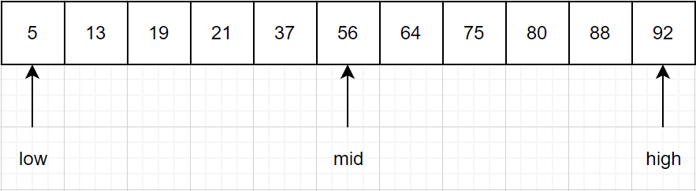
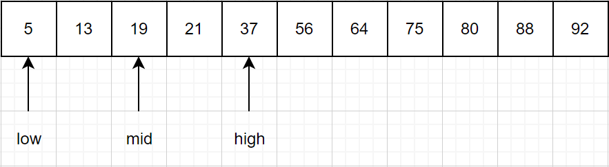
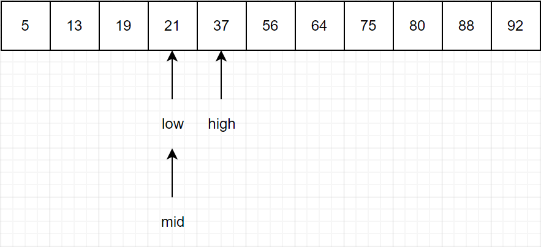

通常认为，STL 是由容器、算法、迭代器、函数对象、适配器、内存分配器这 6 部分构成，其中后面 4 部分是为前 2 部分服务的

容器：一些封装数据结构的模板类，例如： vector 向量容器、list 列表容器等

算法：数据结构算法，被设计为一个个小模板函数

迭代器：STL 中，对容器中数据的读写，是通过迭代器完成

函数对象：如果一个类把 () 运算符重载为成员函数，这个类就称为函数对象类，这个类的对象就是函数对象（仿函数）

适配器：使类的接口（模板参数）适配为用户指定的形式，从而让原本一起工作的两个类一起工作

内存分配器：为容器类模板提供自定义的内存申请和释放


时间复杂度：用来衡量程序的执行效率。


序列容器：

以线性排列（类似普通数组的存储方式）来存储某一指定类型（例如 int、double 等）的数据，需要特殊说明的是，该类容器并不会自动对存储的元素按照值的大小进行排序。


array<T,N> 数组容器

可以储存 N 个 T 类型数据，一旦建立，长度固定，不能增减元素，只能修改元素的值


vector< T > 向量容器

储存 T 类型的可变长容器，储存空间不足时候会自动申请内存。在尾部增减元素效率最高（时间复杂度 O(1) 常熟阶），在其他位置插入或删除元素效率差（时间复杂度 O(n) 线性阶，n 为元素个数）


deque< T > 双端队列容器

储存 T 类型的可变长容器，头尾都可以高效增减数据（时间复杂度 O(1) 常熟阶）,在其他位置插入或删除元素效率差（时间复杂度 O(n) 线性阶，n 为元素个数）


list< T > 链表容器

储存 T 类型的可变长容器，以双向链表的形式组织元素，在这个序列的任何地方都可以高效地增加或删除元素（时间复杂度都为常数阶 O(1)），但访问容器中任意元素的速度要比前三种容器慢，这是因为 list<T> 必须从第一个元素或最后一个元素开始访问，需要沿着链表移动，直到到达想要的元素。


forward_list< T > 正向链表容器

和 list 容器非常类似，只不过它以单链表的形式组织元素，它内部的元素只能从第一个元素开始访问，是一类比链表容器快、更节省内存的容器。


stack< T > 栈容器 

类似 deque< T >

queue< T > 队列容器

类似 deque< T >


关联式容器（底层红黑树结构）：适合需要大量遍历操作的场景

在存储元素值的同时，还会为各元素额外再配备一个值，又称为“键”。功能是直接通过该键就可以找到目标元素，而无需再通过遍历整个容器的方式。关联式容器可以快速查找、读取或者删除所存储的元素，同时该类型容器插入元素的效率也比序列式容器高。另外关联式容器存储的元素，默认会根据各元素的键值的大小做升序排序。

map 容器：其中储存的数据是键-值对应的，而且键必须是唯一的；

set 容器：同 map 容器一样，但是键和值数据完全相同（各元素的键不同，值当然也不同了）；

multimap 容器：同 map 容器一样，但是键可以重复；

multiset 容器：同 set 容器一样，但是键可以重复（值重复）；


无序关联式容器（哈希容器）（底层哈希结构）（C++11）：适合需要大量键值查找的场景

数据用键-值储存，但是键是无序的，数据储存位置由键决定。通过键查找对应值的时间复杂度 O(1) ；但用迭代器来遍历元素，效率不如关联式容器。

unordered_map 容器：无序的 map 容器；

unordered_multimap 容器：无序的 multimap 容器；

unordered_set 容器：无序的 set 容器；

unordered_multiset 容器：无序的 multiset 容器；


查找表：由同一类型数据元素构成的集合。（例如电话号码簿和字典等）

查找表的一般操作：查找某个具体数据元素、插入数据元素、删除数据元素；

顺序查找算法；

二分查找算法（折半查找）：要求数据有排序

例如{5，13，19，21，37，56，64，75，80，88，92}用折半查找法查找 21 ：

指针 low 和 high 指向表头表尾，mid 指向两指针中间。要查找的数同 mid 比较，如果比 mid 小，更新 high 指针指向 mid 左侧，mid 指针指向 low 和 high 中间；如果比 mid 打，更新 low 指针指向 mid 右侧，mid 指针指向 low 和 high 中间；反复如此缩小目标范围。







```c++
#include <stdio.h>
#include <stdlib.h>
#define keyType int
typedef struct {
    keyType key;//查找表中每个数据元素的值
    //如果需要，还可以添加其他属性
}ElemType;

typedef struct{
    ElemType *elem;//存放查找表中数据元素的数组
    int length;//记录查找表中数据的总数量
}SSTable;
//创建查找表
void Create(SSTable **st,int length){
    (*st)=(SSTable*)malloc(sizeof(SSTable));
    (*st)->length=length;
    (*st)->elem = (ElemType*)malloc((length+1)*sizeof(ElemType));
    printf("输入表中的数据元素：\n");
    //根据查找表中数据元素的总长度，在存储时，从数组下标为 1 的空间开始存储数据
    for (int i=1; i<=length; i++) {
        scanf("%d",&((*st)->elem[i].key));
    }
}
//折半查找算法
int Search_Bin(SSTable *ST,keyType key){
    int low=1;//初始状态 low 指针指向第一个关键字
    int high=ST->length;//high 指向最后一个关键字
    int mid;
    while (low<=high) {
        mid=(low+high)/2;//int 本身为整形，所以，mid 每次为取整的整数
        if (ST->elem[mid].key==key)//如果 mid 指向的同要查找的相等，返回 mid 所指向的位置
        {
            return mid;
        }else if(ST->elem[mid].key>key)//如果mid指向的关键字较大，则更新 high 指针的位置
        {
            high=mid-1;
        }
        //反之，则更新 low 指针的位置
        else{
            low=mid+1;
        }
    }
    return 0;
}

int main(int argc, const char * argv[]) {
    SSTable *st;
    Create(&st, 11);
    getchar();
    printf("请输入查找数据的关键字：\n");
    int key;
    scanf("%d",&key);
    int location=Search_Bin(st, key);
    //如果返回值为 0，则证明查找表中未查到 key 值，
    if (location==0) {
        printf("查找表中无该元素");
    }else{
        printf("数据在查找表中的位置为：%d",location);
    }
    return 0;
}
```


分块查找法（索引顺序查找）：。。。。。。


二叉排序树：


平衡二叉树：


红黑树：


哈希表：


