UML：

UML 是一种模型语言，专注于产品的模型和结构，而不是具体实现。

用简单、直观的图形来表达和展现系统的架构，提高软件设计的可读性，方便交流沟通

面向对象基本概念：

对象：代表一个实体的基本构建单元

类：类是对象的蓝图，指具有相通属性，方法，关系和语义的对象集合

抽象化：将现实世界的实体/行为抽象表示

封装：将数据绑定起来，并对外隐藏内部实现机制

继承：从现有的类中发展出新的类

多态性：类以不同的形式来存在

面向对象的分析和设计：

- 确定系统中的对象，对象所执行的功能

- 确定对象间的关系

- 将对象联系起来，构建一个系统

UML 3 个基本模块：事物，关系，图

四种事物：结构事物（描述静态），行为事物（描述动态），分组事物，注释事物

四种关系：依赖，关联，实现，泛化

十种图：

用例图：用例图从用户的角度出发描述系统的功能、需求，展示系统外部的各类角色与系统内部的各种用例之间的关系

类图：类图描述系统所包含的类、类的内部结构及类之间的关系

对象图：对象图是类图的一个具体实例

包图：

部署图：部署关系图定义系统中软硬件的物理体系结构

状态图：状态图描述一类对象的所有可能的状态以及事件发生时状态的转移条件

活动图：特殊的状态图，强调对象间的控制流程

序列图：描述对象间的动态合作关系，强调消息发送顺序

协作图：与序列图相似，描述对象间的动态合作关系

组件图：组件图描述代码部件的物理结构以及各部件之间的依赖关系

UML 可从设计（类图、对象图）、实现（组件图）、处理、部署（部署图） 4 个角度来描述系统。

UML 的基本表示方法：

类表示法：

第一项是类名；第二项是属性；第三项是方法；“+” 表示 “public”；"#" 表示 "protected"；"-" 表示 "private"

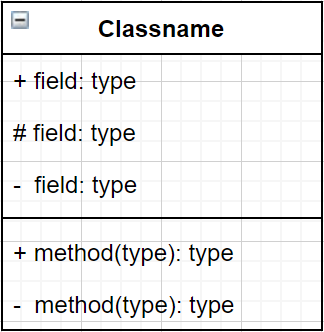

对象表示法：

和类的表示相同，不过名称有下划线

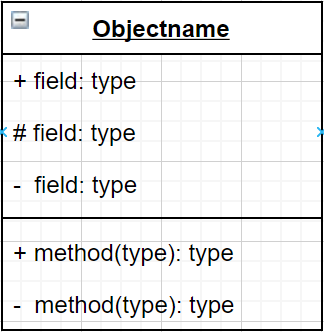

接口表示法：

接口用于描述功能，而不执行

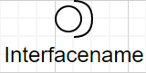

协作表示法：

用例表示法：

表示系统的应用层功能

角色表示法：

与系统交互的角色

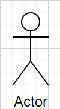

初始状态表示法：

表示一个过程的起点

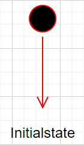

最终状态表示法：

表示一个过程的结束，也可以表示目的

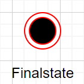

活动类表示法：

类似类的表示，一般用来表示系统的并发行为

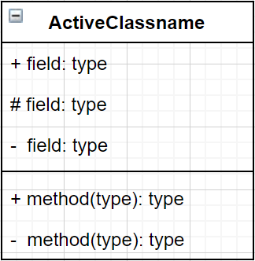

元件表示法：

组件，可表示系统中任何部分的 UML 图

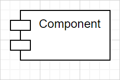

节点表示法：

节点表示一个物理的系统组件，例如服务器，网络等

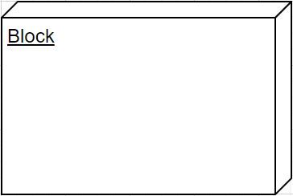

 包表示法：

包装系统组成部分

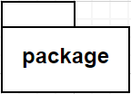

注释表示法：

提供信息

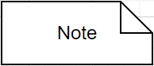

依赖表示法：

描述了两元素的依赖关系，依赖关系用虚线表示，箭头代表独立元素，另一端代表依赖元素

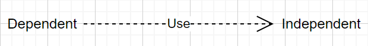

协作表示法：

介绍了有多少元素参与互动，箭头两端表示相关的元素

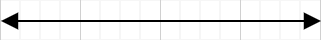

泛化表示法：

表示面向对象中的继承关系，空心箭头一端表示父元素，另一端表示子元素

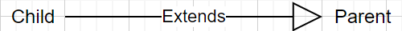

交互表示法：

表示系统中组件的通信，虚线表示对象的生命周期

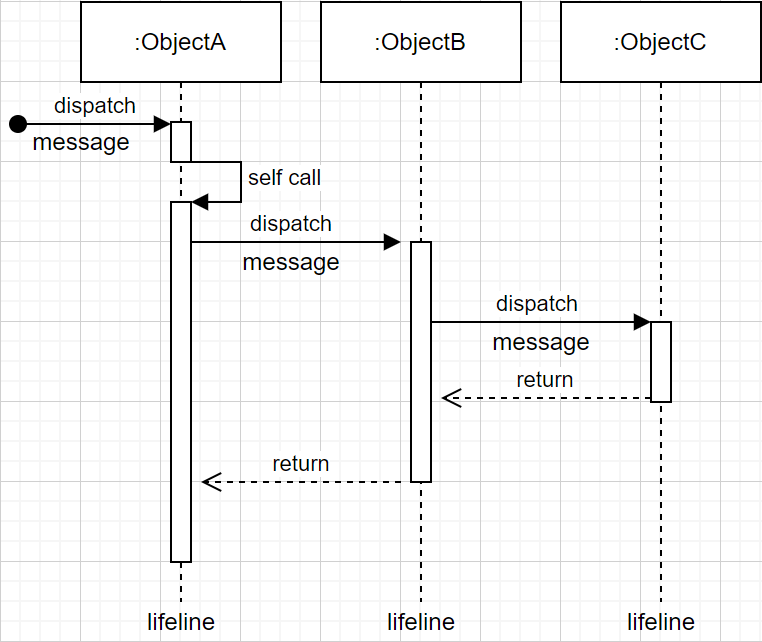

状态机表示法：

表示系统组件在生命周期中的不同状态，可以是活动，空闲等

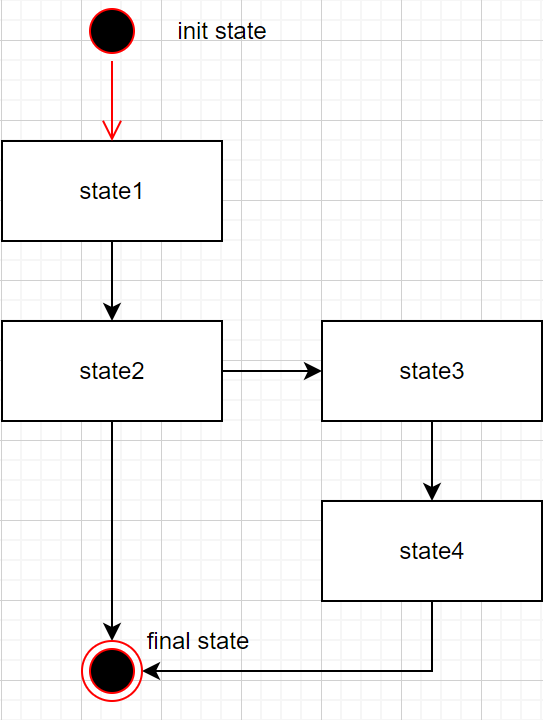

