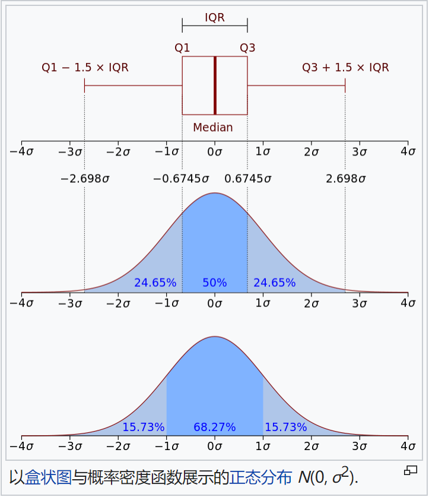

#### 鲁棒性（robustness）

指系统在扰动或不确定的情况下仍然能保持它们的特性行为。

#### 先验与后验

用于透过对经验、证据等来区分知识、证明或理论的类型。

先验知识是独立于经验的知识，包括数学，纯粹理性的推理。（验证前的理论）

后验知识是依赖于经验证据的知识。（验证后的事实、结果）

#### 启发式算法

一个基于直观或经验构造的算法，在可接受开销（计算的时间和空间）下给出解决问题的可行解，可行解于最优解的偏离程度一般不能预计。现阶段启发式算法以仿自然算法为主，主要有蚁群算法、模拟退火算法、神经网络等。

#### 增量学习

指一个学习模型系统能不断从新样本中学习新知识，并且保存大部分之前已学习的信息，不必重新训练整个模型。

#### 概率密度函数

连续型随机变量的概率密度函数，是一个描述这个随机变量的输出值，在某个确定取值点附近的可能性的函数。

如图，横轴为随机变量的取值范围，纵轴为概率密度函数的值，而随机变量的取值落在某个区域的概率为概率密度函数在这个区域上的积分。当概率密度函数存在时，累计分布函数是概率密度函数的积分。

