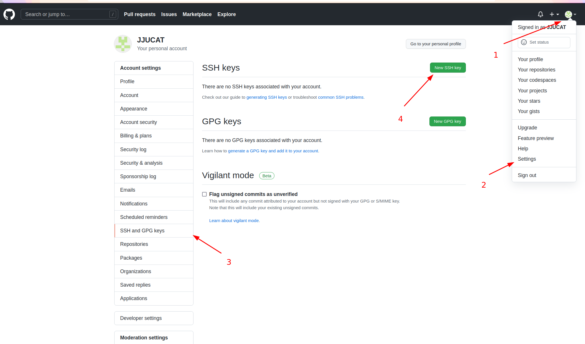
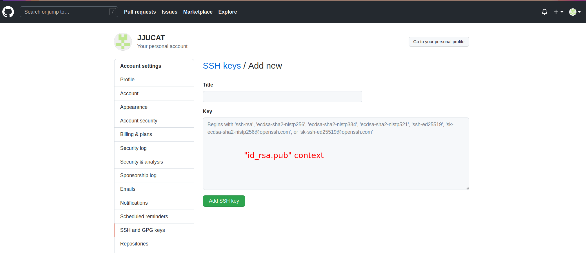

```c++
sudo apt-get install git//安装git

git version//检查版本验证安装

git config --gloabl user.name "Leen"//配置用户名

git config --global user.email "17688010148@163.com"//配置邮箱

git config --list//查看配置

ssh-keygen -t rsa -C "17688010148@163.com"//配置公钥私钥

//虚拟机 ubuntu 下终端输出:(公钥私钥为空，目录:~/.ssh)
Generating public/private rsa key pair.
Enter file in which to save the key (/home/jucat/.ssh/id_rsa): 
Enter passphrase (empty for no passphrase): 
Enter same passphrase again: 
Your identification has been saved in /home/jucat/.ssh/id_rsa.
Your public key has been saved in /home/jucat/.ssh/id_rsa.pub.
The key fingerprint is:
SHA256:+uwrdnwCdK3/Udjx+pfTw+JHefF8Gehj5r9jLOnos5A 17688010148@163.com
The key's randomart image is:
+---[RSA 2048]----+
|                 |
|                 |
|         .    o  |
|      . . .  + = |
|     . .S.  o o.B|
|      ... .  * ==|
|      .o E  = B =|
|      oo+ +..* @o|
|     . +=+.=*o*oB|
+----[SHA256]-----+
    
//同样的操作，在 window 下的 Git Bash 输出：(公钥私钥为空，目录:C:\Users\jucat\.ssh)
Generating public/private rsa key pair.
Enter file in which to save the key (/c/Users/jucat/.ssh/id_rsa):
Enter passphrase (empty for no passphrase):
Enter same passphrase again:
Your identification has been saved in /c/Users/jucat/.ssh/id_rsa
Your public key has been saved in /c/Users/jucat/.ssh/id_rsa.pub
The key fingerprint is:
SHA256:G7QrE4QySQZJJL8Lwn612RKKzQ0k6yFlflkCtWVDBqU 17688010148@163.com
The key's randomart image is:
+---[RSA 3072]----+
|==+.o+B          |
|o+ o B .         |
| .B.E o .        |
|.+++ = . .       |
|++o.oo. S        |
|=.=o= =. +       |
| +.= =o.o        |
|  .   .o         |
|                 |
+----[SHA256]-----+

```


git 公钥上传到 github



要用 gedit 打开公钥，复制内容到 github 的 SSH 中：



github 上新建仓库来存放文档文件，地址：https://github.com/JJUCAT/TyporaFiles.git


在本地目录下

```c++
Git Bash Here

git clone https://github.com/JJUCAT/Typora.git
git clone git@github.com:JJUCAT/TyporaFiles.git

git add * //把新文集添加到 git 中管理

git commit -m "msg"//提交信息

git push -u origin master//本地仓库推送到 github ，main 是主分支名
```

如果报错 failed to push some refs to XXX，说创建仓库选择了创建 README.md 文件

此时要先执行

```c++
git pull --rebase origin master
```

然后再 push


Window 下使用 Git：

git bash 打开 git 命令行，命令使用的是 ssh

告诉 git 用户是谁，"--global" 表示全部仓库的用户，不用该参数表示只通知当前仓库

```c++
  git config --global user.email "you@example.com"
  git config --global user.name "Your Name"
```


查看 git 的配置

```c++
git config --list
```


"mkdir" 新建目录，进入目录后，"git init" 将该目录变为 git 能管理的仓库

```c++
$ git init
Initialized empty Git repository in C:/Users/jucat/code/.git/
```


添加文件/添加修改，把文件放到仓库目录后，使用 "git add" 通知 git 把该文件添加到仓库

```c++
$ git add readme.txt
```

```c++
git add file1.txt file2.txt file3.txt
```


提交文件，"git  commit" 通知 git 文件提交的消息，备注等

```c++
$ git commit -m "wrote a readme file"
```

"-m" 后面带文件提交的说明，方便代码管理


查看仓库状态，"git status" 可以查看文件修改概况

```c++
$ git status
```


查看文件具体变动记录，"git diff" 

```c++
$ git diff readme.txt 
```


查看历史修改版本，“git log”

```c
git log
```


工程版本回退，"git reset"

```c
git reset --hard [HEAD]  //head 就是 git log 看到的 commit
```


