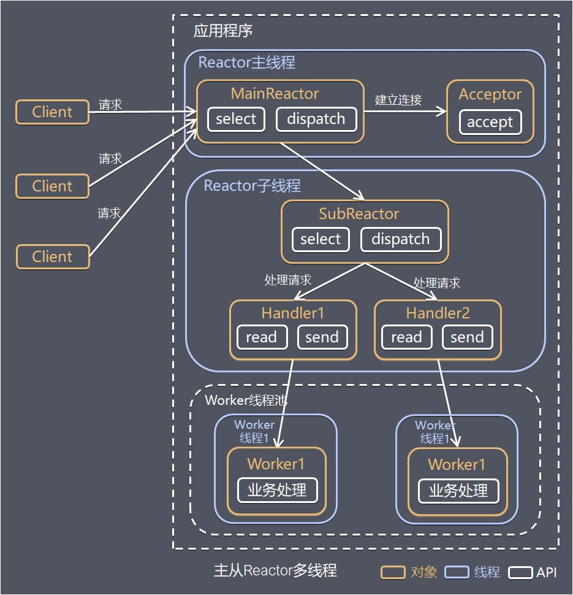

## 线程

线程是操作系统能够调度和执行的基本单位。

linux 没有线程的概念，内核仅仅把线程当作轻量级进程（LWP，Lightweight process），线程是进程间共享资源的一种方式。

资源共享：内存地址空间、进程基本信息、打开的文件、信号处理、当前目录、用户和用户组属性等；

调度：进程的上下文切换也被称为进程调度或者任务切换，由于线程共享了资源，所以进行调度时候需要保存和切换的项比较少，所以调度得快；

性能：线程得创建、调度都高于进程；

缺点：

- 由于内存共享，缺乏保护机制，线程不安全；
- 全局变量是线程共享的，访问时候需要同步加锁；
- 很多库函数是线程非安全的，多线程编程需要注意；
- 一个线程挂了，整个应用就挂了；

同步：线程共享了资源，为了保障数据的准确性和一致性，需要对共享资源的访问进行同步，也就是加锁；

锁的代价高昂，在设计高并发，高吞吐的程序时候要避免锁的使用，或者减少锁的区间；

#### 主从 Reactor 多线程模式

## 进程