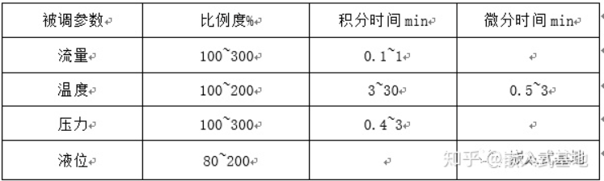
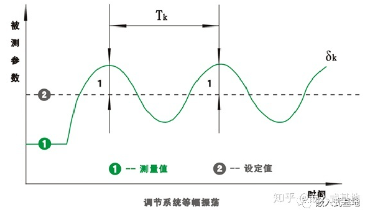
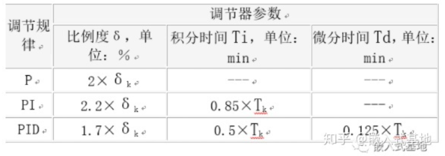
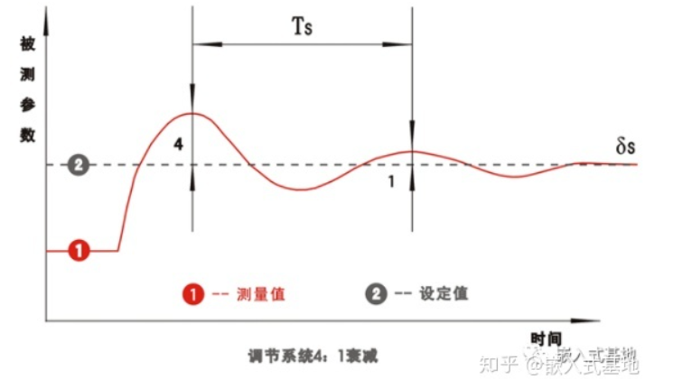
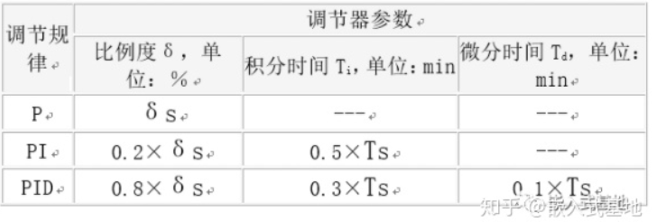

#### PID 原理

P：比例控制，控制器输出和输入误差信号成比例关系，仅存在比例控制输出时候存在稳态误差；

I：积分控制，控制器的输出与输入误差信号的积分成正比关系。为消除稳态误差，引入积分，随时间增加，积分会变大，推动控制器减小稳态误差直至为零；比例+积分控制器可以使系统进稳态后无误差；

D：微分控制，控制器的输出与输入误差信号的微分成正比关系。系统在克服误差的调节过程可能震荡甚至失稳。因为存在惯性环节或滞后环节，具有抑制误差的作用，其变化总是落后于误差的变化。解决的办法是使抑制误差的作用变化提前，即当误差接近零时候，抑制误差的作用也接近零。微分控制可以“预测”误差变化趋势。比例+微分控制器可以避免系统严重超调。对有较大惯性或滞后的被控对象，比例+微分(PD)控制器能改善系统在调节过程中的动态特性。


位置式：

```
/*
根据位置式离散PID公式 
out=Kp*error(t)+Ki*Sum_error(t)+Kd*[error(t)-error(t-1)]
*/
error1 := 0		//上次偏差
integral := 0	//积分和
integral_limit :=100 //积分限幅
out := 0		//输出
//setpoint 设定值为入口参数
//循环
//采样周期为T
//measured_value 采样得到值
loop: 
    error0 := setpoint − measured_value	//本次偏差
    integral := integral + error0	//积分
    if(integral > integral_limit) integral = integral_limit	//积分限幅
    else if (integral < -integral_limit) integral = -integral_limit
    derivative := (error0 − error1) / T	//微分
    out := Kp × error0 + Ki × integral + Kd × derivative

    //记录偏差
    error1 := error0
    wait(T)	//间隔T运行
    goto loop

```


增量式：

```
/*
根据增量式离散PID公式 
out=Kp*[error(t)-error(k-1)]+Ki*error(k)+Kd[error(k)-2error(k-1)+error(k-2)]
*/
error2 := 0		//上上次偏差
error1 := 0		//上次偏差
out := 0		//输出
//setpoint 设定值为入口参数
//循环
//采样周期为T
//measured_value 采样得到值
loop: 
    error0 := setpoint − measured_value	//本次偏差
    derivative := (error0 − 2*error1 + error2) / T	//微分
    out := Kp × (error0 - error1) + Ki × error0 + Kd × derivative

    //记录偏差
    error2 := error1
    error1 := error0
    wait(T)	//间隔T运行
    goto loop

```


整定方法：

1. 理论整定法：依据系统的数学模型，经过理论计算确定控制器参数，需要实践调整；
2. 工程整定法：主要临界比例法，反应曲线法，衰减法；一般采用临界比例度法；


#### 参数整定步骤法

1. 选择一个采样周期让系统工作；

2. 仅加入比例控制环节，直到系统对输入的阶跃响应出现临界震荡，记录下该比例放大系数和临界震荡周期；

3. 在一定的控制度下通过公式计算得 PID 参数

   


#### 临界比例度法

一个调节系统，在阶跃干扰下，出现既不发散也不衰减的等幅震荡过程，此时比例度为临界比例度 δk，被调参数工作周期为临界周期 Tk



步骤：

1. 将调节器积分时间设定为无穷大，微分时间为 0 （即 Ti = ∞，Td = 0），比例度适当取值（仅 P 调节）。系统稳定后，适当减小比例度，在外界干扰下观察过程变化，寻取系统等幅震荡状态，得到临界参数。

2. 根据临界比例度 δk 和临界周期 Tk，按临界比例度法 PID 参数整定经验公式计算出调节器参数整定值：

   

3. 将参数代入系统，观测微调


#### 衰减曲线法

纯比例度作用下调节系统，在比例度逐渐减小时候，出现 4:1 衰减震荡过程，此时比例度为 4:1 衰减比例度 δs，两个相邻同向波峰间距离为 4:1 衰减操作周期 TS，如图：



步骤：

1. 将调节器积分时间设定为无穷大，微分时间为 0 （即 Ti = ∞，Td = 0），比例度适当取值（仅 P 调节）。取适当比例度直到系统稳定，逐步减小比例度，增加 2%-3% 的干扰，直到系统出现 4:1 衰减比。记录此时的 4:1 衰减比例度 δs 和 4:1 衰减操作周期 TS；

2. 根据衰减曲线法 PID 参数整定经验公式求得 I 和 D 参数：

   

3. 将比例度放在比计算值略大的数值上，逐步引入积分和微积分

4. 将参数代入系统，观测微调


#### Mathlab 整定 PID 参数


