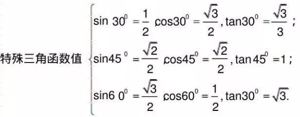
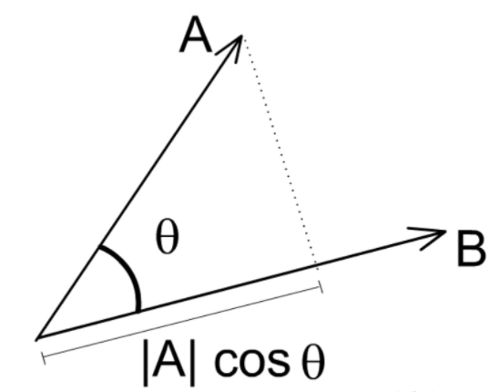
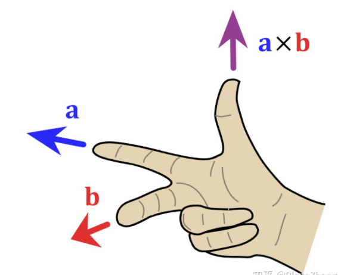
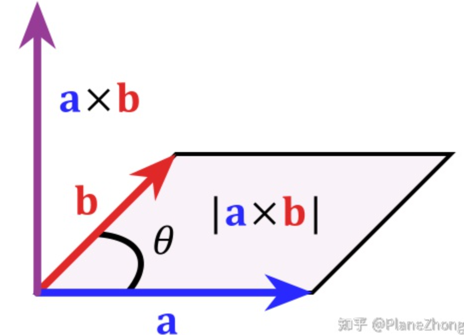
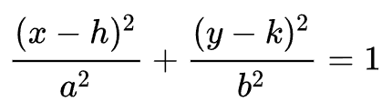
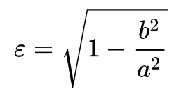
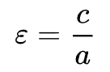
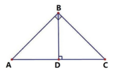

三角函数：

sin a = a对边/a斜边；cos a = a邻边/a斜边；tan a = a对边/a邻边；

同角三角函数关系：

sin^2a + cos^2a = 1，sina / cosa = tana，tana * cota = 1

三角函数诱导公式：利用三角函数的周期性，将大角度转为 小角度计算；

和角公式：

sin(A + B) = sinA * cosB + cosA * sinB

cos(A + B) = cosA * cosB - sinA * sinB

tan(A + B) = (tanA + tanB) / (1 - tanA * tanB) 

差角公式：

sin(A - B) = sinA * cosB - cosA * sinB

cos(A - B) = cosA * cosB + sinA * sinB

tan(A - B) = (tanA - tanB) / (1 + tanA * tanB) 

二倍角公式：

sin(2 * A) = 2 * sinA * cosA

cos(2 * A) = 2 * (cosA)^2 - 1 = 1 - 2 * (sinA)^2 = (cosA)^2 - (sinA)^2 = (1 - (tanA)^2) / (1 + (tanA)^2)

tan(2 * A) = 2 * tanA / (1- (tanA)^2)

y = A * sin(wx + h) + b 图像，最小正周期 T = 2π / |w|，对称轴：x = ((2k + 1) * π - 2 * h) / (2 * w)，对称中心：((k * π - h) / w, b)

正弦定理：

在任意一个平面三角形中，各边和它所对角的正弦值的比相等且等于外接圆的直径

a/sinA = b/sinB = c/sinC = 2r = D（r为外接圆半径，D为直径）

余弦定理：

对于任意三角形，任何一边的平方等于其他两边平方的和减去这两边与它们夹角的余弦的积的两倍。

- a^2 = b^2 + c^2 - (2 * b * c * cosA)
- cosA = (b^2 + c^2 - a^2) / (2 * b * c)

特殊三角函数值：

三边关系：两边之和大于第三边；两边之差小于第三边；

面积：S = 底 * 高 / 2；

3 个内角之和为 180°，外角之和为 360°；

三角形的一个外角等于不相邻两个内角之和；

三角形的一个外角大于任何一个不相邻的内角；

三角形的中线平分三角形面积；

角平分线上的点到两边距离相等；

3 条角平分线的交点到 3 边距离相等，交点也是内切圆的圆心；

中位线：中位线平行于第三边且等于第三边的一半；

垂直平分线：线段的垂直平分线到线段连段距离相等；

直角三角形的勾股定理：a^2 + b^2 = c^2

多边形的内角和为 (n - 2) * 180°，外角和为 360°；

梯形面积：S = (上底 + 下底) * 高 / 2 = 中位线 * 高

#### 向量

具有大小和方向的量

向量 a = (x, y)，a 的模|a| = sqrt(x^2 + y^2)

加法：向量a + 向量b 的几何意义是向量b 的起点移动到向量a 的终点，由向量a 起点指向向量b 终点的新向量c

减法：向量a - 向量b 的几何意义是向量b 的起点移动到向量a 的起点，由向量b 终点指向向量a 终点的新向量c

数乘：向量a * 数量n 的几何意义是向量a 延长 n 倍模，乘负数表示方向取反

#### 向量点乘（内积/数量积）

向量a · 向量b = xa * xb + ya * yb = |a| * |b| * cosθ

几何意义：向量a 在向量b 方向上投影与|b|的乘积，反应两个向量的相似度，结果越大越相似。

向量a · 向量b > 0：方向基本同向，夹角在0°到90°之间

向量a · 向量b = 0：向量正交，互相垂直

向量a · 向量b < 0：方向相反，夹角在90°到180°之间

在图形中，点积有下面的作用：

- 求两个向量的角度（例如光源和表面的夹角和余弦）
- 寻找一个向量投影到另一个向量的样子
- 测量两个方向的接近程度
- 确定向前还是向后

向量a // 向量b：xa * yb - xb * ya = 0

#### 向量叉乘（外积/向量积）

向量a x 向量b = (ya * zb - za * yb, za * xb - xa * zb, xa * yb - ya * xb)

​                         = |a| * |b| * sinθ * 向量n（向量n 是向量ab 所在平面的单位法向量）

**方向由右手法则确定**

几何意义：如果向量a 和向量b 构成平行四边形，那么外积的模长与该四边形的面积相等。

圆的垂径定理：垂直于弦的直径平分弦，且平分两弧；

同弧所对的圆周角是圆心角的一半；

90°的圆周角所对的弦是直径，所对的弧是半圆；

圆的切线垂直于过切点的直径；

弦切角：一边和圆相切，一边和圆相交的角叫弦切角，等于所夹得弧所对的圆周角

圆的两切线相交于点 P，切点A 、B，那么PA = PB，PO 平分角 AOB；

割线：直线和圆有两个交点；

切割线定理：圆外一点 P ，做圆的切线，切点A，做圆的割线，交点 C，D，那么 PA^2 = PC * PD

弧长公式：l = 2 * pi * r * n / 360 = pi * r * n / 180 ，n 是弧所对的圆心角；

扇形面积：S = pi * r^r * n / 360 = l * r / 2；

黄金分割：线段 AB 被 C 分割，AC > CB，如果 AC ^2 = BC * AB，那么点 C 是黄金分割点；

#### 椭圆

平面上到两个相异固定点距离之和为常数的点的轨迹。

中心点位于(h, k) 的主轴平行于 x 轴的椭圆方程如下：

穿过椭圆两个焦点的线段叫做长轴，终止于椭圆上的长轴中垂线叫做短轴。

椭圆的长半轴a，短半轴b，离心率表示为：

离心率越大，a 和 b 的比率就越大，椭圆被拉得更长

半焦距 c 为中心到任一焦点的距离，c 也被称为线性离心率：

相似多边形对应的边成比例、对应角相等；

相似三角形对应角相等、对应边成比例；

对应的线段（中线，高，角平分线，周长）比等于相似比；

面积比等于相似比平方；

**点乘 、点积：**

向量 va = (x1, y1) 向量 vb = (x2, y2)，那么 va · vb = x1 * x2 + y1 * y2；

几何定义中，va · vb = |va|\*|vb|\*cosθ 

射影定理（欧几里德定理）：

直角三角形 ABC， 角 B = 90°，作 BD 垂直斜边 AC，垂足 D，那么有：

BD^2 = AD · CD

AB^2 = AC · AD

BC^2 = CD · AC

以上可以用三角形的相似原理（等比关系）求得

