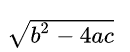
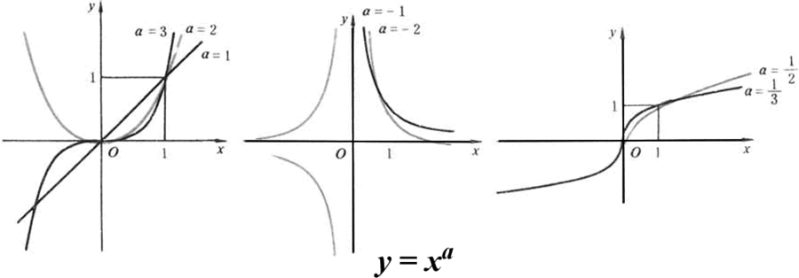

整数：像 -3 -2 -1 0 1 2 3 这样的数称为整数，其中 0 和 正整数称为自然数

有理数：分数和整数的集合，包括无限循环小数

无理数：无限不循环小数

实数：实数可以看作所有小数的集合，能表示数轴上任意数值。

虚数：虚数可以看作实数和虚数单位 i 的乘积，i^2 = -1

复数：实数和虚数的集合

**复数包含了实数和虚数、实数包含了有理数和无理数、有理数包含了分数和整数**

多项式：未知数和常量系数的有限运算的表达式

系数是实数的一元二次方程 ax^2 + bx + c = 0 的判别式：

判别式 > 0 表示有两个不同实数根；

判别式 = 0 表示有两个相同实根；x = - b / (2 * a)；

判别式 < 0 表示两个不同的复数根，两根互为共轭复数；

一元二次方程的韦达定理：

x1 + x2 = - b / a；和 x1 * x2 = c / a；

一次函数： 

斜截式：y = k * x + b；

一般式：a * x + b * y + c = 0；

若 y = k1 * x + b1 和 y = k2 * x + b2 垂直，那么 k1 * k2 = -1；

点到直线距离：

二次函数：

一般式：y = a * x^2 + b * x + c， (a != 0)

顶点式：y = a * (x - k)^2 + h， (a != 0) ，(k, h) 是抛物线顶点坐标

交点式：y = a * (x - x1) * (x - x2) ，(a != 0)，x1, x2 是和 x 轴的交点横坐标

性质：

a > 0 开口向上，a < 0 开口向下； |a| 越大，开口越大，|a|越小，开口越小；

对称性：关于 x = - b / (2 * a) 对称；

顶点坐标：(-b / (2 *a), (4ac - b^2) / 4a)

## 集合

集合(Set)：某种特定性质事物的总体。集合里的事物称为元素。

若 x 是集合 A 的元素，记作 x ∈ A。若 x 不是集合 A 的元素，记作 x ∉ A

- 而族，系得元素也是一些集合

全集：U

集合 A ,B ，若 A 是 B的子集，那么称 A 包含于 B，或者 B 包含 A。

同时 A ≠ B，那么称 A 是 B的真子集，称 A 真包含于 B，或者 B 真包含 A。

集合的运算：

并集：集合 A 和 B 的元素合并：A ∪ B

交集：集合 A 和 B 的相同元素：A ∩ B

差集：属于 B 但不属于 A 的元素：B - A 或者 B \ A

对称差：集合 A 和 B 各自私有的元素集合：A △ B = （A - B）∪（B - A）

集合 A，B 非空，若 A 中元素 x 按某种规律 f ，恒有 B 中**唯一**确定元素 y 与之对应，称 f 为一个从 A 到 B 的映射。

记作：f : A → B

称 y 为 x 的像，记作：y = f (x)，x 是 y 的原像。集合 A 是映射 f 的定义域，集合 B 是 f 的陪域。

## 函数

函数是两个非空集合间的一种对应关系，输入集合中每项元素皆能对应**唯一**一项输出集合中的元素

#### 性质：

单调性：函数 f(x) 在定义区间增减，函数值也随着增减，那么称函数在该区间有单调性；

奇偶性：如果函数 f(x) 定义域内任意一个 x 都有 f(-x) = f(x)， 那么 f(x) 称为偶函数

​                如果函数 f(x) 定义域内任意一个 x 都有 f(-x) = -f(x)， 那么 f(x) 称为奇函数

周期性：在定义域内任意 x，都有 f(x) = f(x + T)，那么 f(x) 称为周期函数

最值：在定义域内，函数值的最大最小值

#### 变换：

平移变换：f(x) -> f(x ± a) 或者 f(x) ± a

对称变换：关于 y 轴对称：f(x) = f(-x)；关于 x 轴对称：-f(x)；

翻折变换：

伸缩变换：f(x) -> f(a * x) 或者 a * f(x)

#### 直线方程的形式：

点斜式：y - y0 = k * (x - x0)

斜截式：(y - y1) / (y2 - y1) = (x - x1) / (x2 - x1)

截距式：y = k * x + b

一般式：a * x + b * y + c = 0

点到线距离：d = |a * x0 + b * y0 + c| / (a^2 + b^2)

平行线距离：d = |c1 - c2| / (a^2 + b^2)

#### 基本函数：

幂函数：f(x) = Cx^r (C，r为常数)，定义域和 r 取值相关，无论 r 为何值，该函数在(0, +∞)总有意义

指数函数：f(x) = a^x，a > 0 且 a ≠ 1，定义域(-∞，+∞)，值域(0, +∞)

对数函数：y = loga x，a > 0 且 a ≠ 1，是指数 y = a^x 的反函数。定义域(0, +∞)，值域(-∞，+∞)

#### 导数：

当函数 y = f(x) 的 x 在 x0 处产生一个增量 △x 时候，函数输出值增量 △y 和自变量 △x 的比值趋近于 0 时的极限 a 如果存在，a 是 x0 处的导数，记作 f'(x0) 或者 df(x0) / dx。

几何意义：表示函数曲线在点 (x0, f(x0)) 处的切线斜率

初等函数的导数：

| **函数**                                                     | **原函数**                                                   | **导函数**                                                   |
| ------------------------------------------------------------ | ------------------------------------------------------------ | ------------------------------------------------------------ |
| **[常函数](https://baike.baidu.com/item/常函数)**（即[常数](https://baike.baidu.com/item/常数)） |  （***C\***为常数） |  |
| **[指数函数](https://baike.baidu.com/item/指数函数)**        |  |  |
|                                                              |   |                  |
| **[幂函数](https://baike.baidu.com/item/幂函数)**            |  |  |
| **[对数函数](https://baike.baidu.com/item/对数函数)**        |  |  |
|                                                              |                  |                  |
| **[正弦函数](https://baike.baidu.com/item/正弦函数)**        |  |  |
| **[余弦函数](https://baike.baidu.com/item/余弦函数)**        |  |  |
| **[正切函数](https://baike.baidu.com/item/正切函数)**        |  |  |
| **[余切函数](https://baike.baidu.com/item/余切函数)**        |  |  |
| **[正割函数](https://baike.baidu.com/item/正割函数)**        |  |  |
| **[余割函数](https://baike.baidu.com/item/余割函数)**        |  |  |
| **[反正弦函数](https://baike.baidu.com/item/反正弦函数)**    |  |  |
| **[反余弦函数](https://baike.baidu.com/item/反余弦函数)**    |  |  |
| **[反正切函数](https://baike.baidu.com/item/反正切函数)**    |  |  |
| **[反余切函数](https://baike.baidu.com/item/反余切函数)**    |  |  |
| **[双曲线函数](https://baike.baidu.com/item/双曲线函数)**    |  |   |

导数的四则运算：

(u ± v)‘ = u' ±v'

(uv)' = u'v + uv'

(u / v)' = (u'v - uv') / v^2

复合求导（链式法则）：d(g(h(x))) / dx = d(g(h(x)) / dh * (dh(x) / dx)

#### 偏导数

一个多变量函数的偏导数，就是关于其中一个变量导数而保持其他变量恒定（全导数允许所有变量变化）。

例如：对于曲面 z = f(x, y) = x^2 + xy + y^2，曲面每个点都有无穷多条切线，偏导数就是求其中一条切线。此时固定 y = y0，对函数求导即是偏导数。

#### 方向导数

例子：

函数 z = x* e^(2y) 在 P(1,0) 到 Q(2,-1) 的方向导数。

这里方向 l 即是 PQ = {1, -1}，x 轴到方向 l 的转角为 -(π/4)

z 的 x 偏导数 = e^(2y) = 1；z 的 y 偏导数 = 2 x e^2y = 2

方向导数 = cos(-π/4) + 2 * sin(-π/4)  

#### 梯度

梯度的本意是一个向量（矢量）， 表示某一函数在该点处的方向导数沿着该方向取得最大值，即函数在该点处沿着该方向（此梯度的方向）变化最快，变化率最大（为该梯度的模）。

梯度是雅可比矩阵的一种特殊形式，当m=1时函数的雅可比矩阵就是梯度，这个概念原是为场论设定的，任何场都可以用来理解梯度，后来被引用到数学中用来指明函数在指定点的变量率最快的方向和大小，是一种变化效率的数字抽象。

#### 微分：

自变量 x 变动到 x + △x 处时候，函数的增量 △y = f(x + △x) - f(x) 可表示为 △y = A△x + o(△x)，A 是不依赖于 △x 的常量，o(△x) 是比 △x 高阶的无穷小，那么称函数 f(x) 在 x 处可微，A△x 称为函数在 x 处自变量 △x 的微分，记作 dy

#### 积分：

定积分：简单地说是函数在某个区间内，函数 曲线和 x 轴围成的面积。

不定积分：如果 f(x) 在某区间 I 上，存在可导函数 F(x)，使得 F‘(x) = f(x) 对任意 x 属于 I 成立，那么 F(x) 是 f(x) 在区间 I 上的一个原函数。这个原函数，也称为不定积分。不定积分是找原函数。

任何函数和 x 轴围成的面积的导数，是这个函数本身。

#### 牛顿-莱布尼茨公式

#### 微分，导数的关系：

导数是曲线某点切线的斜率，导数值等于微商；

微分是微小的增量，即无穷大；

#### 泰勒级数：

**一般运用泰勒级数，是为了在某个点附近，用多项式函数去近似模拟某个函数！**

#### 拉格朗日乘子法

#### 二项式定理：

#### 反函数

h = g * t  ->  h = h(t) ，t 是自变量，h 是应变量

t = h /g  -> t = t(h)，h 是自变量，t 是应变量

#### 显函数隐函数

显函数：形式上表明了自变量和应变量：y = x + 1

隐函数：形式上未表明自变量和应变量：3 * x + y + 1 = 0

