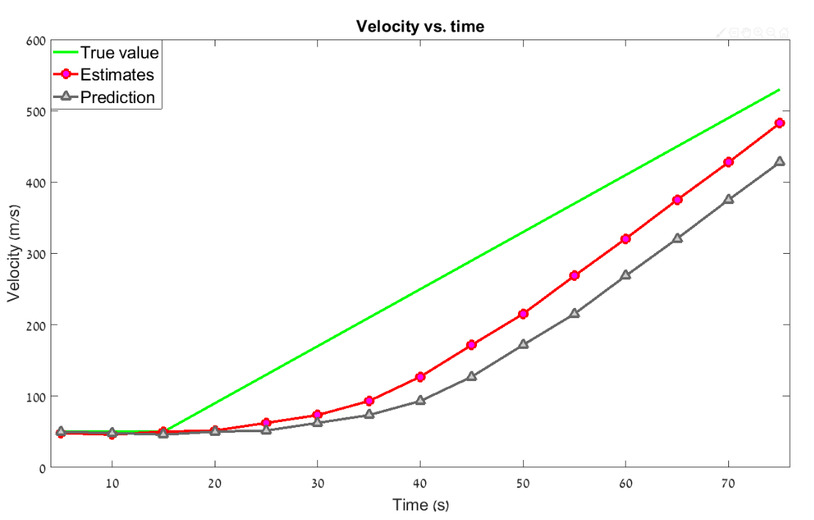
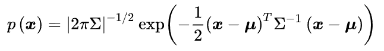

### 基础知识

#### 均值和期望

均值和期望是两个相似而不相同的概念。

e.g. 假设有 5 个硬币，2 个五分，3 个十分，均值 μ = (5 * 2 + 10 * 3) / 5 = 8

上述结果不能定义为期望值，因为系统状态（硬币值）未被隐藏，而且使用了所有样本（全部 5 个硬币）来计算均值。

e.g. 同一个人称体重，分别为 79.8kg，80kg，80.1kg，79.8kg，80.2kg，由于体重秤有随机测量误差，导致我们并不知道真实的体重，因此它是一个隐变量。期望 Ε = (79.8+80+80.1+79.8+80.2) / 5 = 79.98kg

#### 方差和标准差

方差描述了数据与其均值的偏离程度，用 σ^2 表示；

标准差是方差的平方根，用 σ 表示；

如果一个变量 x 服从正态分布，方差是 σ^2，那么 kx 的方差是 k^2 * σ^2

求所有样本的方差公式为：

求所有样本的标准差公式：

以上是知道所有测试样本的计算公式，实际应用中，我们不可能计算所有样本的数据，而是抽样计算估计，此时的公式如下：

公式的解释：https://www.visiondummy.com/2014/03/divide-variance-n-1/

#### 正态分布

正态分布又称为高斯分布，其概率密度函数如下：

通常情况下，测量误差是服从正态分布的，卡尔曼滤波器就是基于这样的假设设计的。

#### 随机变量

交警用激光测速枪测量车速，我们称测速枪的测量值为随机变量，无法知道准确值，测量结果是期望。

随机变量可以是连续的，也可以是离散的。所有测量值都是连续随机变量。

#### 估计，准确度，精确度

估计(Estimate)用来估算系统不可见状态。例如飞机的真实位置对观察者是隐蔽的，用雷达等传感器估算飞机高度，再用跟踪算法（例如卡尔曼滤波器）来提高估算结果；

准确度(Accuracy)表示测量值和真实值有多接近；

精确度(Percision)表示对同个参数进行测量时，测量结果的变化性。（精确度高，测量波动越小）

准确度和精确度构成了估计的基础。

低精度系统称为有偏(biased)系统，因为他们的测量值具有内置的系统误差（偏置）

对测量值进行平均或平滑处理可以降低测量误差的影响。由于误差是随机的，测量次数越多，均值越接近真实值。

测量值的统计学表达：

测量值是一个由概率密度函数（PDF）描述的随机变量；

测量值的均值就是随机变量的数学期望；

测量值的均值与真实值的差称为偏差或系统测量误差，表明测量的精度；

分布的离散程度就是测量的精确度，又叫噪声或随机测量误差，测量不确定性；

#### 下面的例子假设没有系统偏差，只有随机测量噪声

### α，β，γ 滤波器

#### 静态模型

e.g. 估计金条重量，系统是金条，系统状态是金条重量。金条重量在短时间内不变，即系统的动态模型恒定。为估计系统状态（金条重量），可以进行多次测量并求平均值。

由于没法全部记录历史数据，也就没法按照上面公式计算。下面通过迭代法算得估计值，每次只用到上次的估计值，推导如下：

x N,N-1 是 x 在 N 时刻，基于 N-1 时刻（上次）的测量值做出的预测状态，即是先验估计值。

一般来说，利用推导出的最后公式得到了 x N,N，还需要某个方程算出 x N+1,N 作为下轮计算得先验估计，才能继续迭代下去。

上面公式是卡尔曼滤波的五个方程之一，叫状态更新方程，形式如下：

`Factor` 叫卡尔曼增益Kn，这里先用 αn 代替 Kn，此时状态更新方程为：

其中 (zn - x n,n-1) 是测量残差，也称为更新，包含了新的信息。

在第一次侧重之前，可以通过金条上刻的数字估计金条的重量，称为初始猜测，它将是第一个估计。

#### 动态模型

e.g. 假设一维空间中，一架飞行器正在远离（或者接近）雷达，xn 代表飞行器在 n 时刻的航程，速度定义为航程相对于时间的变化率，即距离的导数：x‘ =  v = dx / dt，雷达以恒定的频率向目标发射追踪波束，周期为 △t，假设飞行器速度恒定，系统的动态模型可以用两个运动方程描述（**状态外推方程**）：

x n+1 = x n + △t * x' n
x' n+1 = x' n

飞机速度恒定，所以 x' n+1 = x' n，即下个周期的速度等于当前速度，上面方程称为状态外推方程，或预测方程；

此时我们已经了解了卡尔曼滤波的状态更新方程和状态外推方程了。

#### α-β 滤波器

e.g. 雷达探测间隔 △t 为 5s，假设在 n 时刻，飞行器估计航程 30000m，估计速度 40m/s，使用状态外推方程，可以预测

n + 1 时刻位置： x n+1,n = x n,n + △t * x'n,n

n + 1 时刻速度：x' n+1,n = x' n,n = 40m/s

然而 n 时刻雷达测量航程 z n = 30110m，而不是 30200m，造成偏差可能原因是：

1. 雷达测量不准确
2. 飞行器速度改变了心速度为 (30110 - 30000) / 5 = 22m/s

飞行器的速度状态更新方程：

x' n,n = x' n,n_1 + β((z n - x n,n-1) / △t)

β 取值1取决于雷达的精确程度

假设雷达精度高，σ 为 20m，那么更可能是飞行器速度变化导致，这种情况提高 β 系数 = 0.9，估计速度为：

x' n,n = x' n,n_1 + β((z n - x n,n-1) / △t) = 40 + 0.9 * ((30110 - 30200) / 5) = 23.8 m/s

假设雷达精度低，σ 为 150m，那么更可能是雷达测量误差导致，β 设置为 0.1，估计速度为：

x' n,n = x' n,n_1 + β((z n - x n,n-1) / △t) = 40 + 0.1 * ((30110 - 30200) / 5) = 38.2 m/s

飞行器位置的状态更新方程为：

x n,n = x n,n-1 + α * (z n - x n,n-1)

α 取值取决于雷达精度，高精度雷达设置高 α

若 α = 1，那么估计航程等于测量航程：x n,n = x n,n-1 + 1 * (z n - x n,n-1) = z n

若 α = 0，那么测量航程不起作用：x n,n = x n,n-1 + 0 * (z n - x n,n-1) = x n,n-1

我们得到了雷达追踪器的状态更新方程组，称为 α-β 轨迹更新方程：

#### 动态加速模型

e.g. 战斗机先以 50m/s 恒定速度飞行 15s，再以 8m/s^2 的加速度飞行 35s，假设 α = 0.2，β = 0.1，那么前 75s 的航程和速度的真实值，测量值和估计值如下：

真实值或测量值与估计值之间存在一个差值，称为滞后误差，或动态误差，系统误差

现在用 α-β-γ 滤波器追踪加速飞行器：

状态外推方程：

x n+1,n = x n,n + x' n,n * △t + x'' n,n * (△t ^2) / 2

x' n+1,n = x' n,n + x'' n,n * △t

x'' n+1,n = x'' n,n

状态更新方程：

x n,n = xn,n-1 + α(z n - x n,n-1)

x' n,n = x' n,n-1 + β((z n - x n,n-1) / △t)

x'' n,n = x'' n,n-1 + γ((z n - x n,n-1) / (0.5 * △t^2))

α-β-γ 滤波器对运动状态高度变化的系统难以跟踪，因为 α-β-γ 参数固定，容易产生估计误差，而卡尔曼滤波器可以处理动态模型的不确定性。

#### α-β-γ 滤波器总结

α-β-γ 滤波器有很多种，都基于相同原理：

1. 当前状态估计基于状态更新方程；
2. 状态的下一个估计值（预测值）基于动态模型方程

区别在于加权系统 α-β-γ 的选择。常见的 α-β-γ 滤波器有：

- Wiener Filter （维纳滤波）
- Bayes Filter （贝叶斯滤波）
- Fading-memory polynomial Filter
- Expanding-memory (or growing-memory) polynomial Filter
- Least-squares Filter （最小二乘法滤波）
- Benedict–Bordner Filter
- Lumped Filter
- Discounted least-squares α−β Filter
- Critically damped α−β Filter
- Growing-memory Filter
- **Kalman Filter （卡尔曼滤波）—— 线性系统**
- **Extended Kalman Filter （扩展卡尔曼滤波）—— 非线性系统，寻找一个线性函数来近似这个非线性函数。在运动方程和观测方程的均值处用一阶泰勒展开来模拟切线处的线性化，从而继续使用卡尔曼滤波**
- **Unscented Kalman Filter （无迹卡尔曼滤波）—— 非线性系统，寻找一个与真实分布近似的高斯分布。UKF的基本思路就是： 近似非线性函数的概率分布要比近似非线性函数本身要容易！选取有限的采样点，将其经过非线性变换，最后加权统计变换后结果的均值和方差**
- Extended Complex Kalman Filter
- Gauss-Hermite Kalman Filter（高斯-厄密特 卡尔曼滤波）
- Cubature Kalman Filter （容积卡尔曼滤波）
- **Particle Filter （粒子滤波器）—— 多用于机器人定位，用有限的后验状态采样值来表示后验，这里的采样值即是粒子，也就是某个时刻的可能假设**

### 一维卡尔曼滤波器

测量值和真实值之间的差异称为测量误差，由于测量误差是随机的，用 σ^2 来描述，测量误差的方差是测量不确定性，用 r 来表示测量不确定性。

估计值和真实值之间的误差称为估计误差，迭代多次后最终估计值会收敛于真实值，用 p 来表示估算不确定性。

在前面金条测试中，得到对应的概率密度函数：

蓝线表示测量值，红线表示真实值，绿线表示测量值的概率密度函数，绿色部分的 σ 标准差占概率密度函数 68.26%

之前数据中，有 8 次比较接近真实值，测量不确定性 r 就是测量值的方差 σ^2

在卡尔曼滤波器中，α − β − ( γ ) \alpha-\beta-(\gamma)*α*−*β*−(*γ*) 参数是在每次迭代中动态计算的，这些参数被称为卡尔曼增益，用 K n K_n*K**n*表示。**卡尔曼增益方程**如下：

其中 p n,n-1 是外推估计不确定性，r 是测量不确定性。

此时状态更新方程为：

x n,n = x n,n-1 + Kn(Z n - x n,n-1) = (1 - Kn) * x n,n-1 + Kn * Z n

新的状态更新方程看出来，卡尔曼增益（K n）就是我们给测量值的权重，( 1 − K n ) 就是给估计值的权重，两者结合得到当前状态。

卡尔曼滤波第三个公式

- 当测量不确定性很大，估计不确定性很小的时候，卡尔曼增益接近 0 ，因此估计值占很大的权重，测量值的权重就很小；
- 当测量不确定性很小，估计不确定性很大的时候，卡尔曼增益接近 1 ，因此估计值的权重就很小，测量值的权重较大；
- 当测量不确定性和估计不确定性差不多的时候，卡尔曼增益为 0.5；

**<u>卡尔曼增益告诉，给定一个测量值，我想改变多少我的估计值</u>**

一维估计不确定性的更新：p n,n = (1 - Kn) * p n,n-1

Kn 是卡尔曼增益，p n,n-1 是上次估计不确定性，p n,n 是当前估计不确定性。该公式称为协方差更新方程。

卡尔曼滤波第四个公式

从公式可以明显地看到，由于 ( 1 − K n ) ≤ 1， 每次迭代后，估计不确定性一直在变小。

- 当测量不确定性很大时，卡尔曼增益将会很低，因此估计不确定性会收敛得很慢；
- 当测量不确定性较小时，卡尔曼增益将会增高，估计不确定性将会迅速收敛至零；

**估计不确定性外推方程又称为协方差外推方程**

卡尔曼滤波第五个公式

#### 卡尔曼滤波器主要步骤有：

∙ 初始化

 初始化只进行一次，它提供了2个参数：

- 初始系统状态 (x 1,0)
- 初始系统不确定性 (p 1,0)

 初始参数可以由另一个系统、另一个过程（例如雷达搜索过程）、根据先验或理论知识进行合理猜测提供。尽管初始参数不是很精确，卡尔曼滤波器会使它收敛，以接近真实值。

∙ 测量

 测量会在每个循环周期中执行，它提供了2个参数：

- 系统状态的测量值（z n）
- 测量不确定性（r n）

 除了测量值以外，卡尔曼滤波器还需要测量不确定性的相关参数。通常来说，这个参数由设备供应商提供，或者通过测量设备校准得到。雷达的测量不确定性取决于几个参数：例如SNR（信噪比），波束宽度，带宽，目标时间，时钟稳定性等等。雷达每次测量时，在目标上都有不同的SNR，波束宽度和时间。因此该雷达需要计算每次测量的测量不确定性，并将其报告给跟踪器。

滤波器的输出包括：

- 系统状态估计（x n,n）
- 估计不确定性（p n,n）

 除了系统状态估计之外，卡尔曼滤波器还提供估计不确定性！我们有估算精度这一优点。正如我已经提到的，估计不确定性由以下公式给出：

p n,n = (1 - Kn) * p n,n-1

由于 ( 1 − K n ) ≤ 1 ，p n,n 随着每次迭代一直缩小，所以这取决于我们进行多少次测量。如果我们正在测量建筑物的高度，并且对3厘米（σ）的精度感兴趣，我们将一直测量和迭代，直到估计不确定性（σ^2）小于9厘米。

#### 一维卡尔曼滤波器的完整模型

动态模型的不确定性称为过程噪声，过程噪声产生估计误差，过程噪声用 q 表示，协方差外推方程应该包含过程噪声： p n+1,n = p n,n + q n

### 多维卡尔曼滤波

用矩阵来计算多维卡尔曼滤波

#### 基本知识

##### 方差和协方差定义

统计学中，方差用于度量单个随机变量的离散程度，协方差一般来描述两个随机变量的相似程度

方差公式一般为：

n 表示样本量，<u>x</u> 表示样本均值 

协方差公式：

<u>x</u>  <u>y</u>  表示两个随机变量的样本均值，方差可以视作随机变量 x 关于自身的协方差

协方差矩阵：

对角线上的元素为各个随机变量的方差，非对角线上的元素为两两随机变量之间的协方差，

可以认定协方差矩阵为对称矩阵，大小为 d*d

##### 期望代数

随机变量的期望 E（X）= μx，其中 μx 表示随机变量的均值

|       | Rule                            | Notes                          |
| ----- | ------------------------------- | ------------------------------ |
| **1** | E ( X ) = μ X = ∑ x p ( x )     | p ( x ) 是 x的概率（离散情况） |
| **2** | E ( a ) = a                     | a 是常数                       |
| **3** | E ( a X ) = a E ( X )           | a 是常数                       |
| **4** | E ( a ± X ) = a ± E ( X )       | a  是常数                      |
| **5** | E ( a ± b X ) = a ± b E ( X )   | a  和 b 是常数                 |
| **6** | E ( X ± Y ) = E ( X ) ± E ( Y ) | Y 是另一个随机变量             |
| **7** | E ( X Y ) = E ( X ) E ( Y )     | 如果 X 和 Y 是独立的           |

方差和协方差定理：

|        | **Rule**                                            | **Notes**                                                  |
| ------ | --------------------------------------------------- | ---------------------------------------------------------- |
| **8**  | V ( a ) = 0                                         | V ( a ) 是 a 的方差 a 是常数，常数不会变化                 |
| **9**  | V ( a ± X ) = V ( X )                               | V ( X ) 是 X 的方差 a 是常数，变量加一个常数不会改变其方差 |
| **10** | V ( X ) = E ( X^2 ) − μ^2                           | V ( X )  是 X 的方差，μ 是 x 的均值                        |
| **11** | C O V ( X , Y ) = E ( X Y ) − μ X μ Y               | C O V ( X , Y ) 是 X和 Y 的协方差                          |
| **12** | C O V ( X , Y ) = 0                                 | 如果 X 和 Y 是独立的                                       |
| **13** | V ( a * X ) = a^2  * V ( X )                        | a 是常数                                                   |
| **14** | V ( X ± Y ) = V ( X ) + V ( Y ) ± 2 C O V ( X , Y ) |                                                            |
| **15** | V ( X Y ) ≠ V ( X ) V ( Y )                         |                                                            |

##### 协方差矩阵和期望

假设向量 x 有 k 个元素：x = [x1; x2; ... xk]，那么向量的协方差矩阵为 COV(x) = E((x - μ) * (x - μ)^T)

#### 多维卡尔曼滤波——状态外推方程

首先介绍几个本教程里常用的符号：

- 小写加粗的字母，表示向量，例如 **x**
- 大写加粗的字母，表示矩阵，例如 **A**
- 常规小写字母，表示标量或者向量元素
- 常规大写字母，表示矩阵元素

通过状态外推方程，我们可以基于当前已知状态，推测下一个系统状态。它将状态向量从当前（时间点 n ）外推到将来（时间点 n + 1）。状态外推方程描述了模型的动态性，在其它文章中它也叫做：预测方程

矩阵表示法中状态外推方程的一般形式为：

状态外推方程示意图：

#### 线性时不变系统

这一部分介绍**LTI (Linear Time-Invariant)**系统。稍后会讲时间变化动态系统的**[卡尔曼滤波器](https://so.csdn.net/so/search?q=卡尔曼滤波器&spm=1001.2101.3001.7020)（The Kalman Filter for systems with time-varying dynamics）**，和**非线性系统的卡尔曼滤波（扩展卡尔曼滤波器）**。

所以，什么是线性和时不变性？

**线性系统（linear system）** 是一个方程组，其中变量从来不相互相乘，变量仅与常数相乘，然后求和。线性系统用于描述变量之间的静态和动态关系。

线性系统的输出函数 F 满足以下方程：F ( a × g ( t ) + b × h ( t ) ) = a × F ( g ( t ) ) + b × F ( h ( t ) )

其中：
a 和 b 是常数
g 和 h 是关于自变量 t t*t* 的任意函数

线性系统遵循两个基本规则：

1. 你可以 “分解” 出两个常乘法比例系数（上面式子的 a 和 b ）
2. 系统对输入总和的响应是对每个单独输入的响应之和。

**时不变（time-invariant)**系统的**系统功能（system function)**不是时间的直接函数。

#### 线性动态系统模型

高斯分布（正态分布）

假设向量 x 服从均值向量为 μ，协方差矩阵为 Ε 的多元正态分布

令均值向量 μ = 0，由于 |2πΕ|^(-1/2) 通常作为常数，可简化为：

exp(x) 表示为 e^x ；

再令 x = (y, x)^T，包含两个随机变量 y 和 z，则协方差矩阵为：

## 粒子滤波

#### 正态分布：

1）概率密度曲线在均值处达到最大，并且对称；

2）一旦均值和标准差确定，正态分布曲线也就确定；

3）当X的取值向横轴左右两个方向无限延伸时，曲线的两个尾端也无限渐近横轴，理论上永远不会与之相交；

4）正态随机变量在特定区间上的取值概率由正态曲线下的面积给出，而且其曲线下的总面积等于1 ；

5）均值可取实数轴上的任意数值，决定正态曲线的具体位置；标准差决定曲线的“陡峭”或“扁平”程度：标准差越大，正态曲线越扁平；标准差越小，正态曲线越陡峭。这是因为，标准差越小，意味着大多数变量值离均数的距离越短，因此大多数值都紧密地聚集在均数周围，图形所能覆盖的变量值就少些（比如1±0.1涵盖[0.9，1.1]），于是都挤在一块，图形上呈现瘦高型。相反，标准差越大，数据跨度就比较大，分散程度大，所覆盖的变量值就越多（比如1±0.5涵盖[0.5，1.5]），图形呈现“矮胖型”。我们可以对照下图直观地看一下，图中黄色曲线为A，蓝色曲线为B，紫红色曲线为C。如图，我们可以看到均数的大小决定了曲线的位置，标准差的大小决定了曲线的胖瘦。A和B的均值一样，但标准差不同，所以形状不同，根据我们的描述，图形越瘦高，标准差越小，图形越扁平，标准差越大。确实如此，图中B的标准差是1/2，小于A的标准差1。

##### 正态分布标准化

正态分布标准化也叫作 z 变化，完成z变换，我们就通过可以利用z值表找到对应的概率值。

经过标准化后，原来的曲线的形状不会变化，即不会改变胖瘦，只是位置发生平移，比如下图中的例子，经过标准化实际上只是均数从 xxx 移到了 0。

**一个服从标准正态分布的变量，它的取值很不可能超过2，极不可能超过3**。

1. 初始化                                           初始化粒子集位置
2. 计算权重                                       根据传感器数据来分配粒子权重
3. 重采样                                           根据权重重新分配粒子位置
4. 状态转移（预测），返回 2         预测粒子位置

