#### 复数引入

数系完善：

增加负数后，减法可以任意进行；增加复数后，开根号可以随意进行，等等。

复数的出现是在更高维度上观察事物，能推敲出更多的细节。

在 1 维实数轴上，看到 a 的运动只能受限于这条轴上：

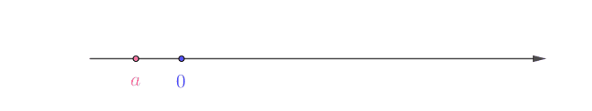

增加复数轴后，a 的运动有了更高的自由度，其在实数轴的运动观测就跟上图一样：

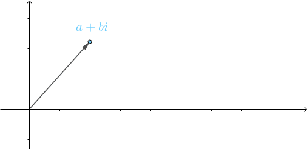

#### 四元数

q = a + b i + c j + d k, (a, b, c, d ∈ R)

q 可以写成向量形式：q = [a, b, c, d]^T

我们经常需要将四元数的实部和虚部分开，并用一个三维向量来表示虚部：q = [s, v]^T, (v = [x, y, z]^T, s, x, y, z ∈ R)

i^2 = j^2 = k^2 = i j k = -1；**不满足乘法交换律**

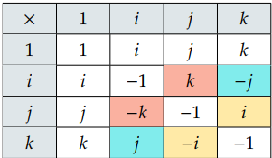

表格左侧元素右乘以顶行元素，带颜色的格子表示乘法交换律不成立

四元素乘法简化：

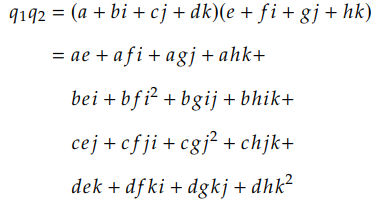

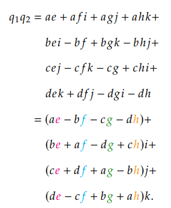

矩阵形式：

左乘：

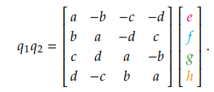

右乘：

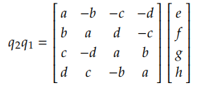

对任意四元数，q1 = [s, v], q2 = [t, u], q1 q2 结果为

q1 q2 = [st - v·u, su + tv+ v×u]

#### 四元数与 3D 旋转

一个向量 v 沿着一个用单位向量所定义的旋转轴 u 旋转 θ 度（轴角式）。我们可以将向量 v 拆分为正交于旋转轴的 v_⊥ 以及平行于旋转轴的 v\_∥。我们可以对这两个分量分别进行旋转，获得 v'\_⊥和 v'\_∥，将它们相加就是 v 旋转后的 v'。将这些向量定义为纯四元数：

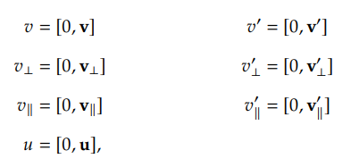

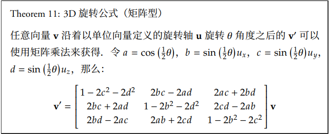

四元数和 3D 旋转关系不是一一对应的，同一个 3D 旋转可以用两个不同的四元数表示。对任意单位四元数 q = [cos(1/2 θ), sin(1/2 θ) u]，q 和 -q 代表同一个旋转。如果 q 表示沿着旋转轴 u 旋转 θ 角度，那么 -q 表示沿着相反旋转轴 -u 旋转 (2Π - θ) 度

#### 四元数插值：

假设两个旋转变换 q0 = [cos(θ0), sin(θ0) u0] 和 q1 = [cos(θ1), sin(θ1) u1]，我们希望找出一些中间变换 qt，让初始变换 q0 能够平滑地过渡到最终变换 q1，t ∈ [0, 1]。

旋转的变化量仍是一个旋转，这个旋转拥有某个固定的旋转轴 ut，我们只需要缩放这个变换对应的角度 φ 就能达到插值的目的。

##### **Lerp 插值法：**

线性插值，会沿着一条直线插值，如果将 v0 和 v1 看作三角形的两边，那么 vt 会指向三角形的第三边：

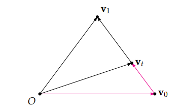

vt 可以写成两个向量的和，其中一个是 v0，另一个是 (v1 - v0) 乘上一个系数。应用在四元数上为：

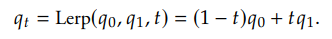

我是沿着直线进行插值（圆上的弦），这样插值出来的四元数不是单位四元数

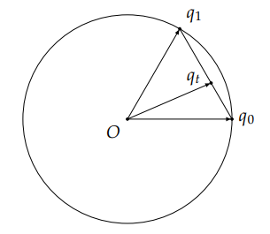

##### **Nlerp 插值法：**

将 qt 除以它的模长，就能够转化为一个单位四元数了。这种先对向量进行插值，再进行正规化的插值方法称为正规化线性插值。Nlerp 的两个输入向量必须是单位向量，否则插值出来的结果不会经过初始和最终向量。

向量和四元数的 Nlerp 公式：

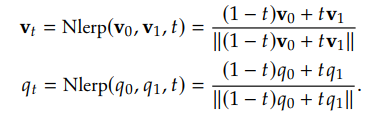

Nlerp 插值仍有一些问题，但插值的弧比较大时， vt 的角速度会有显著变化。

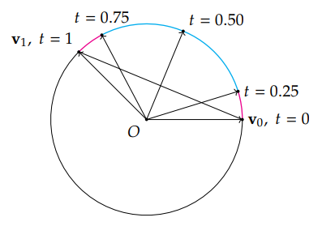

虽然弦上是等分的，但是四个弧是完全不相等的。相同时间内 vt 扫过的角度不同。Nlerp 插值不能保证均匀的角速度。

##### Slerp 插值法：

对角度进行线性插值直接是让向量在球面上的一个弧上旋转，又称为球面线性插值。

向量公式：

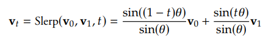

四元数公式：

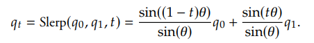

如果插值角度小的话，Nlerp 相对于 Slerp 误差并没有那么大，为了提高效率，经常用 Nlerp 代替 Slerp。

#### 双倍覆盖的问题

虽然 q 和 -q 对应的同一个旋转，但是对应的弧度确实不同，对插值有所影响。我们希望插值按空间弧面最短路径进行，需要先检测旋转角度是否为钝角，即检查点积 q0 · q1 是否为负数。如果为负数，就反转其中一个四元数，用新夹角进行插值，才能保证插值路径最短。

##### 贝斯尔曲线：

Slerp 虽然是对角度进行线性插值，旋转角速度虽然是固定的，但仅仅是对当前两个四元数而言，当切换插值四元数时候，就可能出现切换点不可导情况。例如从 q0q1 到 q1q2 的插值过程，角速度会突然发生改变。我们希望牺牲固定角速度，让插值曲线不仅连续，而且让它的一阶导数甚至高阶导数是连续的。目前最常见而且最直观的方法是球面四边形插值 Squad。

假设有一个向量序列 v0, v1, ... vn，我们可以分别对每一对向量 v0v1, v1v2, ... 进行插值，然后将曲线连接起来，也就是我们说的样条。

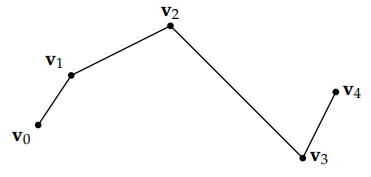

虽然曲线连续，但是他们的一阶导数（切线）在切换插值向量时候都不是连续的。此时需要用到贝塞尔曲线（Bézier）。其中 v1, v2, v3 作为控制点，最终得到的贝塞尔曲线虽然可导，但是插值曲线不会经过中间的向量：

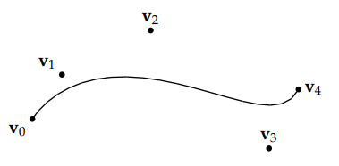

为解决这个问题，可以分段对每对向量 vi 和 vi+1 之间使用贝塞尔曲线进行插值，之后将所有曲线连接起来。因为需要一阶导数连续，还需要知道它们的前一个向量 vi-1 和后一个向量 vi+2，并用它们生成两个控制点 si 和 si+1 来控制曲线趋势。我们使用 vi 和 vi+1 作为端点，si 和 si+1 作为控制点，使用一个三次的贝塞尔曲线来近似两个向量之间的插值。

如果想让最终插值曲线达到一阶导数连续，需要让前一个样条在 vi 的控制点与当前样条在 vi 的控制点分别处于最终曲线在 vi 处切线对等的两侧：

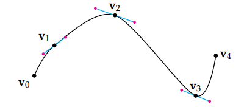

红点为3次贝塞尔曲线的控制点，分别出于切线对等的两侧，对于 v0 和 v4，直接将这两个向量的控制点取为它们本身，最终得到一个平滑的曲线。

##### 德卡斯特里奥算法（de Casteljau ）：

贝塞尔曲线的构造有一个著名的递归算法——德卡斯奥里特算法，它对任意次的贝塞尔曲线都成立。这个算法的基本思想是线性插值的嵌套。

假设有四个向量 v0, v1, v2, v3，首先对每对向量进行线性插值，获得 v01, v12, v23, v34：

v01 = Lerp(v0, v1;t)； v12 = Lerp(v1, v2; t)；v23 = Lerp(v2, v3; t)；

之后对 v01, v12 和 v12, v23 这两对向量进行线性插值，获得 v012 和 v123：

v012 = Lerp(v01, v12; t)；v123 = Lerp(v12, v23; t)；

最后对 v012 和 v123 进行线性插值得到 v0123：v0123 = Lerp(v012, v123; t)；

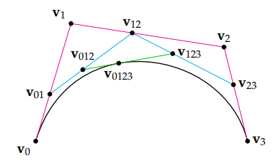

该递归公式运用到四元数上，需要将 Lerp 线性插值改为 Slerp， 得到球面贝塞尔曲线公式，将 Slerp(qi, qi+1; t) 简写为 S(qi, qi+1; t)：

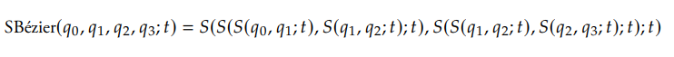

##### Squad 算法：

Squad 是德卡斯特里奥算法的近似算法，简化计算过程。

在平面中的应用称为 Quad 算法。使用的是一层二次插值，嵌套了一层一次的插值，首先对 v0v3 和 v1v2 进行插值：

v03 = Lerp(v0, v3; t)；v12 = Lerp(v1, v2; t)；

之后，使用 2t(1-t) 为参数，对 v03 和 v12 进行二次插值，得到 v0312：

v0312 = Lerp(v03, v12; 2t(1-t))；

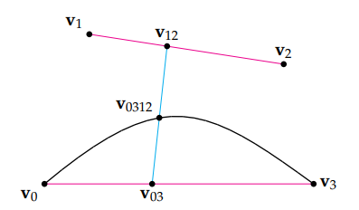

下图中左边是 3 次贝塞尔曲线，右边是 Quad 曲线：

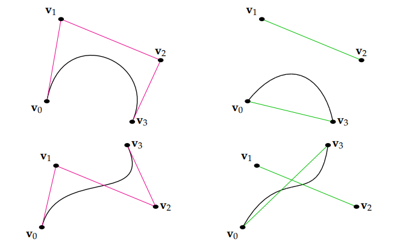

我们将 Quad 递归公式用于球面，就得到四元数的 Squad 公式：

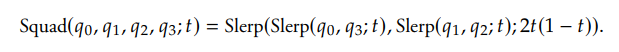

Squad 仍受到双重覆盖的影响，插值前仍需要检测与其他四元数的夹角是否是钝角，钝角的话需要翻转，将插值路线减到最小。

