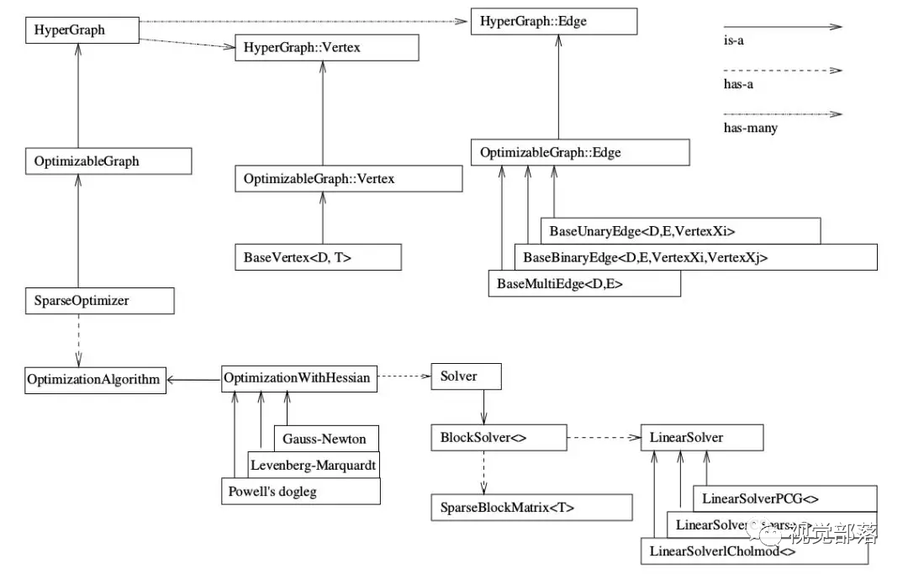

#### 优化

也叫作最优化，指在一定约束条件下，求解一个目标函数的最值问题。

数学优化的定义为：给定一个目标函数（代价函数）f，寻找一个变量 x* ∈ D ，使得 f(x*) 是 f(x) 中的最值，其中 D 为约束集，也叫可行域，D 的变量称为可行解。

##### 无约束优化和约束优化

对 x ∈ R 的优化属于无约束优化；

约束优化中的 x 需要满足一些等式或不等于的约束，通常可以通过拉格朗日乘数进行求解

##### 优化算法

优化问题一般通过迭代方式求解：通过猜测初始估计 x0，然后不断迭代产生新的估计 x1，x2，... xt，希望 xt 最终收敛到期望的最优解 x*。一个好的优化算法是在一定时间或空间复杂度下快速准确地找到最优解，同时受初始猜测影存在响较小，通过迭代找到 x\* 的邻域，然后收敛于 x\*。

#### 图

在离散数学中，图(Graph)是用于表示物体与物体间存在某种关系的结构。数学抽象后的“物体”称为节点或顶点，节点间的相关关系称为边。在描述一张图的时候，通常用一组点表示节点，其间的边则用直线或曲线。

边可以是有方向或没方向的，称为有向图和无向图。

##### 图的遍历：

1. 深度优先遍历：

   从一点出发，碰到死路返回上一个位置。这种不撞南墙不回头的方法不能找到最优路线，但好处是需要记录的位置少；

2. 广度优先遍历：

   把所有可能的路都走一遍，如果没有目标，就增加走的距离再走一遍所有路径，直到找到目标，可以找到最优解，但是记录太多；

#### 图优化

#### g2o库

编写一个图优化的程序需要从底层到顶层逐渐搭建，参照g2o官方框架图（上方），步骤可以分为6步：

1. 创建一个线性求解器LinearSolver。
2. 创建BlockSolver，并用上面定义的线性求解器初始化。
3. 创建总求解器solver，并从GN/LM/DogLeg 中选一个作为迭代策略，再用上述块求解器BlockSolver初始化。
4. 创建图优化的核心：稀疏优化器（SparseOptimizer）。
5. 定义图的顶点和边，并添加到SparseOptimizer中。
6. 设置优化参数，开始执行优化。