简单随机抽样：从总体 N 中任一抽取 n 个样本，每个样本被抽到的概率相等。

系统抽样：将总体 N 依据一定的抽样距离（抽样规则）分为 n 个部分，再从每部分抽取一个样本。

分层抽样：将总体 N 按规矩划分为不同层，然后从不同层中独立，随机地抽取样本，提高估计精度。

以上每个样本被抽到的概率都是相同的。

普查：对统计总体的全部单位进行调查以搜集资料。

抽样调查：一种非全面调查，它是从全部调查研究对象中，抽选一部分单位进行调查，并据以对全部调查研究对象做出估计和推断的一种调查方法。

- 算术平均数：

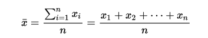

缺点：容易收到极端值影响；

- 几何平均数：

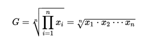

优点：适用于比率、指数、具有等比或近似等比关系的数据的平均，计算数据平均增长率；

​            收极端值影响较小；

- 调和平均数：不适合含 0 的数据

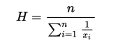

优点：计算平均速率

例子：

经典的例子是以不同的速度通过相同的距离。

考虑一次去便利店并返回的行程：

去程速度为30 mph
返程时交通有一些拥堵，所以速度为10 mph
去程和返程走的是同一路线，也就是说距离一样（5英里）

利用调和平均数：2 / (1/30 + 1/10) = 15

- 平方平均数：

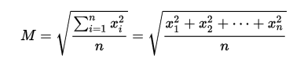

优点：2次方的广义平均数表达

- 加权平均数：

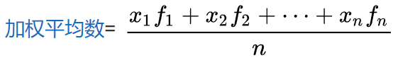

f1 + f2 + ... + fn = 1；

方差：方差用来计算每一个变量（观察值）与总体均数之间的差异。为避免出现离均差总和为零，离均差平方和受样本含量的影响，统计学采用平均离均差平方和来描述变量的变异程度。

总体的方差计算公式：

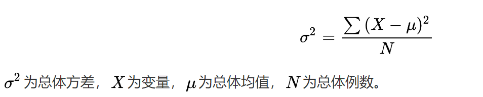

实际工作中总体均值难以得到，下面是抽样的方差计算公式：

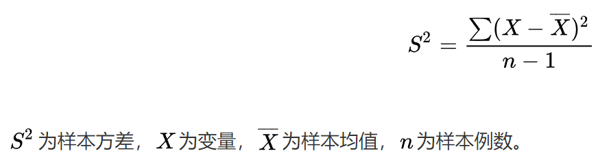

注意分母是 n-1，如果是 n 的话抽样得到的方差估计比实际方差值小；

标准差：

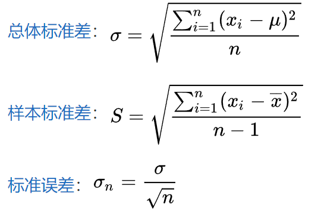

极差：

其最大值与最小值之间的差距，即最大值减最小值后所得之数据。

数学期望：试验中每次可能结果的概率乘以其结果的总和，是最基本的数学特征之一。它反映随机变量平均取值的大小。

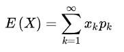

## 贝叶斯定理 

随机事件发生的概率（先验）随着相关条件的发生而改变（后验），一个命题真假的信念即主观概率随着相关证据的发现而改变。当正相关条件发生时，条件概率上调，当负相关条件发生时，条件概率下调。当有利证据发现时，主观概率上调，当不利证据发现时，主观概率下调。

条件概率 P(A|B) 表示随机事件 B 发生的前提下，随机事件 A 发生的概率。

条件概率 P(A|B) 是后验概率，P(A) 是对应的先验概率。

P(A|B) P(B) = P(B|A) P(A) 

表示：事件 B 发生的条件下事件 A 发生的概率 = 事件 A 发生的条件下事件 B 发生的概率，转换后如下：

P(A|B) = P(B|A) P(A) / P(B) 这就是贝叶斯定理

假如事件 x 发生的时候， 一定包含事件 w1 或者事件 w2 发生，那么有如下公式：

P(x) = P(x | w1)P(w1) + P(x | w2)P(w2)

假如事件 x 发生的时候，同时可能有事件 w1 、w2  ... wn 其中之一发生，那么有公式：

P(x) = P(x | w1)P(w1) + P(x | w2)P(w2) + ... + P(x | wn)P(wn)

这里称 P(x | wn) 为 wn 关于 x 的似然函数

示例1：

某网站 10000 个账户有 89% 为真实账户（记为C0），11%虚拟账户（记为C1）

账户特征有：

F1：日志数量/注册天数

F2：好友数量/注册天数

F3：是否使用真实头像（真实头像为1，非真实头像为0）

某个账户 F1 = 0.1；F2 = 0.2；F3 = 0；

判断账户是真实账户还是虚假账户？

用朴素贝叶斯分类器计算，式子有：P(F1|C) * P(F2|C) * P(F3|C) * P(C)

这里的 F1 和 F2 是连环变量，不适宜用某个特定值计算概率。

一种方式是将连续值变为离散值，计算区间概率。例如将 F1 分解成[0，0.05]、(0.05，0.2)、[0.2，+∞]三个区间，计算每个区间的概率，这里 F1 = 0.1，在第二区间，可得：

P(F1|C0) = 0.5，P(F1|C1) = 0.1

P(F2|C0) = 0.7，P(F2|C1) = 0.2

P(F3|C0) = 0.2，P(F3|C1) = 0.9

因此：

P(F1|C0) * P(F2|C0) * P(F3|C0) * P(C0) = 0.0623

P(F1|C1) * P(F2|C1) * P(F3|C1) * P(C1) = 0.00198

该账户是真实账户的概率是假账户概率的 30 倍。

示例2：

人类特征统计资料：

　　性别　　身高（英尺）　体重（磅）　　脚掌（英寸）

　　男 　　　6 　　　　　　180　　　　　12
　　男 　　　5.92　　　　　190　　　　　11
　　男 　　　5.58　　　　　170　　　　　12
　　男 　　　5.92　　　　　165　　　　　10
　　女 　　　5 　　　　　　100　　　　　6
　　女 　　　5.5 　　　　　150　　　　　8
　　女 　　　5.42　　　　　130　　　　　7
　　女 　　　5.75　　　　　150　　　　　9

已知某人身高6英尺、体重130磅，脚掌8英寸，请问该人是男是女？

朴素贝叶斯分类器：P(身高|性别) * P(体重|性别) * P(脚掌|性别) * P(性别)

由于身高，体重，脚掌是连续变量，不能用离散变量的计算办法，样本少不能分区间；

这时候可以假定男性女性的身高，体重，脚掌符合正态分布，通过样本计算均值和方差，也就是正太分布的密度函数，再代入值得到某点的密度函数值。

男性身高是均值 5.855，方差0.035的正太分布。所以男性身高 6 英尺的概率相对值是 1.5789（这里的概率是密度函数反应的各个值相对可能性）

　　P(身高=6|男) * P(体重=130|男) * P(脚掌=8|男) * P(男)
　　　　= 6.1984 * e-9

　　P(身高=6|女) * P(体重=130|女) * P(脚掌=8|女) * P(女)
　　　　= 5.3778 * e-4

女性的概率比男性高出10000倍。

#### 分类加法&分步乘法

分类加法：

完成一件事情有 n 类办法，第 1 类有 m1 种不同的办法，第 2 ，类有 m2 种不同的办法，第 n 类有 mn 个不同的办法，那么完成这事就有 N = m1 + m2 + ... + mn 个不同的办法。

分步乘法：

完成一件事情需要 n 个步骤，第 1 个步骤有 m1 种不同的办法，第 2 个步骤有 m2 种不同的办法，第 n 个步骤有 mn 个不同的办法，那么完成这事就有 N = m1 * m2 * ... * mn 个不同的办法。

#### 排列组合

P 排列，表示有顺序地抽取。n 表示总数，m 表示抽出的个数

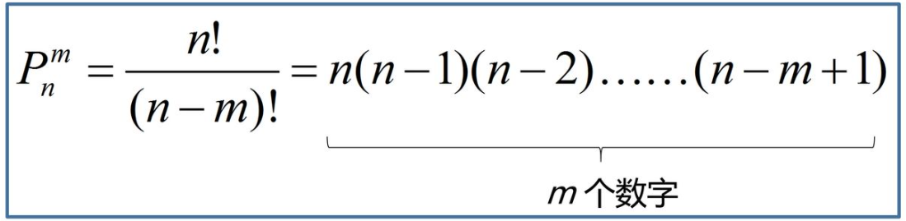

C 组合，表示不计顺序地抽取。n 表示总数，m 表示抽出的个数

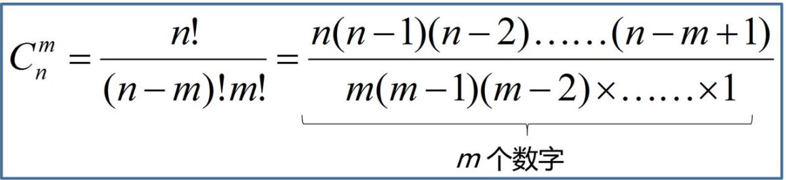

#### 二项分布

n个独立的是/非试验中成功的次数的离散概率分布，其中每次试验的成功概率为p。这样的单次成功/失败试验又称为伯努利试验（两点分布）。实际上，当n = 1时，二项分布就是伯努利分布。二项分布是显著性差异的二项试验的基础。n次试验中正好得到k次成功的概率由概率质量函数给出：

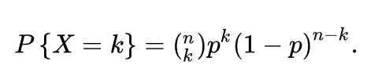

其中(n k)等于：

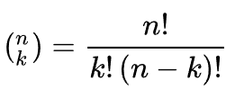

是二项系数，该公式可以用以下方法理解：我们希望有k次成功(p)和n−k次失败(1 −p)。并且，k次成功可以在n次试验的任何地方出现，而把k次成功分布在n次试验中共有

个不同的方法。

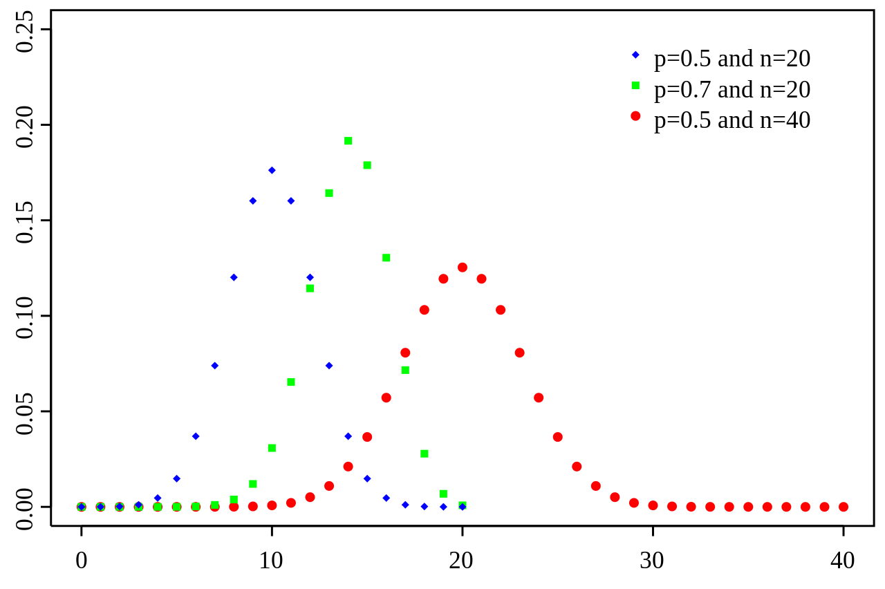

