#### 向量：

1. 具有方向和常量大小的线段（物理）
2. 有序数字列表（计算机）
3. 两向量相加及其数字与向量相乘具有意义即可（数学）

**向量的加法和数乘在线性代数中起到重要作用**

矩阵表达：

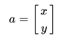

**向量加法**：

va + vb 几何意义是把 vb 的起点移动到 va 的终点，从 va 起点到 vb 终点的新向量

va = [xa, ya]，vb = [xb, yb]，va + vb = [xa + xb, ya + yb]

**向量减法**：

va - vb 几何意义是把 vb 的起点移动到 va 的起点，从 vb 的终点指向 va 的终点的新向量：va = [xa, ya]，vb = [xb, yb]，va - vb = [xb - xa, yb - ya]

**向量数乘**：

va * n 几何意义是把 va 放大 n 倍，如果 n 为负数表示方向取反

va = [xa, ya]，va * n = [n * xa, n * ya]

**向量点乘（内积/数量积）**：

向量a · 向量b = xa * xb + ya * yb = |a| * |b| * cosθ

向量a · 向量b = [{xa}, {ya}] · [{xb}, {yb}] = xaxb + yayb

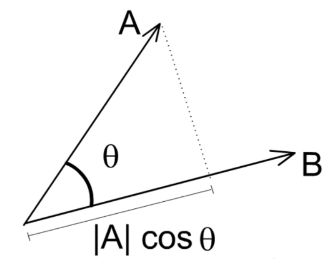

几何意义：向量a 在向量b 方向上投影与|b|的乘积，反应两个向量的相似度，结果越大越相似。

向量a · 向量b > 0：方向基本同向，夹角在0°到90°之间

向量a · 向量b = 0：向量正交，互相垂直

向量a · 向量b < 0：方向相反，夹角在90°到180°之间

在图形中，点积有下面的作用：

- 求两个向量的角度（例如光源和表面的夹角和余弦）
- 寻找一个向量投影到另一个向量的样子
- 测量两个方向的接近程度
- 确定向前还是向后

**向量叉乘（外积/向量积）**：

向量a x 向量b = (ya * zb - za * yb, za * xb - xa * zb, xa * yb - ya * xb)

​                         = |a| * |b| * sinθ * 向量n（向量n 是向量ab 所在平面的单位法向量）

**方向由右手法则确定**

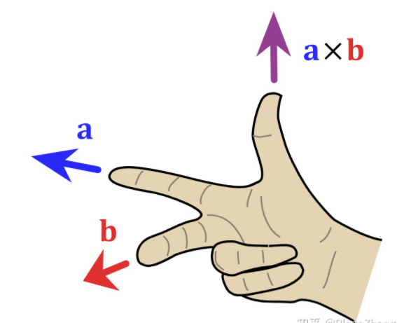

几何意义：如果向量a 和向量b 构成平行四边形，那么外积的模长与该四边形的面积相等。

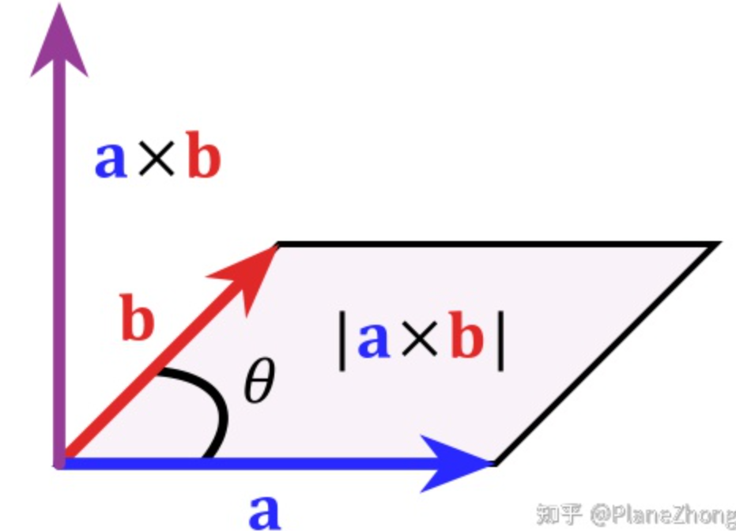

在图形中，叉积有下面的作用：

- 向量的叉积可以建立三维中的直角坐标系
- 判断左或右
- 判断内或外

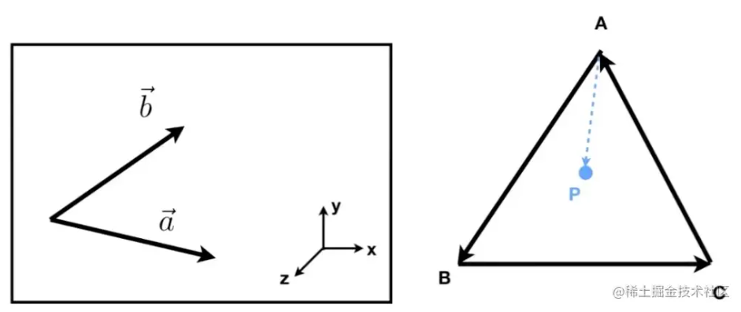

向量 a x 向量 b，得到的结果新向量是正的，判定 b 在 a 的左侧；

判断点 p 是否在三角形内部。在平面内可以使用**同向法**，在三维中可以使用**射线相交法**

**同向法：**

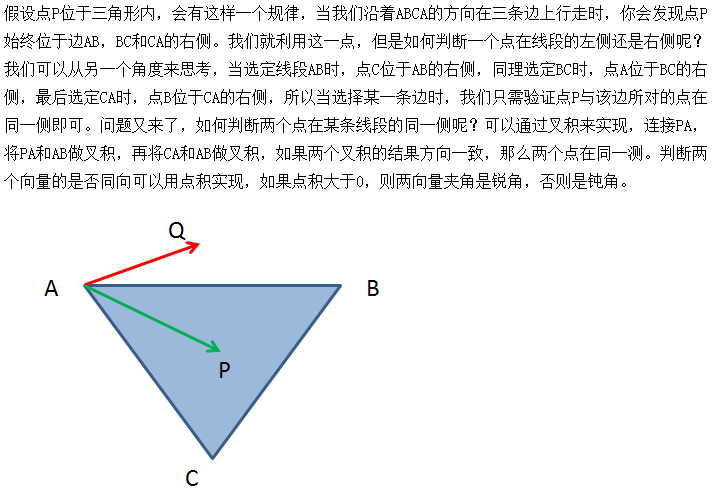

**射线相交法：**

**任何复杂的三维模型都可以视作空间三角面片的集合**

空间一射线，起点为 O，方向为 D，根据射线的参数公式，其上任意一点 P（交点）为：P = O + tD

已知空间三角面片三个顶点为 v1，v2，v3，那么容易求得三角形的法向量 n。面上的向量(v1 - P) 与 n 是垂直的，所以它们的点积为 0：(v1 - P) · n = 0

综上有 t = ((v1 - O) · n) / (D · n)

最后再用同向法得到结果

#### 矩阵在图形中普遍用于表示变换：平移，旋转，剪切，缩放

矩阵乘法条件为 A 的列数要等于 B 的行数：A B = (M x N) (N x P) = (M x P)

矩阵乘法满足结合律和分配律，一般不满足交换律

矩阵转置：(A B)^T = B^T A^T

单位矩阵（对角矩阵）：I_3x3 = [{1, 0, 0}, {0, 1, 0}, {0, 0, 1}]

矩阵的逆：A A^-1 = A^-1 A = I，(A B)^-1 = B^-1 A^-1

向量乘法的矩阵形式：

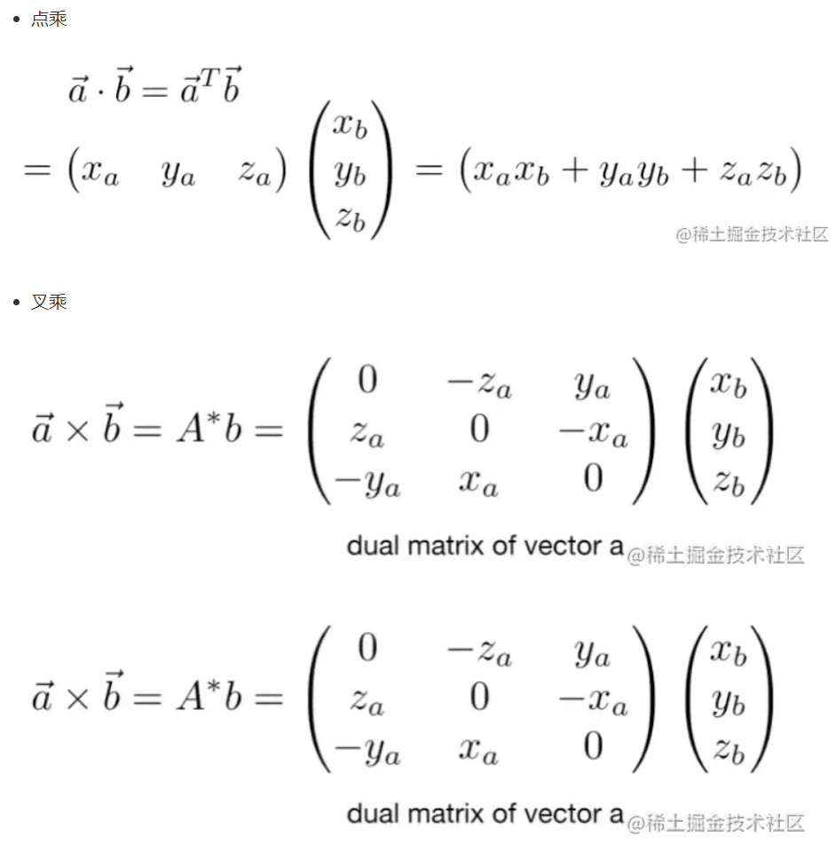

#### 2 维变换

使用矩阵表示变换（线性变换）：旋转，缩放，剪切

**缩放变换：** 

x' = s x ; y' = s y;

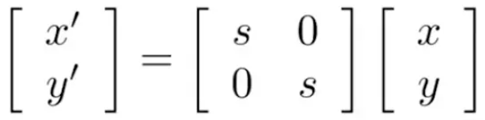

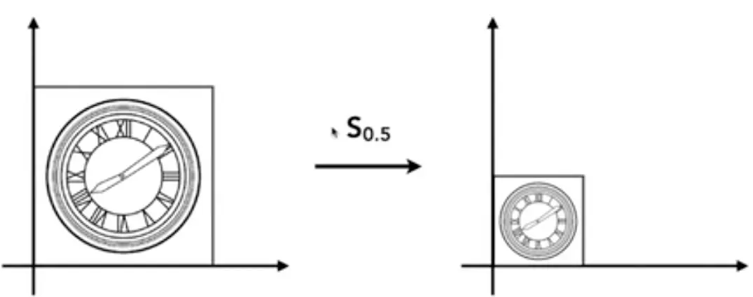

**反射变换：**

x' = -x ; y' = y;

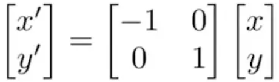

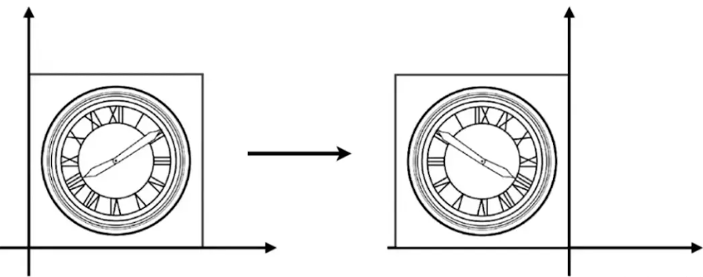

**剪切变换：**

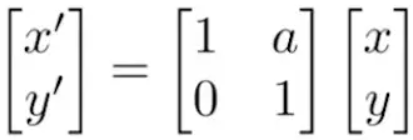

水平位移在 y = 0 处为 0；水平位移在 y = 1 处为 a；垂直位移始终为 0；

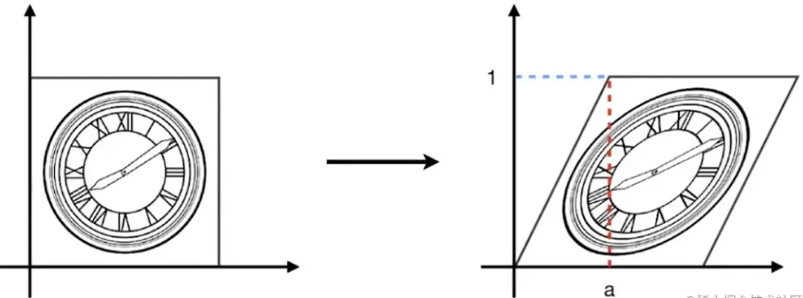

**旋转矩阵：**

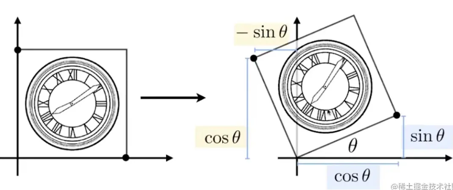

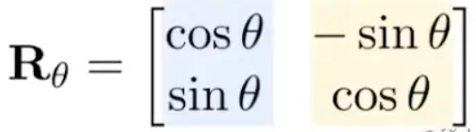

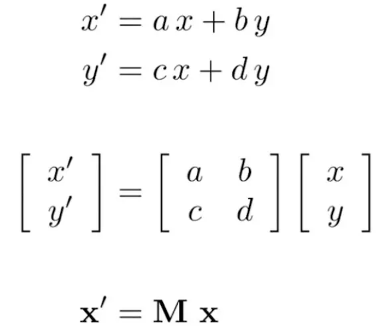

**<u>齐次坐标</u>：**

平移不是线性变换，只能这么表示：

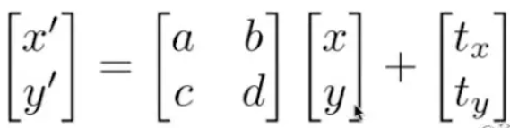

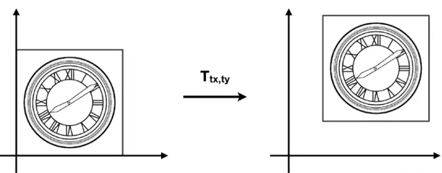

但我们不希望平移变成一个特殊的变换，用一种统一的方式来表示所有的变换——**齐次坐标**

添加第三个坐标：

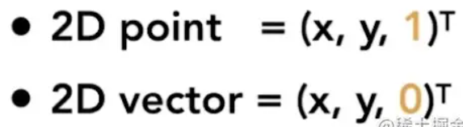

平移变换的矩阵表示：

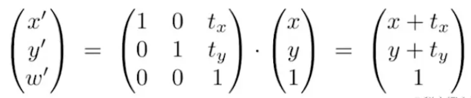

结果中 w 坐标为 1 或 0 则操作有效

**仿射变换：**

仿射变换 = 线性映射 + 变换

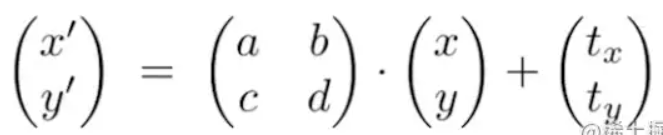

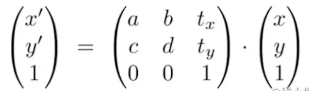

利用齐次坐标表示缩放旋转平移：

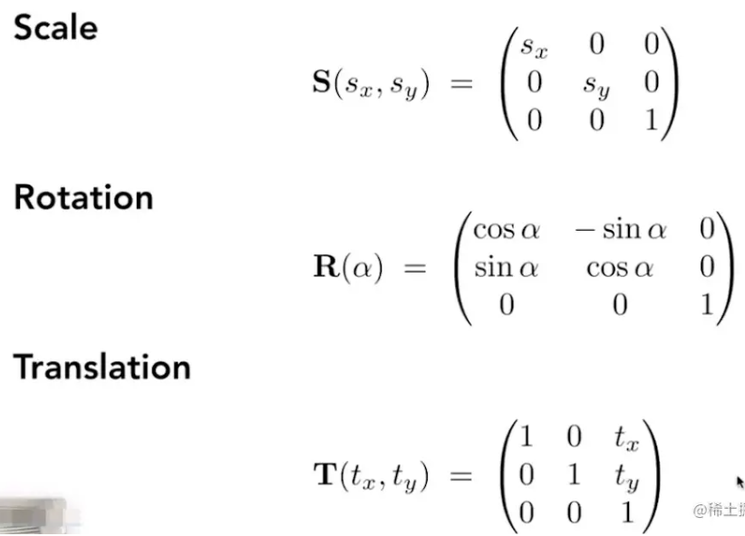

**<u>使用齐次坐标，任何一个点要写成 (x, y, 1)，任何一个向量要写成 (x, y, 0)</u>**

**逆变换：**

把一个变换的操作反过来，就是逆变换，也是变换矩阵的逆。

#### 3 维变换

**仿射变换：**

使用齐次坐标表示：表示点的时候 w = 1，表示向量的时候 w = 0，当 w != 1 和 w != 0 时候， x y z 同除以 w 即可

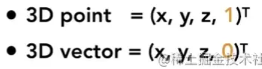

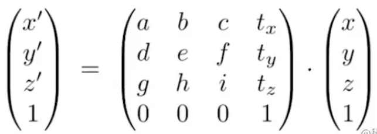

**缩放变换：**

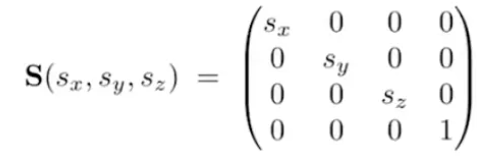

**平移变换：**

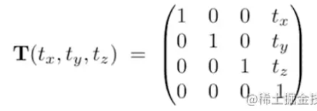

**旋转变换：**

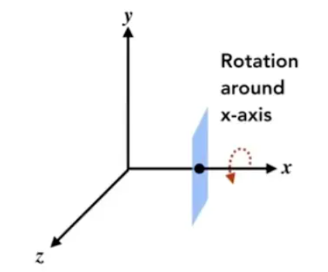

绕某个固定轴旋转：

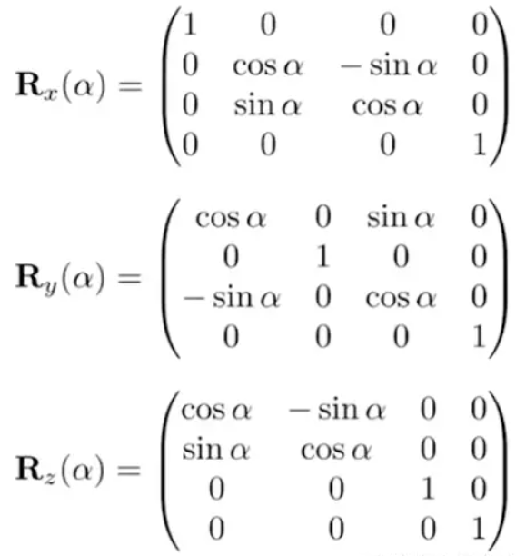

- 绕某个轴旋转，对任意一个点，该轴上的坐标是不变的
- 因为是右手螺旋定则，z 叉乘 x 得到的 y，所以如图的 y 矩阵是反的

**正交矩阵：**

一个矩阵的逆等于它的转置，这个矩阵称为正交矩阵。

#### 视图变换：

#### 投影变换：

透视投影 和 正交投影

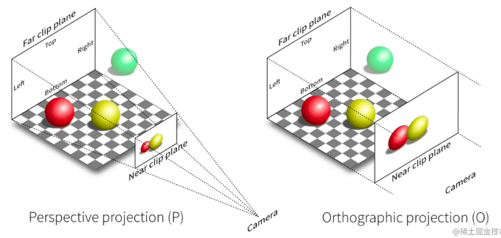

#### 正交投影：

#### 线性组合：

一组向量中，各个向量通过向量数乘的和

向量组 A : va1, va2, ... van

实数组 K : k1, k2, ... kn

线性组合：vb = k1 * va1 + k2 * va2 + ... + kn * van

这里称，vb 向量能用向量组 A 线性表示

#### 张成空间：

所有可以表示为给定的向量线性组合的向量的集合，称为给定向量的张成空间。

#### 线性相关，线性无关：

当一组向量中移除了至少一个向量后，剩下的向量组成的张成空间不变，那么称这组向量线性相关。

其意义是移除的向量，可以由剩下的向量通过线性组合来表示，所以张成空间不变。

相反的，如果一组向量中增减新向量后，其张成空间发生变化，那么称这组向量线性无关。

其意义是这组向量中任何一个向量都不能由其他向量通过线性组合来表示。

#### 基向量：

张成空间中一个线性无关向量的集合。

#### 向量的变换：

接收一个向量并且输出一个向量的变换（向量的函数）

#### 线性变换：

变换后，直线仍是直线，原点固定，称为线性变换

**向量在线性变换前是基向量的特定线性组合，在线性变换后，是变换后的基向量的相同特定线性组合。**

所以只需要关注基向量的线性变换，便可以推断出基向量的张成空间的变换。

e.g. 

平面中 x 轴基向量 u = [1, 0]，y 轴基向量 v = [0, 1]，向量 w = [3, 0]

w = 3 * u + 0 * v；

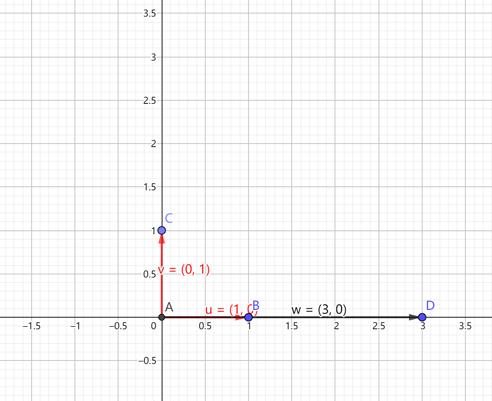

线性变换后 w 变为 w‘ = [3, 3]，设变换后的基向量 u 变为 u'，v 变为 v'

变换后的 w' 仍是基向量 u' 和 v' 相同的特定线性组合，所以有

w' = 3 * u' + 0 * v' = 3 * [1, 1] + 0；

所以变换后的 u' 是 [1, 1]

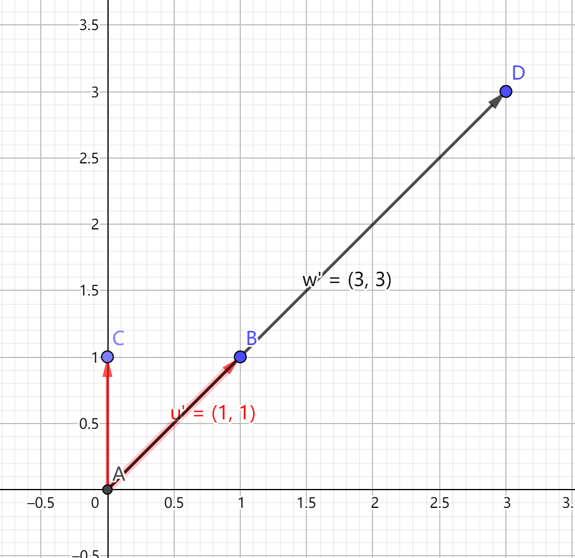

e.g.

平面中 x 轴基向量 u = [1, 0]，y 轴基向量 v = [0, 1]，向量 w = [3, 3]

w = 3 * u + 3 * v；

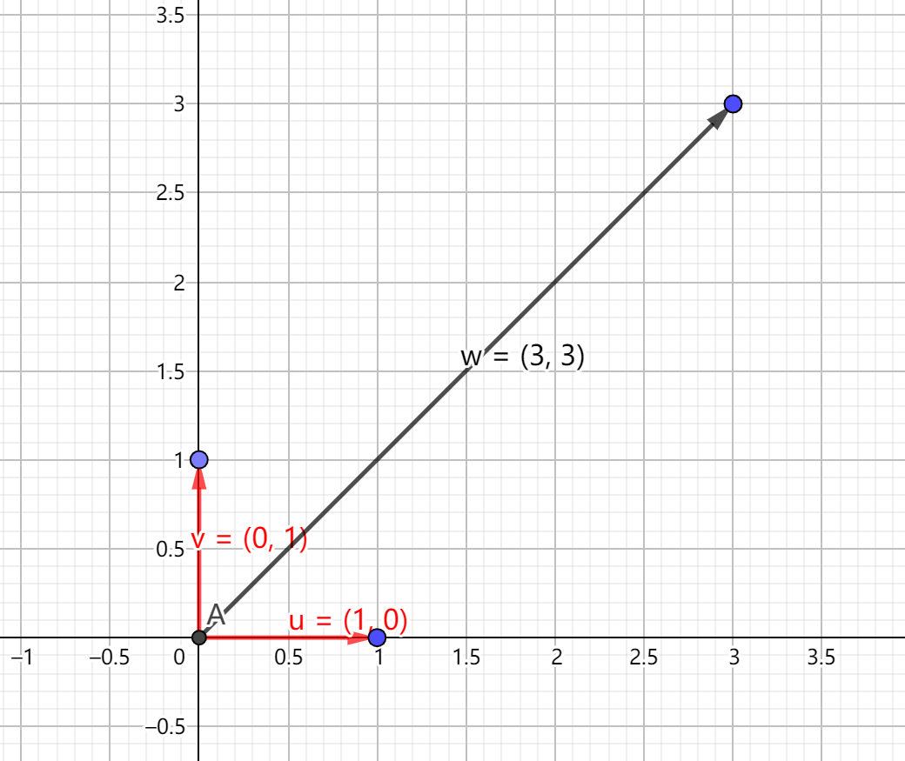

线性变换后 u' = [1, 1]，v' = [-1, 1]

w' = 3 * u' + 3 * v' = [0, 6]

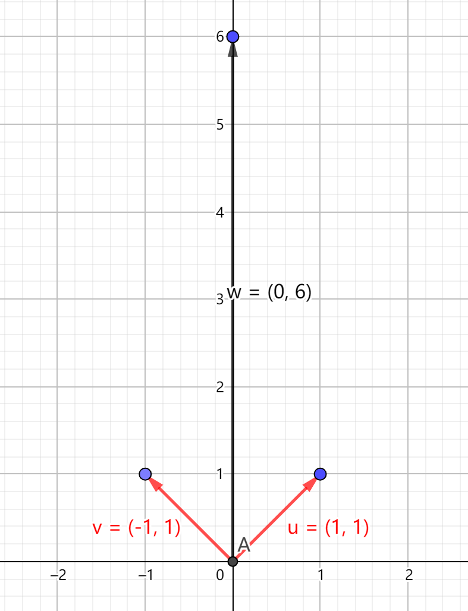

矩阵表示，：

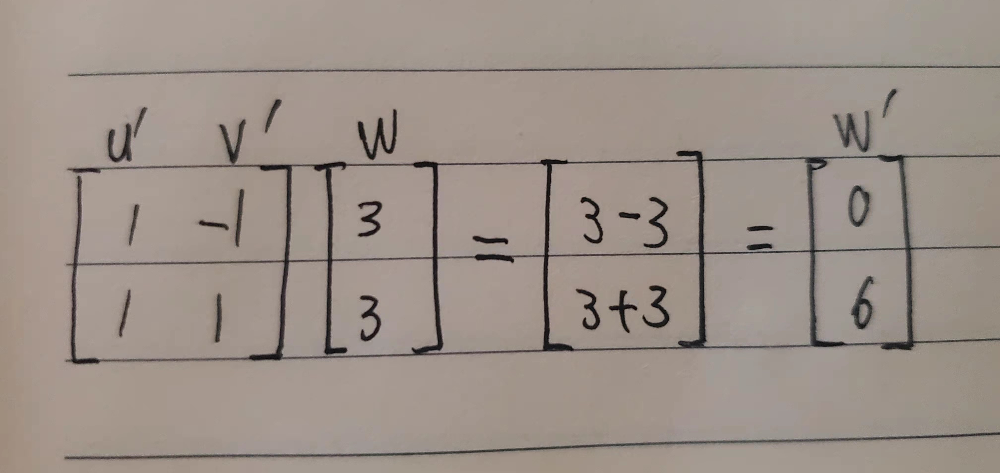

#### 迹：

主对角线（左上角-右下角）的元素和

#### 行列式：

线性变换的矩阵的行列式，几何意思上是变换后新的基向量的面积（2\*2行列式）或者体积（3\*3行列式）的**伸缩倍率**

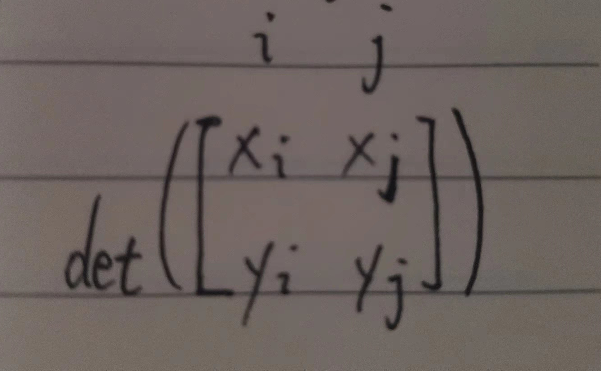

[x_i, y_i] 是基向量 i 线性变换后的坐标，[x_j, y_j] 是基向量 j 线性变换后的坐标，det() 行列式得到基向量线性变换后的面积伸缩倍率。

由于基向量 i 和 j 是单位基向量，所以行列式的值也可以视为面积。但本质还是伸缩倍率。

矩阵的行列式面积**为 0（新的基向量共线，甚至是为 0），表示该线性变换将空间压缩到更小维度。**

对于矩阵 M1,M2，有 det(M1 M2) = det(M1) * det(M2)

这里 det(M1 M2) 是经过了 M2，M1 线性变换后的伸缩倍率，det(M1) * det(M2) 是先经过 M2 变换的伸缩，再经过 M1 变换的伸缩，所以是相等的。

#### 逆变换：

矩阵的逆变换，是和矩阵完全相反的变换，表示为 M^-1

经过 M 变换和 M^-1 变换后，向量不会发生改变。

即 M^-1 M = [{1, 0}, {0, 1}]           <u>[]是矩阵的列，{} 是矩阵的行</u>

**行列式不为 0，就存在逆变换。**

#### 矩阵解线性方程组：

线性方程组：

a1 * x + b1 * y + c1 * z = d1

a2 * x + b2 * y + c2 * z = d2

a3 * x + b3 * y + c3 * z = d3

用矩阵来表达为：

[{a1, b1, c1}, {a2, b2, c2}, {a3, b3, c3}] [x, y, z] = [d1, d2, d3] 简化为

M v = v'

这里表示向量 v = [x, y, z] 经过某个线性变换 M 后得到向量 v‘ = [d1, d2, d3]，等式左右同左乘 M^-1，得

M^-1 M v = M^-1 v'       即   v = M^-1 v'

求得 M^-1 v' 也就得到了 v 的特定解

如果 M 的行列式为 0，没有逆变换，线性方程组仍可能有解。

M v = v' 表示经过 M 变换后，空间降维，从体积变为面积，或者线段，如果 v 恰好在该面积或线段上，仍是有解。

#### 秩：

秩表示经过线性变换后，空间的维数。

秩 = 1，表示变换后空间维数为 1，即直线。秩 = 2，表示变换后空间维数为 2，即平面。等等。

#### 列空间：

所有经过 M 线性变换后可能存在的向量，称为 M 的列空间。

列空间即是经过 M 变换后得到的基向量的所有线性组合（张成空间）

当秩最大时候，也就是和变换矩阵的列数相等时候，称为满秩。

变换后落在原点的向量集合称为零空间或者核。

#### 特征向量：

一个空间经过线性变换后，其中仍存在于自己（单独一个向量）的张成空间的向量。

单独一个向量的张成空间，也就是该向量所在轴。

例如一个平面绕着 x 轴旋转，那么 x 轴上的向量就是特征向量。

绕着原点旋转所有向量都发生变化，故不存在特征向量。

#### 特征值：

特征值即是特征向量的经过线性变换后的伸缩值。

M v = k v = k I v

M 是线性变换矩阵，v 是特征向量，k 是特征值，I 是单位矩阵[{1, 0, 0}, {0, 1, 0}, {0, 0, 1}]

公式表示特征向量 v 经过线性变换 M 后，伸缩了 k 倍。

根据上面得到了 (M - k I) v = 0

公式表示线性变换 M 经过调整后，能使 v 变为零空间。

#### 可对角化：

对角矩阵：主对角线外的元素皆为 0 的矩阵。主对角线上的元素可以为 0 或其他值。

一个方块矩阵 A ，如果存在一个可逆矩阵 P 使得 P^-1 A P 是对角矩阵，则称 A 是可对角化的。

