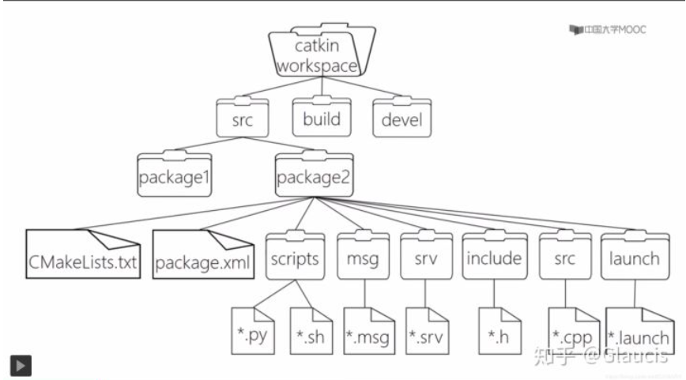

## ROS 环境管理

确保 `ROS_ROOT` 和 `ROS_PACKAGE_PATH` 两个环境变量正确设置，才能顺利查找和使用 ROS 的软件包

```sh
$ printenv | grep ROS
```

查看 ROS 的环境变量，如果缺少 ROS 环境变量，需要重新 `source` 下

```sh
$ source /opt/ros/<distro>/setup.bash
```

每个终端中使用上面命令后才可以使用 ROS 的指令，也可以在用户目录下的 `./bashrc` 文件最后添加上面命令来避免这繁琐的操作


## ROS 基础概念

#### 基本架构 (Computation Graph)

是一个由ROS进程组成的点对点网络，它们能够共同处理数据。ROS的基本计算图概念有节点（Nodes）、主节点（Master）、参数服务器（Parameter Server）、消息（Messages）、服务（Services）、话题（Topics）和袋（Bags），它们都以不同的方式向图（Graph）提供数据。

- 节点：节点是一个可执行文件，它可以通过ROS来与其他节点进行通信。
- 消息：订阅或发布话题时所使用的ROS数据类型。
- 话题（Topics）：节点可以将消息*发布*到话题，或通过*订阅*话题来接收消息。
- 主节点（Master）：ROS的命名服务，例如帮助节点发现彼此。
- rosout：在ROS中相当于 stdout/stderr（标准输出/标准错误）。
- roscore：主节点 + rosout + 参数服务器


#### 节点 (Node)

执行单元，执行具体人物的进程或者独立可执行的文件；

不同节点可以用不同的编程语言，分布运行在不同的主机中；

节点在系统中名称唯一；


#### 节点管理器 (ROS Master)

控制中心，为节点提供命名和注册服务；

跟踪记录话题，辅助节点互相查找、建立连接；

提供参数服务器，节点使用此服务器存储和检索运行时的参数


#### 话题 (Topic)

**异步通信机制**，节点间传输数据的总线；

使用 `发布/订阅` 模型，数据由发布者传输到订阅者，同一个话题的发布者和订阅者可以不唯一；


#### 消息 (Message)

话题数据，具有一定的类型和数据结构，包括 ROS 提供的标准类型和用户自定义类型；

使用编程语言无关的 `.msg` 文件定义，编译过程生成对应的代码文件


#### 服务 (Service)

**同步通信机制**，使用 `客户端/服务器 (C/S)` 模型，客户端请求数据，服务器应答数据；

使用编程语言无关的 `.srv` 文件定义请求和应答数据结构，编译过程生成对应的代码文件；


#### 话题和服务的区别

|          | 话题                       | 服务                  |
| -------- | -------------------------- | --------------------- |
| 同步性   | 异步                       | 同步                  |
| 通信模型 | 发布/订阅                  | 服务器/客户端         |
| 底层协议 | ROSTCP/ROSUDP              | ROSTCP/ROSUDP         |
| 反馈机制 | 无                         | 有                    |
| 缓冲区   | 有                         | 无                    |
| 实时性   | 弱                         | 强                    |
| 节点关系 | 多对多（一般一发布多订阅） | 一对多（一个 server） |
| 使用场景 | 数据传输                   | 逻辑处理              |


#### 参数 (Parameter)

全局共享字典，可通过网络访问的共享、多变量字典；

节点用此服务器存储和检索运行时的参数；

适合存储静态、非二进制的配置参数，不适合存储动态配置的数据；


#### 动作 (Action)

采用了服务端/客户端工作模式，有连续反馈的通信机制，可以不断反馈任务进度和取消任务；

ActionClient 向 ActionServer 发布任务目标 (goal) 和适时取消任务 (cancel)；

ActionServer 向 ActionClient 发布当前状态 (status) 、周期反馈 (feedback) 和结果 (result)（结果只发布一次）;


#### 文件系统

功能包 (Package)，基本单元，包括节点源码、配置文件、数据定义等；

CMakefiles：

package.xml：

功能包清单 (Package manifest)，记录功能包的基本信息、包括作者、许可证、依赖选项、编译标志等；

元功能包 (Meta Packages)，组织多个用于同一目的的功能包；




##### package.xml

必要的标签：

`name` 功能包名

`version` 功能包版本

`description` 描述标签，简介功能包

`maintainer` 维护者和联系方式

`license ` 许可证标签，ROS 组件一般使用 BSD 许可证


依赖项标签：

`buildtool_depend`

`build_depend`

`run_depend`


元功能包标签：

`metapackages`


## ROS 命令

#### rospack

返回文件路径

```sh
$ rospack find [package_name]
```

显示功能包一级（直接）依赖关系

```sh
$ rospack depends1 [package_name]
```

e.g.

```sh
$ rospack depends1 rospy
genpy
roscpp
rosgraph
rosgraph_msgs
roslib
std_msgs
```

显示功能包全部依赖关系

```sh
$ rospack depends [package_name]
```

#### roscd 

切换到文件路径

```sh
$ roscd [locationname[/subdir]]
```

只能切换到包含在 `ROS_PACKAGE_PATH` 环境 变量中的软件包，查看环境变量：

```sh
$ echo $ROS_PACKAGE_PATH
```

#### rosls 

直接查看软件包下的目录，而不用输入绝对路径

```sh
$ rosls [locationname[/subdir]]
```

#### rosnode

查看 ROS 运行的节点

```sh
$ rosnode list
```

查看节点信息

```sh
$ rosnode info [node]
```

e.g.

```sh
$ rosnode info /rosout
------------------------------------------------------------------------
Node [/rosout]
Publications:
 * /rosout_agg [rosgraph_msgs/Log]

Subscriptions:
 * /rosout [unknown type]

Services:
 * /rosout/get_loggers
 * /rosout/set_logger_level

contacting node http://machine_name:54614/ ...
Pid: 5092
```


#### rosrun

运行功能包内的节点

```sh
$ rosrun [package_name] [node_name]
```

e.g.

```sh
$ rosrun turtlesim turtlesim_node
```

#### rostopic

#### rosmsg

#### rosservice

#### rossrv

#### rosparam

#### rosbag

记录话题，把系统所有话题数据记录到文件 file

```sh
rosbag record -a -O file
```

复现话题

```sh
rosbag play file.bag
```


## ROS 工作空间

#### 创建工作空间 (workspace) 

src：代码空间 (source space)，功能包

build：编译空间 (build space)，编译过程的产生的中间文件

devel：开发空间 (development space)，编译后生成的可执行文件，库等

install：安装空间 (install space)，可发布的应用软件安装包


工作空间、编译、生成软件安装包

```sh
mkdir -p ~/catkin_ws/src
cd ~/catkin_ws/src
catkin_init_workspace #创建工作空间
cd ~/catkin_ws
catkin_make#编译
catkin_make install#生成软件安装包
source ~/catkin_ws/devel/setup.bash#将工作区添加到 ROS 环境中
```


#### 创建功能包

```sh
catkin_create_pkg <package_name> [depend1] [depend2] [depend3]#[]为依赖
cd ~/catkin_ws
catkin_make#编译
source devel/setup.bash#设置环境变量，系统才能找到功能包
echo $ROS_PACKAGE_PATH#查看环境变量
```

e.g.

```sh
cd ~/catkin_ws/src
catkin_create testpkg roscpp rospy std_msgs
```


#### 创建发布者

e.g. 发布 `/turtle1/cmd_vel` 话题，消息类型为 `geometry_msgs::Twist`

在 `~/catkin_ws/src/` 下创建功能包 `topictest`，在 `topictest/src` 中新建 `velocity_publisher.cpp` ，代码如下

```c++
#include <ros/ros.h>
#include <geometry_msgs/Twist.h>

int main(int argc, char** argv)
{
    //节点初始化
    ros::init(argc, argv, "velocity_publisher");
    //创建节点句柄
    ros::NodeHandle n;
    //创建 publisher，发布名为 /turtle1/cmd_vel 的 topic
    //消息类型为 geometry_msgs::Twist，队列长度 10, 只保存最新的 10 个数据
    ros::Publisher turtle_vel_pub = n.advertise<geometry_msgs::Twist>("/turtle1/cmd_vel", 10);
    //设置循环频率
    ros::Rate loop_rate(10);
    
    int count = 0;
    
    while(ros::ok())
    {
        //geometry_msgs::Twist 类型消息
        geometry_msgs::Twist vel_msg;
        vel_msg.linear.x = 0.5;
        vel_msg.angular.z = 0.2;
        
        //发布消息
        turtle_vel_pub.publish(vel_msg);
        ROS_INFO("Publish turtle velocity command[%0.2f m/s, %0.2f rad/s]",
                 vel_msg.linear.x, vel_msg.angular.z);
        
        //循环延迟
        loop_rate.sleep();
    }
    
    return 0;
}

```


配置发布者代码编译规则

在功能包的 CMakeList.txt 中设置编译代码和生成可执行文件，设置链接库：

```cmake
add_executable(velocity_publisher src/velocity_publisher.cpp)
target_link_libraries(velocity_publisher ${catkin_LIBRARIES})
```


 编译运行发布者

```sh
cd ~/catkin_ws
catkin_make
source devel/setup.bash
roscore
rosrun turtlesim turtlesim_node
rosrun topictest velocity_publisher
```


注意：

上面的 `topictest` 节点只在执行 `source devel/setup.bash` 命令的终端可见，要全局可见需要在 `~/.bashrc` 文件中添加该命令


#### 创建订阅者

e.g. 创建 `/turtle1/pose` 话题，消息类型 `turtlesim::Pose`

在 `~/catkin_ws/src/` 下创建功能包 `topictest`，在 `topictest/src` 中新建 `pose_subscriber.cpp` ，代码如下

```c++
#include <ros/ros.h>
#include "turtlesim/Pose.h"

void poseCallback(const turtlesim::Pose::ConstPtr& msg)
{
    ROS_INFO("Turtle pose:x:%0.6f, y:%0.6f", msg->x, msg->y);
}

int main(int argc, char** argv)
{
    //初始化节点
    ros::init(argc, argv, "pose_subscriber");
    //创建节点句柄
    ros::NodeHandle n;
    //创建 subscriber，订阅名为 /trutle1/pose 的 topic，注册回调函数 poseCallback
    ros::Subscriber pose_sub = n.subscribe("/turtle1/pose", 10, poseCallback);
    //循环等待回调函数
    ros::spin();
    
    return 0;
}
```


配置发布者代码编译规则

在功能包的 CMakeList.txt 中设置编译代码和生成可执行文件，设置链接库：

```cmake
add_executable(pose_subscriber src/pose_subscriber.cpp)
target_link_libraries(pose_subscriber ${catkin_LIBRARIES})
```


 编译运行发布者

```sh
cd ~/catkin_ws
catkin_make
source devel/setup.bash
roscore
rosrun turtlesim turtlesim_node
rosrun topictest pose_subscriber
rosrun turtlesim turtle_teleop_key
```


在 `turtle_teleop_key` 终端控制乌龟，在 `pose_subscriber` 会事实更新坐标


#### 发布/订阅消息的定义和使用

定义 `msg` 文件

e.g. 定义 `Person.msg` 消息数据结构

在 `~/catkin_ws/src/` 下创建功能包 `topictest`，在 `~/catkin_ws/src/topictest/` 中新建文件夹 `msg`，新建 `Person.msg` 文件，其中消息数据结构如下：

```c++
string name
uint8 sex
uint8 age

uint8 unknown = 0
uint8 male = 1
uint8 female = 2
```


在功能包的 package.xml 中添加功能包依赖

```cmake
<build_depend>message_generation</build_depend>
<exec_depend>message_runtime</exec_depend>
```


在功能包的 CMakeLists.txt 添加编译选项

```cmake
find_package(...... message_generation)

add_message_files(FILES Person.msg)
generate_messages(DEPENDENCIES std_msgs)

catkin_package(CATKIN_DEPENDS geometry_msgs ...... message_runtime)
```


编译生成语言相关文件`~/catkin_ws/devel/include/topictest/Person.h`


在 `topictest/src` 中新建发布者代码 `person_publisher.cpp` 和订阅者 `person_subscriber.cpp`

```c++
#include <ros/ros.h>
#include "topictest/Person.h"

int main(int argc, char** argv)
{
    //初始化节点
    ros::init(argc, argv, "person_publisher");
    //创建节点句柄
    ros::NodeHandle n;
    //创建 publisher，发布名为 /person_info 的 topic，消息类型为 topictest::Person，队列为 10
    ros::Publisher person_info_pub = n.advertise<topictest::Person>("/person_info", 10);
    //设置循环频率
    ros::Rate loop_rate(10);
    
    int count = 0;
    while(ros::ok())
    {
        //初始化 topictest::Person 类型的消息
        topictest::Person person_msg;
        person_msg.name = "Tom";
        person_msg.age = 18;
        person_msg.sex = topictest::Person::male;
        
        //发布消息
        person_info_pub.publish(person_msg);
        
        ROS_INFO("publish person info:name:%s, age:%d, sex:%d",
                 person_msg.name.c_str(), person_msg.age, person_msg.sex);
        
        loop_rate.sleep();
    }
    
    return 0;
}
```


```c++
#include <ros/ros.h>
#include "topictest/Person.h"

void personInfoCallback(const topictest::Person::ConstPtr& msg)
{
    ROS_INFO("subscribe person info:name:%s, age:%d, sex:%d",
             msg->name.c_str(), msg->age, msg->sex);
}

int main(int argc, char** argv)
{
    //初始化节点
    ros::init(argc, argv, "person_subscriber");
    //创建节点句柄
    ros::NodeHandle n;
    //创建 subscriber，订阅名为 /person_info 的 topic，注册回调函数 personInfoCallback
    ros::Subscriber person_info_sub = n.subscribe("/person_info", 10, personInfoCallback);
    //循环等到回调函数
    ros::spin();
    
    return 0;
}
```


配置代码编译规则

在功能包的 `CMakeLists.txt` 中添加

```cmake
add_executable(person_publisher src/person_publisher.cpp)
target_link_libraries(person_publisher ${catkin_LIBRARIES})
add_dependencies(person_publisher ${PROJECT_NAME}_generate_messages_cpp)

add_executable(person_subscriber src/person_subscriber.cpp)
target_link_libraries(person_subscriber ${catkin_LIBRARIES})
add_dependencies(person_subscriber ${PROJECT_NAME}_generate_messages_cpp)
```


 编译运行发布者

```sh
cd ~/catkin_ws
catkin_make
source devel/setup.bash
roscore
rosrun topictest person_subscriber
rosrun topictest person_publisher
```


当发布者和订阅者已经建立了通信，此时关闭 `roscore/rosmaster`，通信仍然继续，因为 `rosmaster` 提供建立话题通信的功能，当通信成功后便可以不需要 `rosmaster`了


#### 创建客户端

创建功能包 `servicetest`

```sh
cd ~/catkin_ws/src
catkin_create_pkg servicetest roscpp rospy std_msgs geometry_msgs turtlesim
```


在功能包的 `/src` 下新建客户端代码 `turtle_spawn.cpp`

```c++
#include <ros/ros.h>
#include <turtlesim/Spawn.h>

int main(int argc, char** argv)
{
    //初始化节点
    ros::init(argc, argv, "turtle_spawn");
    //创建节点句柄
    ros::NodeHandle n;
    //发现 spawn 服务后创建服务客户端，连接名为 /spawn 的 service
    ros::service::waitForService("/spawn");
    ros::ServiceClient add_turtle = n.serviceClient<turtlesim::Spawn>("/spawn");
    
    //初始化 turtlesim::Spawn 的请求数据
    turtlesim::Spawn srv;
    srv.request.x = 2.0;
    srv.request.y = 2.0;
    srv.request.name = "turtle2";
    //请求服务器调用
    ROS_INFO("Call service to spawn turtle[x:%0.6f, y:%0.6f, name:%s]",
             srv.request.x, srv.request.y, srv.request.name.c_str());
    add_turtle.call(srv);
    
    //显示服务调用结果
    ROS_INFO("Spawn turtle successfully [name:%s]", srv.response.name.c_str());
    
    return 0;
}
```


配置客户端代码编译规则

在功能包的 CMakeList.txt 中设置编译代码和生成可执行文件，设置链接库：

```cmake
add_executable(turtle_spawn src/turtle_spawn.cpp)
target_link_libraries(turtle_spawn ${catkin_LIBRARIES})
```


 编译运行客户端

```sh
cd ~/catkin_ws
catkin_make
source devel/setup.bash
roscore
rosrun turtlesim turtlesim_node
rosrun servicetest turtle_spawn
```


注意：

上面的 `servicetest` 节点只在执行 `source devel/setup.bash` 命令的终端可见，要全局可见需要在 `~/.bashrc` 文件中添加该命令


#### 创建服务端

创建功能包 `servicetest`

```sh
cd ~/catkin_ws/src
catkin_create_pkg servicetest roscpp rospy std_msgs geometry_msgs turtlesim
```


e.g. 执行 `/turtle_command` 服务，服务数据类型 `std_srvs/Trigger`

在功能包的 `/src` 下新建服务端代码 `turtle_command_server.cpp`

```c++
#include <ros/ros.h>
#include <geometry_msgs/Twist.h>
#include <std_srvs/Trigger.h>

ros::Publisher turtle_vel_pub;
bool pubCommand = false;

bool commandCallback(std_srvs::Trigger::Request& req,
                     std_srvs::Trigger::Response& res)
{
    pubCommand = !pubCommand;
    
    //显示请求数据
    ROS_INFO("Publish turtle velocity command [%s]", pubCommand == true ? "Yes" : "No");
    //设置反馈数据
    res.success = true;
    res.message = "Change turtle command state!";
        
    return true;
}

int main(int argc, char** argv)
{
    //初始化节点
    ros::init(argc, argv, "turtle_command_server");
    //创建节点句柄
    ros::NodeHandle n;
    //创建名为 /turtle_command 的 server，注册回调函数 commandCallback
    ros::ServiceServer command_service = n.advertiseService("/turtle_command", commandCallback);
    //创建 publisher，发布名为 /turtle1/cmd_vel 的 topic，消息类型为 geometry_msgs::Twist，队列长度 10
    turtle_vel_pub = n.advertise<geometry_msgs::Twist>("/turtle1/cmd_vel", 10);
    //循环等待回调函数
    ROS_INFO("Ready to recevice turtle command.");
    //设置循环频率
    ros::Rate loop_rate(10);
    
    while(ros::ok())
    {
    	//查看回调函数队列
        ros::spinOnce();
        //如果标志为 true，则发布速度指令
        if (pubCommand)
        {
            geometry_msgs::Twist vel_msg;
            vel_msg.linear.x = 0.5;
            vel_msg.angular.z = 0.2;
            turtle_vel_pub.publish(vel_msg);
        }
        
        loop_rate.sleep();
    }
    
    return 0;
}
```


配置服务端代码编译规则

在功能包的 CMakeList.txt 中设置编译代码和生成可执行文件，设置链接库：

```cmake
add_executable(turtle_command_server src/turtle_command_server.cpp)
target_link_libraries(turtle_command_server ${catkin_LIBRARIES})
```


 编译运行服务端

```sh
cd ~/catkin_ws
catkin_make
source devel/setup.bash
roscore
rosrun turtlesim turtlesim_node
rosrun servicetest turtle_command_server
rosservice call /turtle_command "{}"# /turtle_command 服务端
```


#### 客户端/服务端消息的定义和使用

定义 `srv` 文件

e.g. 定义 `Person.srv` 消息数据结构

在 `~/catkin_ws/src/` 下创建功能包 `servicetest`，在 `~/catkin_ws/src/servicetest/`  中新建文件夹 `srv`，新建 `Person.srv` 文件，其中消息数据结构如下：

```c++
string name
uint8 sex
uint8 age

uint8 unknown = 0
uint8 male = 1
uint8 female = 2

---
string result
```


在功能包的 package.xml 中添加功能包依赖

```cmake
<build_depend>message_generation</build_depend>
<exec_depend>message_runtime</exec_depend>
```


在功能包的 CMakeLists.txt 添加编译选项

```cmake
find_package(...... message_generation)

add_service_files(FILES Person.srv)
generate_messages(DEPENDENCIES std_msgs)

catkin_package(CATKIN_DEPENDS geometry_msgs ...... message_runtime)
```


编译生成语言相关文件`~/catkin_ws/devel/include/servicetest/Person.h PersonRequest.h PersonResponse.h`


在 `topictest/src` 中新建发布者代码 `person_client.cpp` 和订阅者 `person_server.cpp`

```c++
#include <ros/ros.h>
#include "servicetest/Person.h"

int main(int argc, char** argv)
{
    //初始化节点
    ros::init(argc, argv, "person_client");
    //创建节点句柄
    ros::NodeHandle n;
    //发现 /person_info 服务后，创建客户端，连接名为 /person_info 的 service
    ros::service::waitForService("/person_info");
    ros::ServiceClient person_client = n.serviceClient<servicetest::Person>("/person_info");
    //初始化 servicetest::Person 的请求数据
    servicetest::Person srv;
    srv.request.name = "Tom";
    srv.request.age = 20;
    srv.request.sex = servicetest::Person::Request::male;
    //请求服务调用
    ROS_INFO("Call service to show person[name:%s, age:%d, sex:%d]",
             srv.request.name.c_str(), srv.request.age, srv.request.sex);
    person_client.call(srv);
    
    ROS_INFO("Show person result:%s", srv.response.result.c_str());
    
    return 0;
}
```


```c++
#include <ros/ros.h>
#include "servicetest/Person.h"

bool personInfoCallback(servicetest::Person::Request& req,
                        servicetest::Person::Response& res)
{
    ROS_INFO("person info:name:%s, age:%d, sex:%d",
             req.name.c_str(), req.age, req.sex);
    
    res.result = "OK";
    
    return true;
}

int main(int argc, char** argv)
{
    //初始化节点
    ros::init(argc, argv, "person_server");
    //创建节点句柄
    ros::NodeHandle n;
    //创建名为 /person_info 的 server，注册回调函数 personInfoCallback
    ros::ServiceServer person_service = n.advertiseService("/person_info", personInfoCallback);
    //循环等到回调函数
    ROS_INFO("Ready to show person info");
    ros::spin();
    
    return 0;
}
```


配置代码编译规则

在功能包的 `CMakeLists.txt` 中添加

```cmake
add_executable(person_client src/person_client.cpp)
target_link_libraries(person_client ${catkin_LIBRARIES})
add_dependencies(person_client ${PROJECT_NAME}_gencpp)

add_executable(person_server src/person_server.cpp)
target_link_libraries(person_server ${catkin_LIBRARIES})
add_dependencies(person_server ${PROJECT_NAME}_gencpp)
```


 编译运行发布者

```sh
cd ~/catkin_ws
catkin_make
source devel/setup.bash
roscore
rosrun servicetest person_server
rosrun servicetest person_client
```


#### 参数服务器 (parameter server)

命令行实现：

```sh
rosparam list#列出参数
rosparam get param_key#显示参数
rosparam set param_key param_value#设置参数
rosparam dump file_name#保存参数到文件
rosparam load file_name#加载参数
rosparam delete param_key#删除参数
```


代码实现：

创建功能包

```sh
cd ~/catkin_ws/src
catkin_create_pkg parametertest roscpp rospy std_srvs
```

到  `~/catkin_ws/src/parametertest/src` 创建 `parameter_config.cpp` 文件

```c++
#include <string>
#include <ros/ros.h>
#include <std_srvs/Empty.h>

int main(int argc, char** argv)
{
    int red, green, blue;
    
    //初始化节点
    ros::init(argc, argv, "parameter_config");
    //创建节点句柄
    ros::NodeHandle n;
    //读取背景颜色
    ros::param::get("/turtlesim/background_r", red);
    ros::param::get("/turtlesim/background_g", green);
    ros::param::get("/turtlesim/background_b", blue);
    //设置背景颜色
    ros::param::set("/turtlesim/background_r", 233);
    ros::param::set("/turtlesim/background_g", 233);
    ros::param::set("/turtlesim/background_b", 233);
    //读取背景颜色
    ros::param::get("/turtlesim/background_r", red);
    ros::param::get("/turtlesim/background_g", green);
    ros::param::get("/turtlesim/background_b", blue);
    //调用服务，刷新背景
    ros::service::waitForService("/clear");
    ros::ServiceClient clear_background = n.serviceClient<std_srvs::Empty>("/clear");
    std_srvs::Empty srv;
    clear_background.call(srv);
    
    sleep(1);
    
    return 0;
}
```


配置代码编译规则

在功能包的 `CMakeLists.txt` 中添加

```cmake
add_executable(parameter_config src/parameter_config.cpp)
target_link_libraries(parameter_config ${catkin_LIBRARIES})
```


 编译运行发布者

```sh
cd ~/catkin_ws
catkin_make
source devel/setup.bash
roscore
rosrun turtlesim turtlesim_node
rosrun parametertest parameter_config
```


#### 创建动作

创建功能包 `fibonaccitest`

```sh
cd ~/catkin_ws/src
catkin_create_pkg fibonaccitest roscpp rospy rosmsg actionlib_msgs
```


定义 `.action` 文件

e.g. 定义 `Fibonacci.action` 数据结构

在 `~/catkin_ws/src/fibonaccitest/` 中新建文件夹 `action`，在其中新建 `Fibonacci.action` 文件，数据结构如下：

```sh
#goal definition
int32 order
---
#result definition
int32[] sequence
---
#feedback
int32[] sequence
```


在功能包的 package.xml 中添加功能包依赖

```cmake
<exec_depend>message_generation</exec_depend>
<build_depend>message_generation</build_depend>

<exec_depend>actionlib_msgs</exec_depend>
<build_depend>actionlib_msgs</build_depend>
```


在功能包的 CMakeLists.txt 添加编译选项

```cmake
find_package(catkin REQUIRED COMPONENTS actionlib_msgs)

add_action_files(
  DIRECTORY action
  FILES Fibonacci.action
)

generate_messages(
  DEPENDENCIES actionlib_msgs std_msgs  # Or other packages containing msgs
)

catkin_package(
  CATKIN_DEPENDS actionlib_msgs
)
```


编译生成语言相关文件

  `~/catkin_ws/devel/share/fibonaccitest/msg` 中生成相关 `.msg` 文件

```sh
FibonacciActionFeedback.msg  FibonacciActionResult.msg  FibonacciResult.msg
FibonacciActionGoal.msg      FibonacciFeedback.msg
FibonacciAction.msg          FibonacciGoal.msg
```

  `~/catkin_ws/devel/include/fibonaccitest` 中生成相关 `.h` 文件

```sh
FibonacciActionFeedback.h  FibonacciActionResult.h  FibonacciResult.h
FibonacciActionGoal.h      FibonacciFeedback.h
FibonacciAction.h          FibonacciGoal.h
```


在 `acttest/src` 中新建客户端代码 `actclient.cpp` 和订阅者 `actserver.cpp`

```c++
#include <actionlib/client/simple_action_client.h>
#include "acttest/dodishesAction.h"

//action 完成后的回调函数
void doneCb(const actionlib::SimpleClientState& state
           , const actionlib::dodishesResultConstPtr& result)
{
    ROS_INFO("The dishes are now clean");
    ros::shutdown();
}

//action 激活后的回调函数
void activeCb()
{
    ROS_INFO("Goal just went active");
}

//收到 feedback 后的回调函数
void feedbackCb(const acttest::dodishesFeedbackConstPtr& feedback)
{
    ROS_INFO("percent_complete:%f",feedback->percent_complete);
}

int main(int argc, char** argv)
{
    //初始化节点
    ros::init(argc, argv, "do_dishes_client");
    //初始化客户端
    actionlib::SimpleActionClient<acttest::dodishesAction> client("do_dishes", true);
    //等待服务器
    ROS_INFO("Waiting for action server to start.");
    client.waitForServer();
    ROS_INFO("Action server started,sending goal.");
    //创建 goal
    acttest::dodishesGoal goal;
    goal.dishwasher_id = 1;
    //发送 action 的 goal 到服务端，并设置回调函数
    client.sendGoal(goal, &doneCb, &activeCb, &feedbackCb);
    
    ros::spin();
    
    return 0;
}
```


```c++
#include <ros/ros.h>
#include <actionlib/server/simple_action_server.h>
#include "acttest/dodishesAction.h"

void execute(const acttest::dodishesGoalConstPtr& goal, Server* as)
{
    ros::Rate rate(1);
    acttest::dodishesFeedback feedback;
    
    ROS_INFO("dishwasher %d is working", goal->dishwasher_id);
    
    //设置洗碗速度和发布频率
    for (int i = 1; i <= 10; i ++)
    {
        feedback.percent_complete = i * 10;
        as->publishFeedback(feedback);
        rate.sleep();
    }
    
    //action 完成后向客户端反馈结果
    ROS_INFO("dishwasher %d finish working", goal->dishwasher_id);
    as->setSuccessed();
}

int main(int argc, char** argv)
{
    //初始化节点
    ros::init(argc, argv, "do_dishes_server");
    //创建节点句柄
    ros::NodeHandle n;
    //创建 subscriber，订阅名为 /person_info 的 topic，注册回调函数 personInfoCallback
    actionlib::SimpleActionServer<acttest::dodishesAction> server(n, "do_dishes", boost::bind(&execute, _1, &server), false);
    //服务器运行
    server.start();
    
    ros::spin();
    
    return 0;
}
```


配置代码编译规则

在功能包的 `CMakeLists.txt` 中添加

```cmake
add_executable(actclient src/actclient.cpp)
target_link_libraries(actclient ${catkin_LIBRARIES})
add_dependencies(actclient ${PROJECT_NAME}_gencpp)

add_executable(actserver src/actserver.cpp)
target_link_libraries(actserver ${catkin_LIBRARIES})
add_dependencies(actserver ${PROJECT_NAME}_gencpp)
```


 编译运行发布者

```sh
cd ~/catkin_ws
catkin_make
source devel/setup.bash
roscore
rosrun servicetest person_server
rosrun servicetest person_client
```


## 坐标系管理系统

tf 测试应用

```sh
sudo apt-get install ros-noetic-turtle-tf
roslaunch turtle_tf turtle_tf_demo.launch
rosrun turtlesim turtle_teleop_key
rosrun tf view_frames
```


运行 `roslaunch turtle_tf turtle_tf_demo.launch` 会遇到 `/usr/bin/env: ‘python’: No such file or directory` 的错误，这是因为 ubuntu20 预安装的是 python3 而不是 python2，所以找不到文件；

可以通过执行 `sudo apt-get install python-is-python3` 来解决；


运行 `rosrun tf view_frames`  会遇到 `TypeError: cannot use a string pattern on a bytes-like object` 的问题，可以修改 `/opt/ros/noetic/lib/tf/view_frames` 文件中第 89 行内容为 `m = r.search(vstr.decode('utf-8'))` 解决


tf-tree 坐标系管理系统查看

 `rosrun tf view_frames`  会监听 5s 内 tf 体系变换并保存下来

`rosrun tf tf_echo turtle1 turtle2` 会持续打印坐标系

图形化查看：

```sh
rosrun rviz rviz -d `rospack find turtle_tf` /rviz/turtle_rviz.rviz
```

界面的左侧 `Fixed Frame` 选择 `world`

然后左下角的 `Add` 添加 `TF`


编程实现上面两海龟的跟随实验

创建功能包

```sh
cd ~/catkin_ws/src
catkin_create_pkg tftest roscpp rospy tf turtlesim
```

在 `~/catkin_ws/src/tftest/src` 创建 tf 广播器源码 `turtle_tf_broadcaster.cpp`

```c++
#include <ros/ros.h>
#include <tf/transform_broadcaster.h>
#include <turtlesim/Pose.h>

std::string turtle_name;

void poseCallback(const turtlesim::PoseConstPtr& msg)
{
    //创建 tf 广播器
    static tf::TransformBroadcaster br;
    //初始化 tf 数据
    tf::Transform transform;
    transform.setOrigin(tf::Vector3(msg->x, msg->y, 0.0));
    tf::Quaternion q;
    q.setRPY(0, 0, msg->theta);
    transform.setRotation(q);
    //广播 world 与海龟坐标系的 tf 数据
    br.sendTransform(tf::StampedTransform(transform, ros::Time::now(), "world", turtle_name));
}

int main(int argc, char** argv)
{
    //初始化 ros 节点
    ros::init(argc, argv, "my_tf_broadcaster");
    //输入参数作为海龟名
    if (argc != 2)
    {
        ROS_ERROR("need turtle name as argument");
        return -1;
    }
    
    turtle_name = argv[1];
    
    //订阅海龟位置话题
    ros::NodeHandle n;
    ros::Subscriber sub = n.subscribe(turtle_name+"/pose", 10, &poseCallback);
    
    //循环等待回调函数
    ros::spin();
}
```

在 `~/catkin_ws/src/tftest/src` 创建 tf 数据监听源码 `turtle_tf_listener.cpp`

```c++
#include <ros/ros.h>
#include <tf/transform_listener.h>
#include <geometry_msgs/Twist.h>
#include <turtlesim/Spawn.h>

int main(int argc, char** argv)
{
    //初始化 ros 节点
    ros::init(argc, argv, "my_tf_listener");
    //创建节点句柄
    ros::NodeHandle n;
    //请求产生 turtle2
    ros::service::waitForService("/spawn");
    ros::ServiceClient add_turtle = n.serviceClient<turtlesim::Spawn>("/spawn");
    turtlesim::Spawn srv;
    add_turtle.call(srv);
    
    //创建发布 turtle2 速度控制指令的发布者
    ros::Publisher turtle_vel = n.advertise<geometry_msgs::Twist>("/turtle2/cmd_vel", 10);
    //创建 tf 监听器
    tf::TransformListener listener;
    
    ros::Rate rate(10.0);
    while(n.ok())
    {
        //获取 turtle1 和 turtle2 坐标系间的 tf 数据
        tf::StampedTransform transform;
        try
        {
            //等待 2 坐标系关系更新
            listener.waitForTransform("/turtle2", "turtle1", ros::Time(0), ros::Duration(3.0));
            //查看 2 坐标系间关系，保存到 transform
            listener.lookupTransform("/turtle2", "turtle1", ros::Time(0), transform);
        }
        catch (tf::TransformException &ex)
        {
            ROS_ERROR("%s", ex.what());
            ros::Duration(1.0).sleep();
            continue;
        }
        //根据 turtle1 和 turtle2 坐标系间位置关系，发布 turtle2 的速度控制指令
        geometry_msgs::Twist vel_msg;
        vel_msg.angular.z = 4.0 * atan2(transform.getOrigin().y(),
                                        transform.getOrigin().x());
        vel_msg.linear.x = 0.5 * sqrt(pow(transform.getOrigin().x(), 2) + 
                                      pow(transform.getOrigin().y(), 2));
        turtle_vel.publish(vel_msg);
        
        rate.sleep();
    }
    
    return 0;
}
```


配置代码编译规则

在功能包的 `CMakeLists.txt` 中添加

```cmake
add_executable(turtle_tf_broadcaster src/turtle_tf_broadcaster.cpp)
target_link_libraries(turtle_tf_broadcaster ${catkin_LIBRARIES})

add_executable(turtle_tf_listener src/turtle_tf_listener.cpp)
target_link_libraries(turtle_tf_listener ${catkin_LIBRARIES})
```


 编译运行

```sh
cd ~/catkin_ws
catkin_make
source devel/setup.bash
roscore
rosrun turtlesim turtlesim_node
rosrun tftest turtle_tf_broadcaster __name:=turtle1_tf_broadcaster /turtle1#重命名节点
rosrun tftest turtle_tf_broadcaster __name:=turtle2_tf_broadcaster /turtle2
rosrun tftest turtle_tf_listener
rosrun turtlesim turtle_teleop_key
```


## launch 启动文件

`launch` 文件通过 `xml` 文件实现多节点的配置和启动（可自动自动 ros master）


```xml
<launch>
    <node pkg="turtlesim" name="sim1" type="turtlesim_node"/>
    <node pkg="turtlesim" name="sim2" type="turtlesim_node"/>
</launch>
```

根元素采用 `<launch>` 标签定义；

启动节点采用 `<node>` 标签定义；

`pkg` ：节点所在功能包名称；

`type`：节点的可执行文件名称；

`name`：节点运行时的名称；

`output`：日志打印输出；

`respawn`：节点运行异常是否重启；

`required`：设置节点是否必须启动；

`ns`：给节点设置命名空间，避免命名冲突；

`args`：节点的输入参数；


```xml
<param name="output_frame" value="odom"/>
```

设置 ROS 运行参数，存储在参数服务器中，`name` ：参数名；`value`：参数值


```xml
<rosparam file="params.yaml" command="load" ns="params"/>
```

加载参数文件的多个参数


```xml
<arg name="arg-name" default="arg-value"/>

<!--调用-->
<param name="foo" value="$(arg arg-name)"/>
<node name="node" pkg="package" type="type" args="$(arg arg-name)"/>
```

`launch` 文件内部的局部变量，仅限于文件内使用，`name`：参数名，`value`：参数值


```xml
<remap from="/turtlebot/cmd_vel" to="/cmd_vel"/>
```

重映射 ros 计算图资源的命名，`from`：原命名；`to`：映射后的命名


```xml
<include file="$(dirname)/other.launch"/>
```

包含其他 `launch` 文件，`file`：其他文件路径


e.g. 

```sh
cd ~/catkin/src
catkin_create_pkg launchtest
cd ~/catkin/src/launchtest/
mkdir launch
cd launch/
touch simple.launch
```

`simple.launch` 文件内容：

```xml
<launch>
    <node pkg="topictest" type="person_subscriber" name="talker" output="screen"/>
    <node pkg="topictest" type="person_publisher" name="listener" output="screen"/>
</launch>
```


```sh
cd ~/catkin/
catkin_make
source devel/setup.bash
roslaunch launchtest simple.launch
```


e.g. 节点内容的参数会把节点名作为命名空间，所有参数在 ros 都是可见的

```xml
<launch>
    <!-- 下面的参数在 ros 整个系统可见 -->
    <param name="/turtle_number" value="2"/>
    
    <node pkg="turtlesim" type="turtlesim_node" name="turtlesim_node">
        <!-- 下面的参数会在前面添加 /turtlesim_node/ 作为命名空间，以区分其他同名参数 -->
        <param name="turtle_name1" value="Tom"/>
        <param name="turtle_name2" value="Jerry"/>
        <rosparam file="$(find launchtest)/config/param.yaml" command="load"/>
    </node>
    
    <node pkg="turtlesim" type="turtle_teleop_key" name="turtle_teleop_key" output="screen"/>
</launch>
```


## ROS 工具

#### rosbag 话题记录


#### rqt 工具箱

`rqt_console` ：日志输出工具


`rqt_graph` ：系统节点关系可视化


`rqt_plot` ：数据绘图


`rqt_image_view` ：图像渲染


#### Rviz 三维可视化


#### Gazebo 三维物理仿真平台


