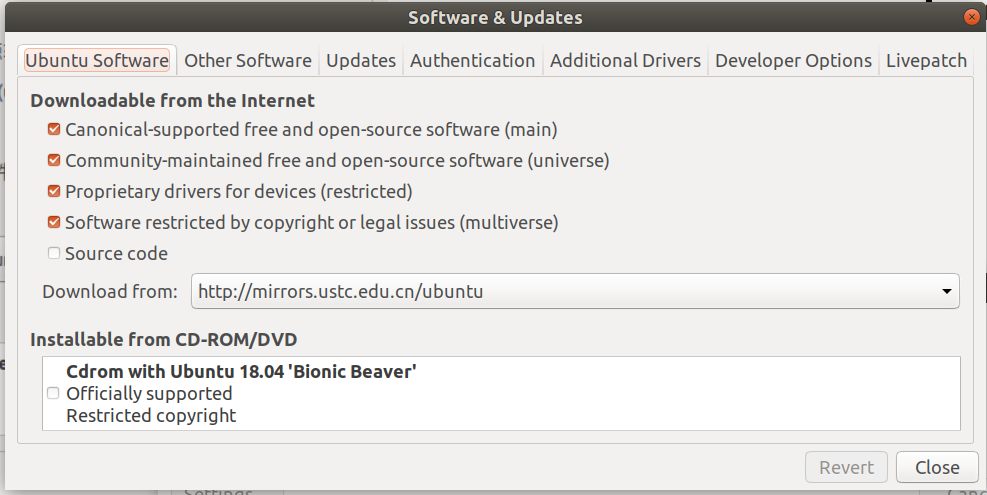
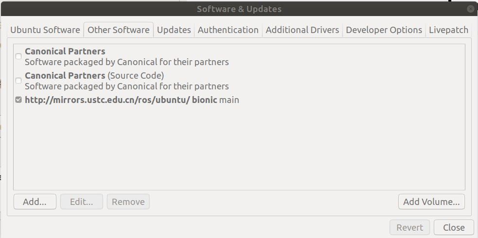
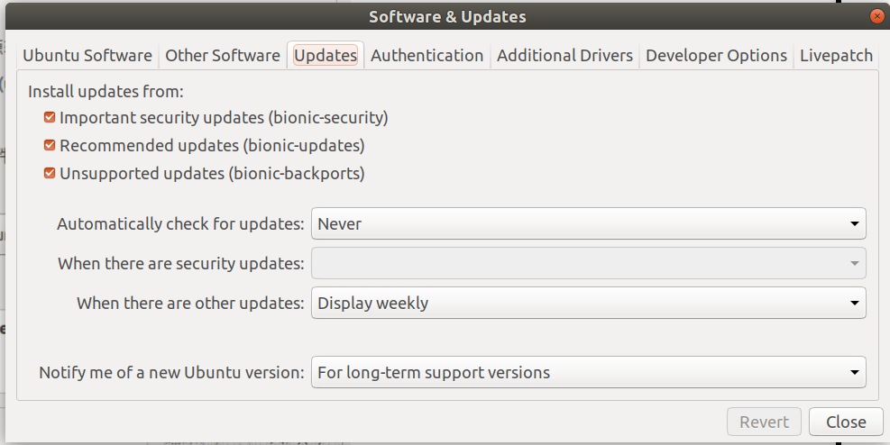

Ubuntu 18.0.4安装ros

1.软件和更新源：

​	选用中科大的软件源








2.设置ROS的下载源

2.1设置中科大源：

```c
sudo sh -c '. /etc/lsb-release && echo "deb http://mirrors.ustc.edu.cn/ros/ubuntu/ `lsb_release -cs` main" > /etc/apt/sources.list.d/ros-latest.list'
```

2.2设置公钥：

```c
sudo apt-key adv --keyserver 'hkp://keyserver.ubuntu.com:80' --recv-key C1CF6E31E6BADE8868B172B4F42ED6FBAB17C654
```

2.3更新软件包列表：

```c
sudo apt update
```

3.安装ROS


