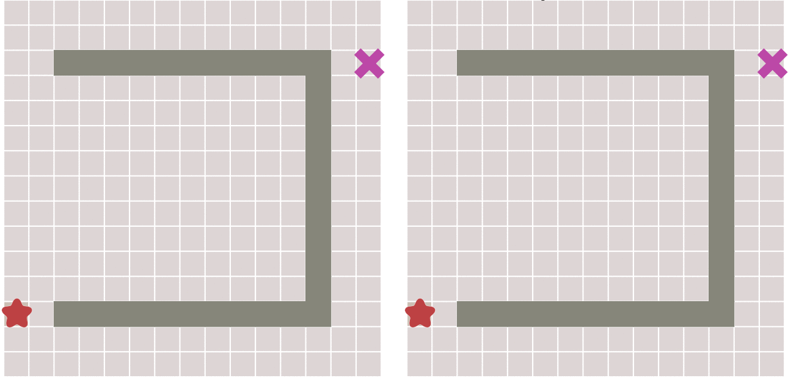

## 路径规划

根据对环境信息的把握程度可把路径规划划分为基于先验完全信息的全局路径规划和基于传感器信息的局部路径规划。其中，从获取障碍物信息是静态或是动态的角度看，全局路径规划属于静态规划，局部路径规划属于动态规划。全局路径规划需要掌握所有的环境信息，根据环境地图的所有信息进行路径规划；局部路径规划只需要由传感器实时采集环境信息，了解环境地图信息，然后确定出所在地图的位置及其局部的障碍物分布情况，从而可以选出从当前结点到某一子目标结点的最优路径。

### 广度优先算法：

从一个点开始遍历周围节点逐渐向外扩散，以遍历的点不需要再遍历，直到终点

### 最佳优先算法：

用每个点到终点距离的估计值来判断点的优先级。首先遍历起点周围点，计算点到终点的距离，距离最近优先级最高。取出优先队列中优先级最高的点，再遍历它周围的节点加入优先队列中，重复该过程直到终点。和广度优先级对比，最佳优先级搜索效率更高。

但是最佳优先算法得到的路径可能不是最佳路径：

### 传统路径规划算法对比

传统路径规划算法有 5 种：`Dijkstra`、`A*` 、`D*`、`LPA*` 和 `D* Lite`

|          | 搜索方向 | 启发式 | 增量式 |                  适用范围                  |        现实应用        |
| :------- | :------: | :----: | :----: | :----------------------------------------: | :--------------------: |
| Dijkstra | 正向搜索 |   否   |   否   |           全局信息已知，静态规划           |   网络通信的最短路由   |
| A*       | 正向搜索 |   是   |   否   |           全局信息已知，静态规划           | 游戏、无人机、路径规划 |
| D*       | 反向搜索 |   否   |   是   |           部分信息已知，动态规划           |   火星探测器路径规划   |
| LPA*     | 正向搜索 |   否   |   是   | 部分信息已知，假设其余为自由通路，动态规划 |     机器人路径规划     |
| D* Lite  | 反向搜索 |   是   |   是   | 部分信息已知，假设其余为自由通路，动态规划 |     机器人路径规划     |

### Dijkstra

`Dijkstra` 计算一个节点到其他所有节点的最短路径，主要特点是以起始点为中心向外围层层扩散，直到扩展到终点为止。能得到最短路径最优解，但是效率低。

### A*

`A*` 结合了广度优先算法和最佳优先算法。

`A*` 是种静态路网求解最短路径最有效方法。公式表示为：f(n) = g(n) + h(n)；f(n) 是节点 n 从初始点到目标点的估价函数；g(n) 是从初始节点到节点 n 的实际代价；h(n) 是节点 n 到目标节点的最佳路径的估计代价。

`A*` 算法还需要使用两个集合来表示代遍历的节点和已经遍历的节点，通常成为 `open list` 和 `close list`，其中 `open list` 需要使用优先队列。`A*` 算法首先从起点开始，计算周围的点的优先值并且加入优先队列。之后开始从优先队列中选取优先值最小的点，将其加入 `close list` 并且同样计算周围的点的优先值加入优先队列（`close list` 中的点就不需要再计算了）。不断重复这个过程直到搜索到终点算法就结束，返回路径。

`A*` 算法的公式中，g(n) 使得算法能选取相对来说走得更少的点，h(n) 能使算法优先选择离终点更近的点（不考虑障碍物的情况，因为是估计值）。

由于 g(n) 是实际代价（已知的环境，能够算得节点 n 到初始节点的代价），那 f(n) 的估价就受到 h(n) 的制约，节点 n 离目标点越近，h 值越小，能保证最短路径的搜索向终点的方向进行。

### D*

由目标位置开始向起始位置进行路径搜索，当物体朝目标位置运行中发现路径上存在新障碍物，障碍物后方到目标点的路径是不变的，但是物体到障碍物后方的路径是收到影响的。在遇到障碍物后，会将障碍物周围节点向物体所在位置扩散开搜索路径，将新的路径连接到原本的障碍物后方到目标点的路径之后，以最小程度减少计算开销。新路径由障碍物位置发散搜索直到找到物体位置为止，类似 `Dijkstra` 。

`D*` 是增量式启发算法，当检测到新障碍物后算法不需要完全重新规划，可以利用之前获得的信息找到可以避开障碍物的路径。

`D*` 的 g(n) 和 h(n) 与 `A*` 有所不同：g(n) 表示节点 n 到终点的实际代价；h(n) 表示节点 n 到起点的估计代价。

### LPA*

### D* Lite

