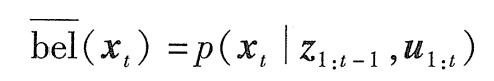

## 基础知识

### 递归状态估计算法

#### 概率的基本概念

概率机器人核心是由传感器数据来估计状态，传感器信息在测量中可能被破坏，状态估计旨在从数据中找到状态，概率状态估计法在可能的状态空间上计算置信度分布。

X 表示一个随机变量，x 表示 X 的特定值。如果 X 所取的所有值空间是离散的，则 x 的概率为： p(X = x)，一个变量的所有可能情况的概率和为 1。

一个连续型随机变量的概率密度函数的积分也总是为 1，但概率密度函数的上限不限于 1。

两个随机变量 X 和 Y 的联合分布：p(x, y) = p(X = x, Y = y)，如果 X 和 Y 互相独立，则有 p(x, y) = p(x)p(y)

随机变量携带其他随机变量的信息，假设 Y 是 y，基于该条件的 X = x 的概率表示为：p(x | y) = p(X = x | Y = y)

这样的概率称为条件概率。如果 p(y) > 0，条件概率定义为 p(x | y) = p(x, y) / p(y)

贝叶斯准则：

p(x | y) 为基于 y 的概率条件下，x 的概率。

贝叶斯准则在概率机器人中起主导作用，如果 x 是一个希望由 y 推测出来的数值，那么 p(x) 称为先验概率分布，其中 y 称为数据，也就是传感器的测量值。分布 p(x) 总结了综合数据 y 之前已经得到关于 x 的信息。概率 p(x | y)称为后验概率分布。

贝叶斯准则利用逆条件概率 p(y | x) 和先验概率 p(x) 一起计算后验概率 p(x | y) 。

期望：值是每次可能的结果值乘以其结果概率的和。

协方差：衡量偏离均值的二次方期望

熵是 x 所携带的期望信息，假定 p(x) 是观测 x 的概率，那么对 x 的最佳编码所需比特数为：

#### 机器的环境交互

传感器获得的环境信息是有噪音的，机器人内部保持着环境状态的一个内部置信度。

环境特征以状态来表征。动态的状态有机器附近走动的人，静态的状态有建筑的墙等，机器本身的状态有位姿，速度，传感器是否正常运行等。

俯仰角(pitch)、横滚角(roll)、偏航角(yaw)

马尔可夫链，又称离散时间马尔可夫链。是状态空间从一个状态到另一个状态的转换的随机过程。该过程要求具备“无记忆”的性质：下一个状态的概率分布只能由当前状态决定，在时间序列中与它前面的事件无关。这种特定类型的“无记忆性”称为马尔可夫性质。

环境交互：

- 环境传感器测量，有时也称为观察或认知，传感器得到的数据有延迟，是过去的状态信息。

- 控制动作改变环境状态，机器有时候会有意无意地改变环境状态，同时进行测量。

概率生成法则：

**x 是环境状态（包括外部状态和机器内部状态）、z 是测量（传感器测量）、u 是控制（机器行为）**

状态和测量的演变由概率法则支配。通常，状态 x_t 是随机地由状态 x_t-1 产生的。  

状态 x_t 的出现可能是以过去的状态、测量、控制为条件的。表征状态演变的概率法则可以表示为：

这里假定先执行动作 u，然后得到一个测量 z

概率 p(x_t | x_t-1, u_t) 是状态转移概率，指出环境状态作为机器控制 u_t 的函数如何随时间变化。

概率 p(z_t | x_t) 是测量概率，测量 z 由环境状态 x 产生，认为测量结果是状态的有噪音估算结果。

状态转移概率和测量概率一起描述了机器及环境的动态随机系统。

动态贝叶斯网络 显示概率定义的状态和测量的演变，该模型称为隐马尔可夫模型：

置信度：

概率机器人通过条件概率分布表示置信度，置信度分布是以可获得数据为条件的关于状态变量的后验概率。

用 bel(x_t) 表示状态变量 x_t 的置信度：

默认置信度是在综合了测量 z_t 后得到的。有时，预测在刚刚执行完控制 u_t 之后的后验可以表示为：

这个 <u>bel</u>(x_t) 不包括 z_t 的测量，是基于以前的状态和控制的后验，预测 t 时刻的测量 z。由 <u>`bel(x_t)`</u> 计算 `bel(x_t)` 称为修正或测量更新。 

#### 贝叶斯滤波算法：

大多数计算置信度的通用算法由贝叶斯滤波算法给出。该算法根据测量和控制数据计算置信度分布 bel ()。

贝叶斯滤波是递归的，时刻 t 的置信度 bel(x_t) 由时刻 t-1 置信度 bel(x_t-1) 来计算。输入最近时刻 t-1 的置信度，和最近的控制作用 u_t 及测量 z_t ；输出就是时刻 t 的置信度 bel(x_t)。伪代码如下：

贝叶斯滤波算法两个基本步骤：

1. 控制更新：

   <u>bel</u>(x_t ) 通过分配给 x_t-1 的置信度和控制 u_t 引起的从 x_t-1 到 x_t 的转移概率的积分得到。（第 3 行）

2. 测量更新：

   用已经观测到的 z_t 的概率乘以置信度 <u>bel</u>(x_t)。结果不再为一个概率，总和可能不为 1.结果需要归一化处理。（第 4 行）

实例参考《概率机器人》2.4.2 的贝叶斯滤波算法实例（21页）

- 机器人机器环境交互建立了一个耦合的动态系统模型，机器人通过选择来操纵环境，并且通过传感器来感知环境。

- 在概率机器人中，机器及环境的动态以两种概率法则：状态转移分布和测量分布形式为特点。状态转移分布描述状态如何随时间变化的特征，可能作为机器人控制的效果。测量分布描述测量如何由状态控制的特征。两个法则都是概率性的，从而导致状态演变和检测的固有不确定性。

- 置信度是对传感器测量和过去控制的环境状态的一个后验分布。贝叶斯滤波是计算机器人置信度的基本算法，通过递归：时刻 t-1 到时刻 t 的置信度来计算。

- 贝叶斯滤波做了一个马尔可夫假设，状态在过去是完整的，当受到扰乱，需要根据条件辨识。

## Cartographer 算法分析

sub_map 的创建，两个相邻的子图的头尾的 scan 是相同的。sub_map 是怎么插入的。

通过 imu odom scan 推断出下一个点云的位姿（先验）

自适应体素滤波，点云分远近处理，一部分高分辨率，一部分低分辨率 

#### 地图模型

主要在 `hybrid_grid.h` 文件

 * 这里的地图是经过体素滤波后，最小单位是 grid，即是一个体素的大小
 * 3 个维度下的 n 个 grid 构成一个 FlatGrid 地图；
 * 3 个维度下的 m 个 FlatGrid 构成一个 NestedGrid 地图；
 * DynamicGird 可以将 NestedGrid 各个维度扩展一倍；
 * HybridGridBase 给 DynamicGird 增加了分辨率属性，可以映射到浮点数坐标（距离坐标，米等）
 * HybridGrid 增加了栅格概率值的接口

#### 栅格概率值更新

在 `range_data_inserter.cc` 文件

黑点是激光打到障碍物的位置，所在的栅格阴影画叉，称为 hit_cell；

激光点跟雷达连线穿过的栅格涂上阴影，称为 miss_cell；

更新阴影区域的占用概率

在 `probability_values.cc` 文件

参考 https://zhuanlan.zhihu.com/p/49030629 的说明

#### 两轮差速底盘运动学模型

v_l ，v_r 表示左轮右轮线速度，v，w 表示小车中心线速度和角速度，d 为轮子离底盘中心的距离，b 为轮距，r 为底盘中心的回转半径

对于底盘的回转中心，有：v = (v_l + v_r) / 2； w = (v_r - v_l) / (2 * d)；

回转中心角速度的推导：

线速度 v = 2 π r / T；角速度 w = 2 π / T ；所以 v = r * w；

那么对上面有：w = v_l / (r - d) = v_r / (r + d)；变形得到 v_l * (r + d) = v_r * (r - d)，最后得到 r = (v_r + v_l) * d / (v_r - v_l)

将上面公式代入 v_r / (r + d) 的 r 中，化简得到 (v_r - v_l) / (2 * d) = w

将上式代入 v = w * r 的 w 和 r 中，得到 v = (v_r + v_l) / 2

#### 坐标变换

刚体坐标转换关系有：

#### 里程计标定

直接线性法：优点：通用性强，实现简单；缺点：精度不高

基于模型的方法：优点：精度高；缺点：实现复杂，特异性高

#### 运动去畸变

ICP方法

里程计辅助方法

