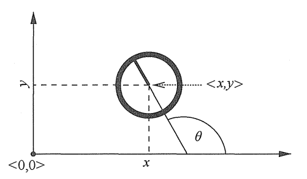

## 基础知识

### 递归状态估计算法

#### 概率的基本概念

概率机器人核心是由传感器数据来估计状态，传感器信息在测量中可能被破坏，状态估计旨在从数据中找到状态，概率状态估计法在可能的状态空间上计算置信度分布。

X 表示一个随机变量，x 表示 X 的特定值。如果 X 所取的所有值空间是离散的，则 x 的概率为： p(X = x)，一个变量的所有可能情况的概率和为 1。

一个连续型随机变量的概率密度函数的积分也总是为 1，但概率密度函数的上限不限于 1。

两个随机变量 X 和 Y 的联合分布：p(x, y) = p(X = x, Y = y)，如果 X 和 Y 互相独立，则有 p(x, y) = p(x)p(y)

随机变量携带其他随机变量的信息，假设 Y 是 y，基于该条件的 X = x 的概率表示为：p(x | y) = p(X = x | Y = y)

这样的概率称为条件概率。如果 p(y) > 0，条件概率定义为 p(x | y) = p(x, y) / p(y)

贝叶斯准则：

p(x | y) 为基于 y 的概率条件下，x 的概率。

贝叶斯准则在概率机器人中起主导作用，如果 x 是一个希望由 y 推测出来的数值，那么 p(x) 称为先验概率分布，其中 y 称为数据，也就是传感器的测量值。分布 p(x) 总结了综合数据 y 之前已经得到关于 x 的信息。概率 p(x | y)称为后验概率分布。

贝叶斯准则利用逆条件概率 p(y | x) 和先验概率 p(x) 一起计算后验概率 p(x | y) 。

期望：值是每次可能的结果值乘以其结果概率的和。

协方差：衡量偏离均值的二次方期望

熵是 x 所携带的期望信息，假定 p(x) 是观测 x 的概率，那么对 x 的最佳编码所需比特数为：

#### 机器的环境交互

传感器获得的环境信息是有噪音的，机器人内部保持着环境状态的一个内部置信度。

环境特征以状态来表征。动态的状态有机器附近走动的人，静态的状态有建筑的墙等，机器本身的状态有位姿，速度，传感器是否正常运行等。

俯仰角(pitch)、横滚角(roll)、偏航角(yaw)

马尔可夫链，又称离散时间马尔可夫链。是状态空间从一个状态到另一个状态的转换的随机过程。该过程要求具备“无记忆”的性质：下一个状态的概率分布只能由当前状态决定，在时间序列中与它前面的事件无关。这种特定类型的“无记忆性”称为马尔可夫性质。

环境交互：

- 环境传感器测量，有时也称为观察或认知，传感器得到的数据有延迟，是过去的状态信息。

- 控制动作改变环境状态，机器有时候会有意无意地改变环境状态，同时进行测量。

概率生成法则：

**x 是环境状态（包括外部状态和机器内部状态）、z 是测量（传感器测量）、u 是控制（机器行为）**

状态和测量的演变由概率法则支配。通常，状态 x_t 是随机地由状态 x_t-1 产生的。  

状态 x_t 的出现可能是以过去的状态、测量、控制为条件的。表征状态演变的概率法则可以表示为：

这里假定先执行动作 u，然后得到一个测量 z

概率 p(x_t | x_t-1, u_t) 是状态转移概率，指出环境状态作为机器控制 u_t 的函数如何随时间变化。

概率 p(z_t | x_t) 是测量概率，测量 z 由环境状态 x 产生，认为测量结果是状态的有噪音估算结果。

状态转移概率和测量概率一起描述了机器及环境的动态随机系统。

动态贝叶斯网络 显示概率定义的状态和测量的演变，该模型称为隐马尔可夫模型：

置信度：

概率机器人通过条件概率分布表示置信度，置信度分布是以可获得数据为条件的关于状态变量的后验概率。

用 bel(x_t) 表示状态变量 x_t 的置信度：

默认置信度是在综合了测量 z_t 后得到的。有时，预测在刚刚执行完控制 u_t 之后的后验可以表示为：

这个 <u>bel</u>(x_t) 不包括 z_t 的测量，是基于以前的状态和控制的后验，预测 t 时刻的测量 z。由 <u>`bel(x_t)`</u> 计算 `bel(x_t)` 称为修正或测量更新。 

#### 贝叶斯滤波算法：

大多数计算置信度的通用算法由贝叶斯滤波算法给出。该算法根据测量和控制数据计算置信度分布 bel ()。

贝叶斯滤波是递归的，时刻 t 的置信度 bel(x_t) 由时刻 t-1 置信度 bel(x_t-1) 来计算。输入最近时刻 t-1 的置信度，和最近的控制作用 u_t 及测量 z_t ；输出就是时刻 t 的置信度 bel(x_t)。伪代码如下：

贝叶斯滤波算法两个基本步骤：

1. 控制更新：

   <u>bel</u>(x_t ) 通过分配给 x_t-1 的置信度和控制 u_t 引起的从 x_t-1 到 x_t 的转移概率的积分得到。（第 3 行）

2. 测量更新：

   用已经观测到的 z_t 的概率乘以置信度 <u>bel</u>(x_t)。结果不再为一个概率，总和可能不为 1.结果需要归一化处理。（第 4 行）

实例参考《概率机器人》2.4.2 的贝叶斯滤波算法实例（21页）

- 机器人机器环境交互建立了一个耦合的动态系统模型，机器人通过选择来操纵环境，并且通过传感器来感知环境。

- 在概率机器人中，机器及环境的动态以两种概率法则：状态转移分布和测量分布形式为特点。状态转移分布描述状态如何随时间变化的特征，可能作为机器人控制的效果。测量分布描述测量如何由状态控制的特征。两个法则都是概率性的，从而导致状态演变和检测的固有不确定性。

- 置信度是对传感器测量和过去控制的环境状态的一个后验分布。贝叶斯滤波是计算机器人置信度的基本算法，通过递归：时刻 t-1 到时刻 t 的置信度来计算。

- 贝叶斯滤波做了一个马尔可夫假设，状态在过去是完整的，当受到扰乱，需要根据条件辨识。

  

#### 卡尔曼滤波算法（KF）

KF 算法的输入是 t-1 时刻的置信度，均值用 u_t-1 、方差用 E_t-1 表示。为了更新参数，KF 需要控制向量 u_t 和测量向量 z_t 。输出 t 时刻的置信度，均值 u_t 和方差 E_t 。

1. 计算预测的置信度均值 <u>u_t</u> 和方差 <u>E_t</u> (2~3 行)
2. 更新置信度 u_t 和 E_t (4~6 行)

实例参考《概率机器人》3.2.3 的卡尔曼滤波算法实例（32页）

#### 扩展卡尔曼滤波（EKF）

KF 的线性预测在 EKF 中由非线性的泰勒扩展代替。

#### 无迹卡尔曼滤波（UKF）

#### 信息滤波（IF）

高斯分布可以用矩参数和正则参数表示。矩参数由高斯均值（一阶矩）和（协）方差（二阶矩）组成；正则由信息矩阵和信息向量组成。两种参数彼此间是对偶的。通过矩阵求逆，可以由一个参数得到另一个参数。

### 非参数滤波

非参数滤波不依赖确定的后验函数，通过有限数量的值来近似后验，每个值大致与状态空间的一个区域有关。近似后验的效果取决于表示后验的参数的数量，随着参数数量增加，非参数会逐渐收敛于正确的后验值。

#### 直方图滤波

直方图将状态空间分解成有限区域，用单一概率值表示每个区域的累计后验。

应用于有限空间被称为离散贝叶斯滤波，应用于连续空间，称为直方图滤波。

离散贝叶斯滤波算法：

时刻 t 的置信度是对每个状态 x_k 的概率分布，用 p_k,t 表示。输入的就是离散的概率分布{p_k,t}以及最新的控制 u_t 和测量 z_t。第 3 行计算预测，仅基于控制来计算新状态的置信度。第 4 行更新综合测量。

直方图滤波：

#### 粒子滤波

粒子滤波是贝叶斯滤波的另一种非参数实现，用有限个参数来近似后验。粒子滤波主要思想是用一系列从后验得到的随机状态采样表示后验 bel(x_t) 。

### 机器人运动

运动学是描述控制行为对机器人构型产生影响的微积分。一个刚性移动机器人通常用 6 个变量来描述，3 个直角坐标系， 3 个欧拉角（横滚、俯仰、偏航）。平明移动机器人则用 3 个变量来描述，简称位姿(pose)，包括平面直角坐标系的 x 和 y，以及航向角。

没有航向角的位姿称为位置(location)

#### 概率运动学模型：

x_t 是 t 时刻的位姿，u_t 是运动控制，模型描述对 x_t-1 执行运动控制 u_t 后，机器人的运动学状态的后验分布。

#### 速度运动模型：

通过旋转速度和平移速度来控制机器人。用 v_t 表示 t 时刻速度，w_t 表示 t 时刻角速度。逆时针旋转角速度为正，向前进速度为正。

#### 里程计运动模型：

里程计运动模型用距离测量代替控制，比速度运动模型更精确，因为里程计只有在机器人移动后才可用，里程计信息就是传感器测量。

里程计反馈了机器人在 (t-1, t] 时刻内，在自身坐标系中的位姿变化，模型如下：

u_t 被转换为 3 个步骤：旋转、直线运动（平移）、再旋转。

### 机器人感知

测量模型描述在客观世界生成传感器测量的过程。  

地图可以分为基于特征的地图和基于位置的地图。基于位置的地图记录了环境具体位置的信息，例如空闲，有障碍，悬崖等。基于特征的地图仅指明环境中有对象的信息，例如环境的形状。

经典的地图表示法是占用栅格地图。

#### 测距仪的波束模型：

#### 地标的测量：

机器人技术中，将环境中具有特征的物理对象称为地标，用于机器导航。

特征提取器可以生成一个签名，可以是个数值、多维向量等来表征一个地标。

## 定位

移动机器人定位就是确定相对于给定地图环境的机器人位姿的，经常被称为位置估计。  

#### 位置跟踪：

机器人初始位姿已知，通过适应机器人运动噪声来完成定位机器人，经常用单峰分布（高斯分布）来近似，是个局部问题，局限于机器人真实位姿附近。

#### 全局定位：

机器人初始位姿未知，不能通过单峰概率分布识别，因为全局中可能存在多个与机器人当前局部相似的环境，并且包含了位置跟踪。

#### 绑架机器人问题：

实际适用中，机器人可能被强制移动，机器需要能够从失效中恢复。

### 马尔可夫定位

贝叶斯滤波定位的简单应用称为马尔可夫定位。

测量模型（第 3 行）：p(x_t | x_t, m) 在定位中尤其重要，而运动模型（第 4 行）：p(x_t | u_t, x_t-1, m)并不是一定需要，马尔可夫定位将时刻 t-1 的概率置信度转换为时刻 t 的置信度。

### 栅格定位

### 蒙特卡罗定位

## 地图构建