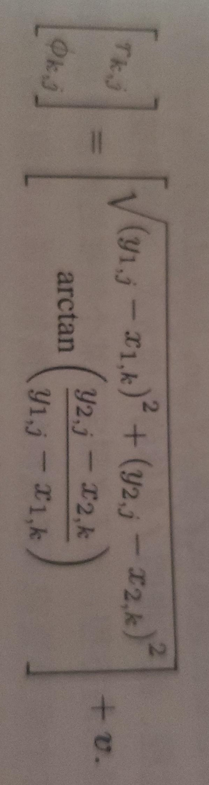

# 视觉 SLAM

# 什么是 SLAM

SLAM(Simultaneous Localization and Mapping) 是实时定位与地图构建：

指搭载特定传感器的主体，在没有环境先验信息的情况下，在运动过程中建立环境模型，同时估计自己的运动。

目的是解决 `定位` 和 `地图构建` 问题

#### 单目相机

记录三维空间的投影；

静态下无法判断景深，动态中可以通过 “近处物体移动快，远处物体移动慢” 来推测物体的远景；

动态评估得到的环境信息的 `尺度` 是不确定的，根本原因是无法获得 `深度` 信息；

#### 双目和深度相机

记录三维空间的投影，并且获得 `深度` 信息；

双目相机的两个相机之间的距离称为“基线”，通过基线和大量计算来估计每个像素的空间位置，和人眼类似；双目相机得到的 `深度` 信息不太可靠。基线越长，能测到的距离越远；

深度相机（RGB-D）相机，增加红外结构光或 Tof 直接测得深度信息。

#### 经典视觉 SLAM 框架

1. 传感器信息读取：相机图像信息读取和预处理。可能还有码盘，惯性传感器等信息的读取
2. 前端视觉里程计：估算相邻图像间相机的运动，以及局部地图的样子。
3. 后端（非线性）优化：后端接收不同时刻视觉里程计测量的相机位姿，以及回环检测信息进行优化，得到全局一致的轨迹和地图。
4. 回环检测：判断机器人是否到达过先前的位置。如果检测到回环，会把信息提供给后端处理。
5. 建图：根据估计轨迹，建立与任务要求对应的地图。

#### 视觉里程计

视觉里程计关心相邻图像间的相机运动，最简单的就是两张图像间的运动关系。为了定量估计相机运动，必须先了解相机与空间点的几何关系。

视觉里程计通过相邻图像估计相机运动并恢复场景的空间结构。

把相邻时刻的运动“串”起来，就构成了机器人的运动轨迹，从而解决了定位问题。再根据每个时刻的相机位置，计算各像素对应的空间点位置，就得到了地图。但仅通过视觉里程计估计轨迹，将出现累积漂移。因为视觉里程计只通过过去短时间内的图像估计造成的。每个时刻的误差会被传递到下一个时刻，导致一段时间后轨迹不再精确。

为解决漂移问题，需要`后端优化` 和`回环检测`

#### 后端优化

后端优化主要处理 SLAM 的噪声问题。要考虑如何从带有噪声的传感器信息数据中估计整个系统的状态，以及这个状态估计的不确定性有多大，也称为最大后验概率估计，这个状态包括轨迹和地图。

视觉里程计也称为前端。前端给后端提供待优化的数据，及数据的初值。后端面对的是数据，并不需要关心数据来自什么传感器。在视觉里程计中，前端和计算机视觉研究更加相关，比如图像的特征提取和匹配等，后端则主要过滤与非线性优化算法。

SLAM 问题的本质是对运动主体和周围环境空间不确定性的估计。为解决 SLAM 问题需要状态估计理论，把定位和建图的不确定性表达出来，然后采用滤波器或非线性优化，估计状态的均值和不确定性（方差）。

#### 回环检测

也称为闭环检测，主要解决位置估计随时间漂移的问题。假如检测到机器“回到了某个位置”，但位置估计值却没有在那个位置，那么机器需要把位置估计值“拉”到那个位置，就可以消除漂移了。

回环检测与“定位”和“建图”二者密切相关。为实现回环检测，需要让机器“识别到过的场景”的能力。可以通过判断图像相似性来完成回环检测，是一种计算图像数据相似性的算法。

经过回环检测后，我们会把 A 和 B 是同一个点的信息告诉后端优化算法，后端根据信息把轨迹和地图调整到符合回环检测结果的样子。

#### 建图

度量地图：

度量地图强调精确表示地图中物体位置关系。分有稀疏和稠密两类。稀疏地图进行了一定程度的抽象，并不需要表达所有物体，可以选择一部分有意义的东西作为`路标` ，非路标部分可以直接忽略。定位时用稀疏路标地图就够了，而导航则往往需要用稠密地图，稠密地图通常按照某种分辨率，有许多小块组成，一个小块一般由占据、空闲、未知三个状态。

拓扑地图：

拓扑地图强调地图元素间的关系，拓扑地图由节点和边组成，只考虑节点间的连通性，例如关心A，B是连通的，而不考虑如何从A到B。放松了地图对精确位置的需要，去掉地图细节，是更为紧凑的表达方式。

然而拓扑地图仍待研究。

#### SLAM 问题的数学表达

假设机器人再未知环境中运动，在离散时刻 t = 1, 2, ... k 时候采集传感器数据。用 x 表示机器位置，于是各个时刻的位置表示为 x1, x2, ... x_k，它们构成了轨迹。假设地图由 n 个路标组成，用 y1, y2, ... y_n 表示。

在上面的设定中，“机器人在环境中运动”，由如下两件事情描述：

1. 什么是运动 ？我们要考察机从 k-1 到 k 时刻，机器的位置 x 是如何变化的。
2. 什么是观测 ？假设机器在 k 时刻于 x_k 出探测到某个路标 y_j，我们要考察如何用数学语言来描述。

先看运动，机器一般通过码盘，惯性传感器等测量自身运动，机器在 “前进 1 米”，“左转 90 °”，“刹车”等运动，可以用下面的抽象函数描述：

`x_k = f(x_k-1, u_k, w_k)`

`u_k`是运动传感器的数据，`w_k` 是该过程的噪声，`x_k-1` 是上个时刻的位置，`x_k`是当前时刻的位置

噪声的存在使得模型变成了随机模型。例如“前进 1 米”的指令，实际可能只前进了 0.9 米，也可能是 1.1 米。噪声是随机的。

于运动方程相对应的是观测方程。机器在 x_k 位置看到了路标 y_j 时，产生了一个观测数据 z_k,j。用下面的抽象函数表示：

`z_k,j = h(y_j, x_k, v_k,j)`

`v_k,j` 是观测噪声，`y_j` 观测目标，`x_k` 是观测位置，`z_k,j`是观测结果

假设机器用二维激光传感器观测，那么可以得到路标和机器的距离 r 和夹角 θ。记路标为 y_j = [y1, y2]^T _k，机器位姿为 x_k = [x1, x2]^T _k，观测数据为 z_k,j = [r_k,j, θ\_k,j]^T，那么观测方程为：

SLAM 的过程可以总结为：

x_k = f(x_k-1, u_k, w_k)，k = 1, ...k

z_k,j = h(y_j, x_k, v_k,j)，(k, j) ∈ O  (O 是一个集合，记录了观察到路标)

方程描述了已知运动测量读数 u，传感器数据 z 时，求解定位问题（估计 x）和建图问题（估计 y），我们把 SLAM 问题建模成状态估计问题：如何通过带有噪声的测量读数，估计内部，隐藏的状态变量。

状态估计问题的求解，与两方程的具体形式，以及噪声服从哪种分布有关。按运动和观测方程是否为线性，噪声是否服从高斯分布进行分类，分为`线性/非线性` 和`高斯/非高斯`系统。其中`线性高斯系统`最简单，它的无偏最优估计可以由卡尔曼滤波器（KF）给出。而复杂的`非线性非高斯系统`可以用扩展卡尔曼滤波器（EKF）和非线性优化两大类方法求解。知道 21 世纪早期，EKF 会在工作点把系统线性化，以预测-更新两大步骤进行求解。为了克服 EKF 缺点，例如线性化误差和噪声高斯分布假设，人们开始用粒子滤波器等其他滤波器，乃至使用非线性优化的方法。主流视觉 SLAM 使用图优化为代表的优化技术进行状态估计。**一般认为优化技术已经明显优于滤波器技术**。

