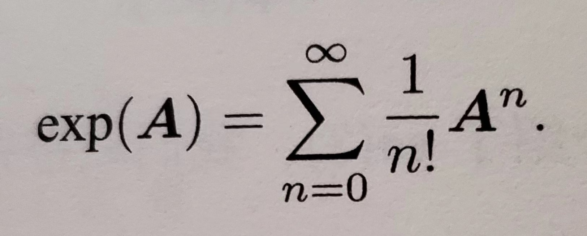
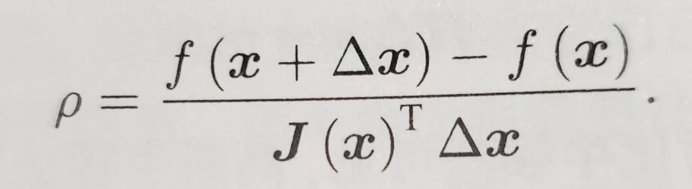

# 视觉 SLAM

## 什么是 SLAM

SLAM(Simultaneous Localization and Mapping) 是实时定位与地图构建：

指搭载特定传感器的主体，在没有环境先验信息的情况下，在运动过程中建立环境模型，同时估计自己的运动。

目的是解决 `定位` 和 `地图构建` 问题


#### 单目相机

记录三维空间的投影；

静态下无法判断景深，动态中可以通过 “近处物体移动快，远处物体移动慢” 来推测物体的远景；

动态评估得到的环境信息的 `尺度` 是不确定的，根本原因是无法获得 `深度` 信息；


#### 双目和深度相机

记录三维空间的投影，并且获得 `深度` 信息；

双目相机的两个相机之间的距离称为“基线”，通过基线和大量计算来估计每个像素的空间位置，和人眼类似；双目相机得到的 `深度` 信息不太可靠。基线越长，能测到的距离越远；

深度相机（RGB-D）相机，增加红外结构光或 Tof 直接测得深度信息。


#### 经典视觉 SLAM 框架

1. 传感器信息读取：相机图像信息读取和预处理。可能还有码盘，惯性传感器等信息的读取
2. 前端视觉里程计：估算相邻图像间相机的运动，以及局部地图的样子。
3. 后端（非线性）优化：后端接收不同时刻视觉里程计测量的相机位姿，以及回环检测信息进行优化，得到全局一致的轨迹和地图。
4. 回环检测：判断机器人是否到达过先前的位置。如果检测到回环，会把信息提供给后端处理。
5. 建图：根据估计轨迹，建立与任务要求对应的地图。


#### 视觉里程计

视觉里程计关心相邻图像间的相机运动，最简单的就是两张图像间的运动关系。为了定量估计相机运动，必须先了解相机与空间点的几何关系。

视觉里程计通过相邻图像估计相机运动并恢复场景的空间结构。

把相邻时刻的运动“串”起来，就构成了机器人的运动轨迹，从而解决了定位问题。再根据每个时刻的相机位置，计算各像素对应的空间点位置，就得到了地图。但仅通过视觉里程计估计轨迹，将出现累积漂移。因为视觉里程计只通过过去短时间内的图像估计造成的。每个时刻的误差会被传递到下一个时刻，导致一段时间后轨迹不再精确。

为解决漂移问题，需要`后端优化` 和`回环检测`


#### 后端优化

后端优化主要处理 SLAM 的噪声问题。要考虑如何从带有噪声的传感器信息数据中估计整个系统的状态，以及这个状态估计的不确定性有多大，也称为最大后验概率估计，这个状态包括轨迹和地图。

视觉里程计也称为前端。前端给后端提供待优化的数据，及数据的初值。后端面对的是数据，并不需要关心数据来自什么传感器。在视觉里程计中，前端和计算机视觉研究更加相关，比如图像的特征提取和匹配等，后端则主要过滤与非线性优化算法。

SLAM 问题的本质是对运动主体和周围环境空间不确定性的估计。为解决 SLAM 问题需要状态估计理论，把定位和建图的不确定性表达出来，然后采用滤波器或非线性优化，估计状态的均值和不确定性（方差）。


#### 回环检测

也称为闭环检测，主要解决位置估计随时间漂移的问题。假如检测到机器“回到了某个位置”，但位置估计值却没有在那个位置，那么机器需要把位置估计值“拉”到那个位置，就可以消除漂移了。

回环检测与“定位”和“建图”二者密切相关。为实现回环检测，需要让机器“识别到过的场景”的能力。可以通过判断图像相似性来完成回环检测，是一种计算图像数据相似性的算法。

经过回环检测后，我们会把 A 和 B 是同一个点的信息告诉后端优化算法，后端根据信息把轨迹和地图调整到符合回环检测结果的样子。


#### 建图

度量地图：

度量地图强调精确表示地图中物体位置关系。分有稀疏和稠密两类。稀疏地图进行了一定程度的抽象，并不需要表达所有物体，可以选择一部分有意义的东西作为`路标` ，非路标部分可以直接忽略。定位时用稀疏路标地图就够了，而导航则往往需要用稠密地图，稠密地图通常按照某种分辨率，有许多小块组成，一个小块一般由占据、空闲、未知三个状态。

拓扑地图：

拓扑地图强调地图元素间的关系，拓扑地图由节点和边组成，只考虑节点间的连通性，例如关心A，B是连通的，而不考虑如何从A到B。放松了地图对精确位置的需要，去掉地图细节，是更为紧凑的表达方式。

然而拓扑地图仍待研究。


#### SLAM 问题的数学表达

假设机器人再未知环境中运动，在离散时刻 t = 1, 2, ... k 时候采集传感器数据。用 x 表示机器位置，于是各个时刻的位置表示为 x1, x2, ... x_k，它们构成了轨迹。假设地图由 n 个路标组成，用 y1, y2, ... y_n 表示。

在上面的设定中，“机器人在环境中运动”，由如下两件事情描述：

1. 什么是运动 ？我们要考察机从 k-1 到 k 时刻，机器的位置 x 是如何变化的。
2. 什么是观测 ？假设机器在 k 时刻于 x_k 出探测到某个路标 y_j，我们要考察如何用数学语言来描述。

先看运动，机器一般通过码盘，惯性传感器等测量自身运动，机器在 “前进 1 米”，“左转 90 °”，“刹车”等运动，可以用下面的抽象函数描述：

`x_k = f(x_k-1, u_k, w_k)`

`u_k`是运动传感器的数据，`w_k` 是该过程的噪声，`x_k-1` 是上个时刻的位置，`x_k`是当前时刻的位置

噪声的存在使得模型变成了随机模型。例如“前进 1 米”的指令，实际可能只前进了 0.9 米，也可能是 1.1 米。噪声是随机的。

于运动方程相对应的是观测方程。机器在 x_k 位置看到了路标 y_j 时，产生了一个观测数据 z_k,j。用下面的抽象函数表示：

`z_k,j = h(y_j, x_k, v_k,j)`

`v_k,j` 是观测噪声，`y_j` 观测目标，`x_k` 是观测位置，`z_k,j`是观测结果

假设机器用二维激光传感器观测，那么可以得到路标和机器的距离 r 和夹角 θ。记路标为 y_j = [y1, y2]^T _k，机器位姿为 x_k = [x1, x2]^T _k，观测数据为 z_k,j = [r_k,j, θ\_k,j]^T，那么观测方程为：


SLAM 的过程可以总结为：

x_k = f(x_k-1, u_k, w_k)，k = 1, ...k

z_k,j = h(y_j, x_k, v_k,j)，(k, j) ∈ O  (O 是一个集合，记录了观察到路标)

方程描述了已知运动测量读数 u，传感器数据 z 时，求解定位问题（估计 x）和建图问题（估计 y），我们把 SLAM 问题建模成状态估计问题：如何通过带有噪声的测量读数，估计内部，隐藏的状态变量。

状态估计问题的求解，与两方程的具体形式，以及噪声服从哪种分布有关。按运动和观测方程是否为线性，噪声是否服从高斯分布进行分类，分为`线性/非线性` 和`高斯/非高斯`系统。其中`线性高斯系统`最简单，它的无偏最优估计可以由卡尔曼滤波器（KF）给出。而复杂的`非线性非高斯系统`可以用扩展卡尔曼滤波器（EKF）和非线性优化两大类方法求解。知道 21 世纪早期，EKF 会在工作点把系统线性化，以预测-更新两大步骤进行求解。为了克服 EKF 缺点，例如线性化误差和噪声高斯分布假设，人们开始用粒子滤波器等其他滤波器，乃至使用非线性优化的方法。主流视觉 SLAM 使用图优化为代表的优化技术进行状态估计。**一般认为优化技术已经明显优于滤波器技术**。


## 三维空间刚体运动

线性代数库`Eigen` 提供矩阵计算，其中 `Geometry` 模块提供四元素等描述刚体运动的结构。


#### 旋转矩阵

三维空间中的基向量为[e1, e2, e3]，任意向量 a 表示为：

a = [{e1, e2, e3}] [{a1} {a2} {3}] = a1e1 + a2e2 + a3e3 （这里 {} 表示占矩阵一行） 

向量的点乘（内积）: a · b

几何意义：向量a 在向量b 方向上投影与|b|的乘积，反应两个向量的相似度，结果越大越相似。

向量的叉乘（外积）: a x b

几何意义：如果向量a 和向量b 构成平行四边形，那么外积的模长与该四边形的面积相等。

把 a 写成矩阵，事实上是`反对称矩阵`，将 `^` 记作反对称符号。a x b 写为矩阵和向量的乘法 a ^ b


#### 坐标系间的欧氏变换

两个坐标系间的运动由一个旋转加一个平移组成，这种运动称为刚体运动。刚体运动中物体的位姿变换过程称为欧氏变换。由旋转和平移组成。

某个单位正交基(e1, e2, e3)经过旋转为(e1', e2', e3')，对于同一个向量a（没有因为旋转发生运动），它在两个坐标系下坐标为[{a1}, {a2}, {a3}] 和 [{a1'}, {a2'}, {a3'}]（这里 {} 表示占矩阵一行），那么有：

```
[{e1, e2, e3}] [{a1}, {a2}, {a3}] = [{e1', e2', e3'}]  [{a1'}, {a2'}, {a3'}]
```

左右两边同左乘 [{e1^T}, {e2^T}, {e3^T}] 得到

```
[{a1}, {a2}, {a3}] = R a'
```

R 描述了坐标系的旋转，称为旋转矩阵

旋转矩阵的行列式为 1，表示为 det(R) = 1

行列式的几何意义是变换后的新基的面积或体积的伸缩率。行列式为 1 表示经过旋转变换后，两个坐标系没有发生伸缩变换。


设坐标系1，坐标系2，向量a 在两个坐标系中坐标为a1，a2，欧式变换的旋转用旋转矩阵R表示，平移用平移向量t表示，那么：

```
a1 = R12 a2 + t12
```

R12 表示从坐标系2 到坐标系1 的变换，t12 实际表示的是坐标系1 原点指向坐标系2 原点，在坐标系1 中取的向量


#### 变换矩阵和齐次坐标

假设进行两次变换：b = R1 a + t1, c = R2 b + t2，从 a 到 c 的变换为：c = R2 (R1 a + t1) + t2

引入齐次坐标和变换矩阵：[{a'} {1}] = [{R, t} {0^T, 1}] [{a} {1}] = T [{a} {1}]

这是一个数学技巧，在三维向量末尾添加 1 ，将其变为四维向量，称为齐次坐标。在四维向量中，我们把旋转和平移写在一个矩阵里，使得整体关系变为线性关系，矩阵 T 称为变换矩阵。

用 a' 变 a 的齐次坐标，那么 a 到 c 变换可以写为：b' = T1 a', c' = T2 b'  ---> c' = T2 T1 a'

变换矩阵 T 的左上角为旋转矩阵，右上角为平移向量，左下角为 0，右下角为 1。这种矩阵又称为特殊欧氏群。


#### <u>使用 Eigen 库来计算矩阵</u>


#### 旋转向量和欧拉角

6 个自由度：3 个维度的旋转和平移

任意旋转都可以由一个旋转轴和一个旋转角来描述。

一个向量的方向与旋转轴一致，长度等于旋转角，这样的向量称为旋转向量（或角轴），只需要一个三维向量就可以描述旋转。

对于一个变换矩阵，可以用一个旋转向量和一个平移向量来描述，此时该变量维数是六维。


用 R 表示旋转，旋转轴上单位向量为 n ，角度 θ，从旋转向量到旋转矩阵的转换过程由 `罗德里格斯公式` 表明：


欧拉角将一个三维空间的旋转分解为 3 个不同旋转轴的旋转的顺序组合。

z 轴旋转，得到偏航角（yaw）；y 轴旋转，得到俯仰角（pitch）；x 轴旋转，得到翻滚角（roll）；

欧拉角的万向锁问题：当俯仰角为 ±90°时候，第一次旋转和第三次旋转都使用同一个轴，使得系统丢失一个自由度（从 3 次旋转变为 2 次旋转）。**任何用 3 个实数来表达三维旋转都会遇到这个奇异性问题**。（当旋转角度大于 360° 时候，旋转向量也会发生奇异性问题）因此欧拉角并不适合用于插值，迭代计算，但是适合人机交互。


#### 四元数

三维向量描述三维旋转都带有奇异性，就像用经纬度描述地球表面位置，当纬度±90° 时候，经度会失去意义一样。

四元数是一种扩展复数，紧凑且没有奇异性。

二维平面的旋转可以用**<u>单位复数</u>**来描述，三维空间的旋转可以用**<u>单位四元数</u>**来描述。

一个四元数有一个实部和三个虚部：q = q0 + q1i + q2j + q3k；其中

1. i^2 = j^2 = k ^2 = -1；
2. ij = k, ji = -k；
3. jk = i, kj = -i；
4. ki = j, ik = -j；

把 i j k 看作三个坐标轴，那么它们与自身的乘法同复数一样，互相间的乘法同外积一样。

有时也用一个标量和一个向量来表达四元数：

q = [{s}, {v}]，s = q0 ∈ R，v = [{q1} {q2} {q3}] ∈ R^3，s 称为四元数实部，v 称为虚部。

四元数的运算：

1、加减法；2、乘法；3、模长；4、共轭；5、逆；6、数乘；


四元数表示旋转：

假设空间三维点 p = [x, y, z] ，一个单位四元数 q 指定旋转。旋转后变为 p'。

把三维空间点用一个虚四元数表示 p = [0, x, y, z]^T = [0, v]^T，把四元数 3 个虚部和空间 3 个轴对应。

那么旋转后 p' = q p q^(-1)，取出 p' 的虚部即得到旋转后的点坐标

任意单位四元数描述了一个旋转，该旋转也可以用旋转矩阵和旋转向量表示。

单位四元数到旋转矩阵和旋转向量的转换公式：略


#### *相似，仿射，射影变换


#### 可视化演示

通过 pangolin 库来观察三维空间变换。

#### <u>使用 Eigen 库来计算四元素</u>


## 李群和李代数

三维旋转矩阵构成特殊正交群 SO(3)，变换矩阵构成特殊欧氏群 SE(3)：


#### 李群李代数基础

旋转矩阵，变换矩阵没有（良好地）定义加法，减法，除法运算，只定义好了乘法运算，且可以求逆。像这样只有一种（良好）定义的运算的集合，我们称为群。

群是一种集合加一种运算的代数结构。把集合记作 A，把运算记作 ·，群可以记作 G = （A, ·）。群要求该运算满足：

1. 封闭性：a1 · a2 = a3，(a1 a2 a3 ∈ A)；
2. 结合律：(a1 · a2) · a3 = a1 · (a2 · a3)，(a1 a2 a3 ∈ A)；
3. 幺元：存在 a0，对于任意 a，有 a0 · a = a · a0 = a
4. 逆：任意 a，存在 a^(-1)，有 a · a^(-1) = a0


李群是指具有连续（光滑）性质的群。


#### 李代数的定义

每个李群都有对应的李代数。李代数描述了李群的局部性质，准确地说是单位元附近的正切空间。

李代数由一个集合 V，一个数域 F 和一个二元运算符 [ , ]组成。如果满足以下性质，则称 (V, F, [ , ]) 为一个李代数，记作 g

1. 封闭性：任意 X，Y ∈ V， [X, Y] ∈ V

2. 双线性：任意 X，Y，Z ∈ V，a，b ∈ V，有

   [aX + bY，Z] = a[X，Z] + b[Y，Z]；[Z，aX + bY] = a[Z，X] + b[Z，Y]

3. 自反性：任意 X ∈ V，[X，X] = 0，自己和自己运算结果为 0

4. 雅可比等价：任意 X，Y，Z ∈ V，[X，[Y，Z]] + [Z，[X，Y]] + [Y，[Z，X]] = 0

 二元运算符称为李括号，表达了两个元素的差异。

向量的叉积（外积）是一种李代数。


#### 李代数 so(3) （搞不懂）

SO(3) 对应的李代数是定义在三维向量空间 R^3 上，记作 φ，每个 φ 可以生成一个反对称矩阵：


SO(3) 是三维向量的集合，每个向量对应一个反对称矩阵，可用于表达旋转矩阵的导数。


#### 李代数 se(3) （搞不懂）

先跳过


#### 指数与对数的映射

任意矩阵的指数映射可以写成泰勒展开，但只有在收敛的情况下有结果。结果仍是矩阵：



对于 so(3）的任意元素 φ，可得到指数映射：


这里的指数映射即是之前的罗德里格斯公式，通过它可以将任意 so(3) 中的向量映射到位于 SO(3) 的旋转矩阵。如果定义了对数映射，也能把 SO(3) 中的元素映射到 so(3) 中。

每个 SO(3) 中元素可以找到一个 so(3 元素与之对应，但可能存在多个 so(3) 的元素对应到同一个 SO(3)。对于旋转角 θ，± 360°和没转是一样的。具有周期性。如果把旋转角度固定在 ±π 之间，那么李群和李代数是一一对应的。


#### 李代数求导与扰动模型

利用 BCH 公式来讨论李群乘法和李代数加法；


假设机器在某个时刻位姿为 T，观测到一个位于世界 坐标 p 处的路标点，产生观测数据 z，由坐标变换关系有：

z  = Tp + w

w 为随机噪声，由于它的存在 z 不能满足 z = Tp 的关系。存在误差 e = z - Tp

假设存在 N 个路标点和观测，于是有 N 个上式，对机器位姿估计，相当于找一个最优解 T，使得整体误差最小


我们会经常构建与位姿有关的函数，然后讨论该函数关于位姿的导数，以调整当前的估计值。求解此问题，需要计算目标函数 J 关于变换矩阵 T 的导数。求导思路有两种：

1. 用李代数表示姿态，根据李代数的加法对李代数求导，称为李代数求导模型；
2. 对李群左乘或右乘微小扰动，然后对扰动求导，称为左扰动模型，右扰动模型；


李代数求导模型：略


SE(3) 的李代数求导：略


#### <u>使用 Sophus 来计算李群和李代数</u>


#### <u>评估轨迹误差</u>


## 相机与图像

#### 相机模型

针孔模型描述了一束光线通过针孔后，在针孔背面投影成像的关系。由于相机镜头透镜的存在，使得光线投影到成像过程产生畸变。相机的针孔和畸变模型构成相机的内参。


像素坐标系 o - u - v ：原点 o 在图像左上角，u 轴向右与 x 轴平行，v 轴向下与 y 轴平行。像素平面与成像平面之间，差了缩放和原点平移。 假设像素坐标系在 u 轴的缩放为 A，v 轴缩放为 B，原点平移了 [c_x, c_y]^T，那么像素坐标 [u, v]^T 关系为：

u = A X' + c_x；v = B Y' + c_y；

u, v, c_x, c_y 单位是像素，A, B 单位是像素/米，X', Y' 单位是米


中间量组成的矩阵称为相机的内参数矩阵 K，P 是相机位置。内参数一般是固定的。有时候需要自己确定内参，称为标定。单目相机有**棋盘格张正友**标定法。

相机的外参数是由相机在机器的安装位置决定的。


相机透镜本身会对光线传播进行影响，另外在机械组装中，透镜和成像平面不可能完全平行，从而造成成像位置的变化。

由透镜形状引起的畸变称为径向畸变。主要分为桶型畸变和枕型畸变。桶型畸变图像放大率会随着光轴间的距离增加而减小，而枕型畸变则相反。

由机械组装是透镜和成像平面不能完全平行的畸变称为切向畸变。


径向畸变可以看作是坐标点沿着长度方向发生了变化，就是其距离原点的长度发生了变化；切向畸变可以看成坐标点沿着切线方向发生变化，也就是水平夹角发生了变化。


单目相机成像过程：

1. 世界坐标系下有一点 P，世界坐标为 P_w；
2. 由于相机在运动，它的运动由 R，t 或变换矩阵 T 描述。P 的相机坐标 P_c = R P_w + t；
3. 此时 P_c 的分量为 X，Y，Z，投影到归一化平面 Z = 1 上，得到 P 的归一化坐标：P_c = [X/Z, Y/Z, 1]^T；
4. 有畸变时，根据畸变 参数计算 P_c 的正确坐标；
5. P 的归一化坐标经过内参后，对应到它的像素坐标：P_uv = K P_c


#### 双目相机模型

通过同步采集左右相机图像，计算图像间视差，以估计每个像素的深度。


左右相机的光圈中心距离称为双目相机的基线；

假设空间一点 P ，在左右相机中成像 P_L , P_R。理想情况下相机在 x 轴（图像的 u 轴）上有平移，记左坐标为 u_L，右坐标为 u_R ，根据△P P_L P_R 和 △P O_L O_R 的相似关系：有

(z - f) / z = (b -u_L + u_R) / b；             z = f b / d，d = u_L - u_R；

d 定义为左右图横坐标之差，称为视差。b 是两相机的基线。

视差越大，距离越近。由于视差最小为一个像素，所以双目能观察到的景深存在一个理论最大值，由 fb 决定。基线越长，双目能观察到的最大距离越远。

视差 d 的计算比较困难，需要确认左图像跟右图像的对应关系，实际应用中需要 GPU 或 FPGA 来计算。


#### RGB-D 相机模型

RGB-D 相机可以主动获取每个像素的深度。主要原理有红外结构光和飞行时间来测量像素距离。


红外结构光相机容易受到日光或其他传感器发出的红外光干扰，所以不能在室外使用，对于透明材质的物体也无法测量。


#### 图像


A 表示透明度


<u>**使用 OpenCV 来处理图像**</u>

**图像去畸变**


## 非线性优化

状态估计问题

处理状态估计问题分为两种。由于在 SLAM 过程中，数据随时间逐渐到来，所以我们应该持有一个当前时刻的估计状态，然后用新数据来更新它，这种方式称为增量/渐进的方式，或叫滤波器。历史上常用扩展卡尔曼滤波器求解。另一种方式是把数据累积起来处理，这种方式称为批量的方法。

增量方式仅关心当前时刻的状态估计 x_k，而对之前的状态不多考虑；而批量的方式在更大范围内达到最优化，被认为优于传统的滤波器，成为 SLAM 的主流方式。批量的方式甚至可以把初始状态到结束时刻的全部数据一起处理，但这种极端情况不实时不符合 SLAM 的实际运用场景。实际应用中，我们固定一些历史轨迹，仅对当前时刻附近的一些轨迹进行优化，这便是滑动窗口估计法；


假设从 1 到 N 的所有时刻，有 M 个路标点。定义所有时刻的机器人位姿和路标点坐标为：

 x = {x1, x2, ... x_N}, y = {y1, y2, ... y_M}

用 u 表示所有时刻的输入，z 表示所有时刻的观测数据。对机器人状态的估计，从概率学观点看就是已知输入数据 u 和观测数据 z 的条件下，求状态 x, y 条件概率分布：P(x, y |z, u)

特别地，当不知道控制输入的情况下，只有一张张图像，只考虑观测方程，相当于 P(x, y | z) 的条件概率分布。利用贝叶斯法则有：

P(x, y|z, u) = P(z, u|x, y) P(x, y) / P(z, u)  近似于 P(z, u|x, y) P(x, y),            P(z, u|x, y) 称为似然，P(x, y) 称为先验

贝叶斯法则左侧称为后验概率，右侧 P(z |x)称为似然，另一部分 P(x) 称为先验。直接求后验概率比较困难，但求一个状态最优估计，使得在该状态下后验概率最大化。如果我们不知道机器人位姿或路标在哪里，此时就没有先验，那么可以用似然来估计状态。

<u>**直观地说，似然是指“在现在位姿下，可能产生怎么样的观测数据”。由于我们知道观测数据，所以最大似然可以理解为“在什么样的状态下，最可能产生现在观测到的数据”**</u>


#### 非线性最小二乘

最小二乘形式：


令目标函数导数为零，然后求解 x 的最优值。求解这样的方程需要知道关于函数的全局性质，但这往往是不可能的。对于不方便直接求解的最小二乘问题，我们可以用迭代的方式，从初始值触发，不断更新当前最优变量，使目标函数下降，具体步骤如下：


这让求解导函数为 0 的问题变成了一个不断寻找下降增量 △x_k 的问题。由于可以对 f 进行线性优化，增量计算将简单的多，当函数下降直到增量非常小时候认为算法收敛，目标函数达到极小值。问题在于如何找到每次迭代的增量，我们只用关心迭代值处的局部性质而非全局性质。

下面讨论如何寻找这个增量 △x_k，这属于数值优化的领域。


一阶和二阶梯度法：

假设我们在 x_k 处，想要寻找增量 △x_k，那么最直观的方式是将目标函数在 x_k 附近进行泰勒展开：


J(x_k) 是 F(x) 关于 x 的一阶导数（也叫梯度、雅可比矩阵），H 则是二阶导数（海塞矩阵）。 

如果只保留一阶梯度，那么取增量为反向的梯度，即可保证函数下降：△x^* = - J(x_k)，这只是方向，通常还需要指定一个步长 λ。这种方法称为最速下降法。它的直观意义是，只有我们沿着反向梯度方向前进，在一阶（线性）的近似下，目标函数必定会下降。

如果保留二阶梯度信息，这种方法称为牛顿法。

事实上，我们用一个一次或二次函数近似了原函数，然后用近似函数的最小值来猜测原函数的极小值。只要原函数的局部看起来像一次或二次函数，这类算法就是成立的。最速下降法过于贪心，容易走出锯齿路线，反而增加了迭代次数。而牛顿法需要计算目标函数的 H 矩阵，在规模较大时候非常困难，通常要避免 H 矩阵的计算。一些拟牛顿法可以得到较好结果，例如高斯牛顿法和列文伯格-马夸尔特方法


#### 高斯牛顿法

高斯牛顿法的思想是将 f(x) 进行一阶泰勒展开。请注意这里是 f(x) 而不是 F(x)，否则就成了牛顿法了。


高斯牛顿方程：


这个方程式关于变量 △x 的线性方程组，称为增量方程或正规方程。把左边系数定义为 H，右边定义为 g，上式简化为：H △x = g。求解增量方程式整个优化问题的核心所在。高斯牛顿法的算法步骤可以写为：


#### 列文伯格-马夸尔特法

列文伯格-马夸尔特法被认为比高斯牛顿法的鲁棒性更强，但收敛速度更慢，被称为阻尼牛顿法。

高斯牛顿法中采用近似二阶泰勒展开，只能在展开点附近取的较好近似效果。我们给 △x 添加一个信赖范围，认为在这个信赖范围内二阶近似是有效的。信赖范围根据近似模型和实际函数的差异来确定，差异小，就扩大近似范围，差异大，就缩小近似范围。用 ρ 来描述这种近似程度：



ρ 的分子是实际函数下降值，分母是近似模型下降值。如果 ρ 接近 1 说明近似是好的。

阻尼牛顿法的步骤如下：


#### <u>手写高斯牛顿法</u>


#### **<u>Ceres 优化库的使用</u>**

ceres 是广泛使用的最小二乘问题求解库。


#### <u>g2o 图优化库</u>

g2o 是将非线性优化和图论结合起来的理论。

图优化理论：把优化问题表现成图的一种方式。这里的图是图论意义上的图。一个图由若干个顶点，连接顶点的边组成。进而用顶点表示优化变量，用边表示误差项。


## 视觉里程计1

SLAM 系统分为前端和后端。前端也称为视觉里程计，主流算法分为特征点法和直接法。特征点法具有稳定，对光照，动态物体不敏感的优势。

视觉里程计的核心问题是如何根据图像估计相机运动。从图像中选取比较有代表性的点，这些点在相机运动发生少量变化后仍保持不变，于是我们可以在图像中找到相同的点。然后在这些点的基础上，讨论相机位姿估计问题，以及这些点的定位问题。在经典 SLAM 中，这些点称为路标，在视觉 SLAM 中，路标则是指图像特征。

特征点是图像里一些特别的地方。可以将图像中角点，边缘和区块都当成图像有代表性的地方。通常来说，在两张图像中寻找相同的角点比边缘容易，而区块则最难。

**角点提取算法有：`Harris算法`，`FAST角点`，`GFTT角点` 等。**

**实际应用中，由于相机的远近，旋转，角点可以发生变化，所以还需要更加稳定的局部图像特征，例如 `SIFT`，`SURF`，`ORB` 等。**

人工设计的特征点拥有如下性质：

1. 可重复性：相同特征可以在不同图像中找到
2. 可区别性：不同的特征有不同的表达
3. 高效率：同一图像，特征点的数量应该远小于像素数量
4. 本地性：特征仅与一小片图像区域相关。


特征点由关键点和描述子两部分组成。关键点指该特征点在图像里的位置，有些特征点还有朝向，大小等信息。描述子通常是一个向量，按照人为设计的方式，描述了该关键点周围像素的信息。描述子是按照**“外观相似的特征应该有相似的描述子”**的原则设计。因此，只要两个特征点的描述子在向量空间上距离相近，就可以认为他们是相同的特征点。

`SIFT算法` 尺度不变特征变换，充分考虑了图像变换中的光照，尺度，旋转等变化，但随之而来是极大的计算量，难以实际运用。

`FAST关键点` 适当降低精度和鲁棒性，以提高效率。该算法没有描述子。

`ORB算法` 是目前非常具有代表性的实时图像特征，改进了 `FAST` 不具有方向性的问题，并采用速度极快的二进制描述子 BRIEF，使整体图像特征提取环节大大加速。

大部分特征提取具有较好的并行性，可以通过 GPU 等设备加速。**ORB 是质量和性能之间较好的折中**。


#### ORB 特征

ORB 特征由关键点和描述子两部分组成。其关键点是改进的 FAST 角点。ORB 在平移，旋转和缩放变换下仍具有良好的表现。提取 ORB 特征分为两个步骤：

1. FAST 角点提取，相比原版 FAST，增加了特征点的主方向，为后续 BRIEF 描述子增加了旋转不变特性；
2. BRIEF 描述子，对前一步骤提取的特征点周围图像区域进行描述。ORB 对 BRIEF 进行了改进，主要指使用了前面的方向信息；


##### FAST 关键点

FAST 是一种角点，主要检测局部像素灰度变化明显的地方，以速度著称。主要思想是：如果一个像素与邻域像素差别较大（过亮或过暗），那么它可能是角点。相比其他角点检测，FAST 只比较像素亮度大小。过程如下：

1. 在图像中选取像素 ρ，假设亮度为 I_ρ；
2. 设置一个阈值 T（比如，I_ρ 的 20%）；
3. 以像素 ρ 为中心，选取半径为 3 的圆上的 16 个像素点；
4. 假如先去的圆上有连续 N 个点亮度大于 I_ρ + T  或小于 I\_ρ - T ，那么像素 ρ 可以被认为是特征点（N 通常取 12，即 FAST-12。其他常用的 N 取 9 和 11，即 FAST-9 和 FAST-11）；
5. 循环以上四步，对每个像素执行相同步骤；

在 FAST-12 中可以加预测试操作，以快速排除大多数不是角点的像素。例如直接检测邻域圆上第 1,5,9,13 个像素的亮度，只有这 4 个像素中有 3 个像素同时大于 I_ρ + T 或小于 I\_ρ - T 时候，当前像素才可能是角点，否则直接排除。原始 FAST 角点经常出现“扎堆”现象，在一遍检测后，还需要用非极大值抑制，在一定区域内仅保留响应极大值的角点，避免角点集中的问题。


原始 FAST 缺点有重复性不强，分布不均匀，不具有方向性。由于它固定取半径为 3 的圆，存在尺度问题：远处看的像角点的地方，接近后却不是角点了。ORB 针对了 FAST 的方向性和尺度问题，添加了尺度和旋转的描述。尺度不变性由构建**<u>图像金字塔</u>**（指对图像进行不同层次的降采样，以获得不同 分辨率的图像），并在金字塔的每一层上检测角点来实现。而特征的旋转是由**<u>灰度质心法</u>**实现

金字塔是计算机视觉中常用的一种处理方法。金字塔底层是原始图像。每往上一层，就对图像进行一个固定倍率的缩放，这样就获得不同分辨率的图像。小图像可以看作是远处看过来的场景。在特征匹配算法中，我们可以匹配不同层上的图像，从而实现尺度不变性。

例如相机后退，我们能够在上一个图像金字塔的上层和下一个图像金字塔的下层中找到匹配。


图像灰度质心，质心指以图像块灰度值作为权重的中心。步骤如下：

1. 在一个小图像块 B 中，定义图像块的矩为：

   

2. 通过矩可以找到图像块质心：

   C = （m_10 / m_00, m_01 / m_00）

3. 连接图像块的几何中心 O 和质心 C，得到一个方向向量 OC，于是特征点方向可以定义为：

   θ = arctan(m_01 / m_10)

   

改进后的 FAST 称为 Oriented FAST


##### BRIEF 描述子

提取 Oriented FAST 关键点后，对每个点计算其描述子。

BRIEF 是一种二进制描述子，描述向量由许多 0 和 1 组成，这里的 0 和 1 编码了关键点附近两个随机像素（比如 p 和 q ）的大小关系：如果 p 比 q 大，则取 1，反之取 0。如果去了 128 个这样的 p，q，最后得到了 128 维由 0，1 组成的向量。原始的 BRIEF 描述子不具有旋转不变性，因此在图像旋转时候容易丢失。而 ORB 在提取关键点步骤计算了方向，所以可以利用方向信息计算旋转后的特征，使得描述子具有较好的旋转不变性。


##### 特征匹配

特征匹配解决了 SLAM 问题中的数据关联问题，即确定当前看到的路标和之前看到的路标之间的对应关系。通过对图像间的描述子进行准确匹配，可以为后续姿态估计，优化等操作减轻大量负担。由于图像特征的局部特性，误匹配的情况广泛存在，长期没有得到有效解决。

最简单的匹配方式就是**暴力匹配**，即对一个时刻的每个特征点与另一个时刻的所有特征点测量描述子的距离，然后排序，去最近点作为匹配点。描述子距离表示了两个特征点间的相似程度。对于浮点类型的描述子，可以使用欧氏距离进行度量。对于二进制描述子（例如BRIEF），往往使用汉明距离（指两个二进制串之间不同位数的个数）作为度量。

当特征点数量很大时，暴力匹配不符合 SLAM 实时性需求。此时可以使用**快速近似最近邻（FLANN）**来匹配特征点。该算法已集成到 OpenCV


#### <u>使用 OpenCV 的 ORB 和 快速近似最近邻 来实现特征点匹配</u>


