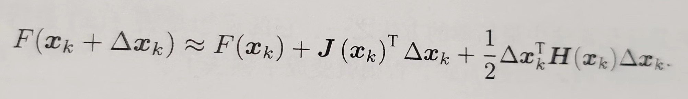
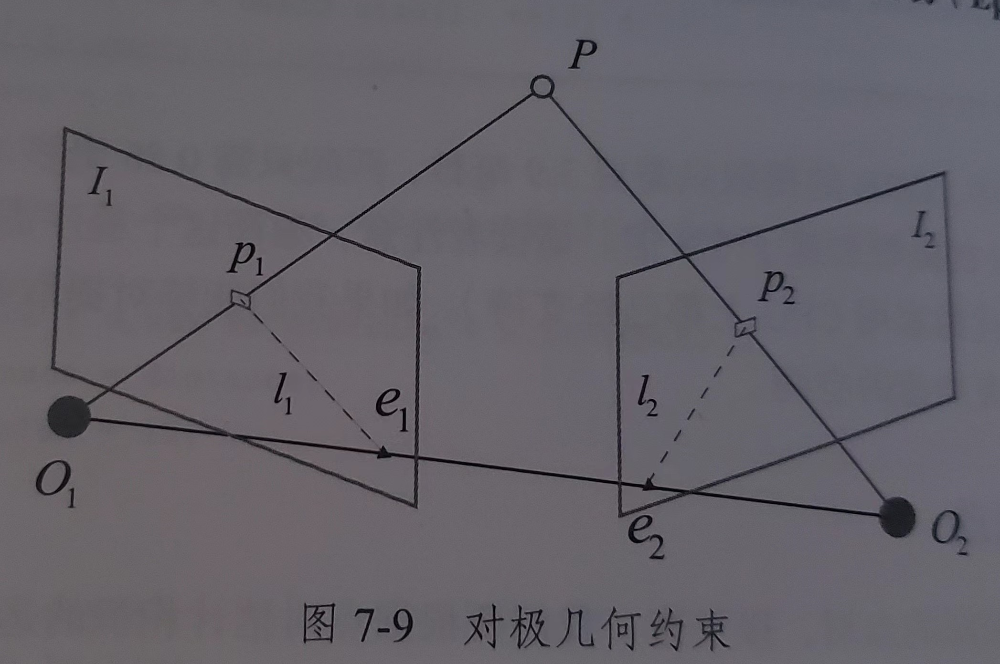
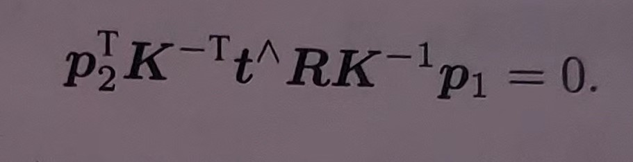
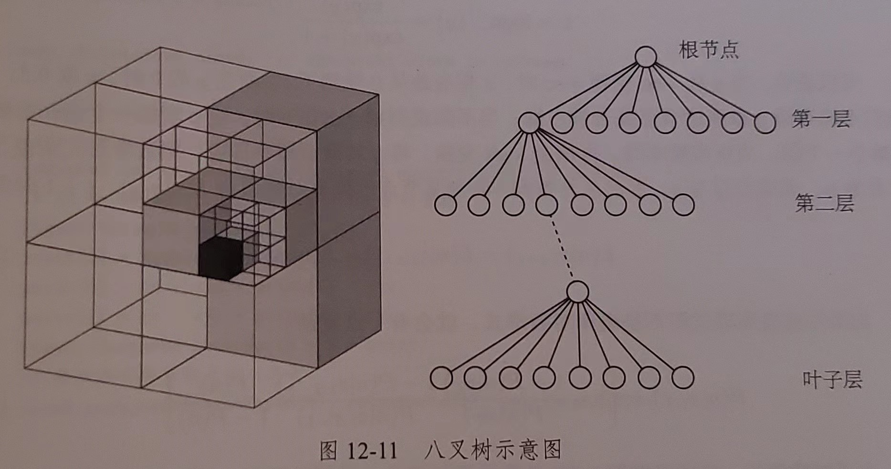

# 视觉 SLAM

## 什么是 SLAM

SLAM(Simultaneous Localization and Mapping) 是实时定位与地图构建：

指搭载特定传感器的主体，在没有环境先验信息的情况下，在运动过程中建立环境模型，同时估计自己的运动。

目的是解决 `定位` 和 `地图构建` 问题


#### 单目相机

记录三维空间的投影；

静态下无法判断景深，动态中可以通过 “近处物体移动快，远处物体移动慢” 来推测物体的远景；

动态评估得到的环境信息的 `尺度` 是不确定的，根本原因是无法获得 `深度` 信息；


#### 双目和深度相机

记录三维空间的投影，并且获得 `深度` 信息；

双目相机的两个相机之间的距离称为“基线”，通过基线和大量计算来估计每个像素的空间位置，和人眼类似；双目相机得到的 `深度` 信息不太可靠。基线越长，能测到的距离越远；

深度相机（RGB-D）相机，增加红外结构光或 Tof 直接测得深度信息。


#### 经典视觉 SLAM 框架

1. 传感器信息读取：相机图像信息读取和预处理。可能还有码盘，惯性传感器等信息的读取
2. 前端视觉里程计：估算相邻图像间相机的运动，以及局部地图的样子。
3. 后端（非线性）优化：后端接收不同时刻视觉里程计测量的相机位姿，以及回环检测信息进行优化，得到全局一致的轨迹和地图。
4. 回环检测：判断机器人是否到达过先前的位置。如果检测到回环，会把信息提供给后端处理。
5. 建图：根据估计轨迹，建立与任务要求对应的地图。


#### 视觉里程计

视觉里程计关心相邻图像间的相机运动，最简单的就是两张图像间的运动关系。为了定量估计相机运动，必须先了解相机与空间点的几何关系。

视觉里程计通过相邻图像估计相机运动并恢复场景的空间结构。

把相邻时刻的运动“串”起来，就构成了机器人的运动轨迹，从而解决了定位问题。再根据每个时刻的相机位置，计算各像素对应的空间点位置，就得到了地图。但仅通过视觉里程计估计轨迹，将出现累积漂移。因为视觉里程计只通过过去短时间内的图像估计造成的。每个时刻的误差会被传递到下一个时刻，导致一段时间后轨迹不再精确。

为解决漂移问题，需要`后端优化` 和`回环检测`


#### 后端优化

后端优化主要处理 SLAM 的噪声问题。要考虑如何从带有噪声的传感器信息数据中估计整个系统的状态，以及这个状态估计的不确定性有多大，也称为最大后验概率估计，这个状态包括轨迹和地图。

视觉里程计也称为前端。前端给后端提供待优化的数据，及数据的初值。后端面对的是数据，并不需要关心数据来自什么传感器。在视觉里程计中，前端和计算机视觉研究更加相关，比如图像的特征提取和匹配等，后端则主要过滤与非线性优化算法。

SLAM 问题的本质是对运动主体和周围环境空间不确定性的估计。为解决 SLAM 问题需要状态估计理论，把定位和建图的不确定性表达出来，然后采用滤波器或非线性优化，估计状态的均值和不确定性（方差）。


#### 回环检测

也称为闭环检测，主要解决位置估计随时间漂移的问题。假如检测到机器“回到了某个位置”，但位置估计值却没有在那个位置，那么机器需要把位置估计值“拉”到那个位置，就可以消除漂移了。

回环检测与“定位”和“建图”二者密切相关。为实现回环检测，需要让机器“识别到过的场景”的能力。可以通过判断图像相似性来完成回环检测，是一种计算图像数据相似性的算法。

经过回环检测后，我们会把 A 和 B 是同一个点的信息告诉后端优化算法，后端根据信息把轨迹和地图调整到符合回环检测结果的样子。


#### 建图

度量地图：

度量地图强调精确表示地图中物体位置关系。分有稀疏和稠密两类。稀疏地图进行了一定程度的抽象，并不需要表达所有物体，可以选择一部分有意义的东西作为`路标` ，非路标部分可以直接忽略。定位时用稀疏路标地图就够了，而导航则往往需要用稠密地图，稠密地图通常按照某种分辨率，有许多小块组成，一个小块一般由占据、空闲、未知三个状态。

拓扑地图：

拓扑地图强调地图元素间的关系，拓扑地图由节点和边组成，只考虑节点间的连通性，例如关心A，B是连通的，而不考虑如何从A到B。放松了地图对精确位置的需要，去掉地图细节，是更为紧凑的表达方式。

然而拓扑地图仍待研究。


#### SLAM 问题的数学表达

假设机器人再未知环境中运动，在离散时刻 t = 1, 2, ... k 时候采集传感器数据。用 x 表示机器位置，于是各个时刻的位置表示为 x1, x2, ... x_k，它们构成了轨迹。假设地图由 n 个路标组成，用 y1, y2, ... y_n 表示。

在上面的设定中，“机器人在环境中运动”，由如下两件事情描述：

1. 什么是运动 ？我们要考察机从 k-1 到 k 时刻，机器的位置 x 是如何变化的。
2. 什么是观测 ？假设机器在 k 时刻于 x_k 出探测到某个路标 y_j，我们要考察如何用数学语言来描述。

先看运动，机器一般通过码盘，惯性传感器等测量自身运动，机器在 “前进 1 米”，“左转 90 °”，“刹车”等运动，可以用下面的抽象函数描述：

`x_k = f(x_k-1, u_k, w_k)`

`u_k`是运动传感器的数据，`w_k` 是该过程的噪声，`x_k-1` 是上个时刻的位置，`x_k`是当前时刻的位置

噪声的存在使得模型变成了随机模型。例如“前进 1 米”的指令，实际可能只前进了 0.9 米，也可能是 1.1 米。噪声是随机的。

于运动方程相对应的是观测方程。机器在 x_k 位置看到了路标 y_j 时，产生了一个观测数据 z_k,j。用下面的抽象函数表示：

`z_k,j = h(y_j, x_k, v_k,j)`

`v_k,j` 是观测噪声，`y_j` 观测目标，`x_k` 是观测位置，`z_k,j`是观测结果

假设机器用二维激光传感器观测，那么可以得到路标和机器的距离 r 和夹角 θ。记路标为 y_j = [y1, y2]^T _k，机器位姿为 x_k = [x1, x2]^T _k，观测数据为 z_k,j = [r_k,j, θ\_k,j]^T，那么观测方程为：


SLAM 的过程可以总结为：

x_k = f(x_k-1, u_k, w_k)，k = 1, ...k

z_k,j = h(y_j, x_k, v_k,j)，(k, j) ∈ O  (O 是一个集合，记录了观察到路标)

方程描述了已知运动测量读数 u，传感器数据 z 时，求解定位问题（估计 x）和建图问题（估计 y），我们把 SLAM 问题建模成状态估计问题：如何通过带有噪声的测量读数，估计内部，隐藏的状态变量。

状态估计问题的求解，与两方程的具体形式，以及噪声服从哪种分布有关。按运动和观测方程是否为线性，噪声是否服从高斯分布进行分类，分为`线性/非线性` 和`高斯/非高斯`系统。其中`线性高斯系统`最简单，它的无偏最优估计可以由卡尔曼滤波器（KF）给出。而复杂的`非线性非高斯系统`可以用扩展卡尔曼滤波器（EKF）和非线性优化两大类方法求解。知道 21 世纪早期，EKF 会在工作点把系统线性化，以预测-更新两大步骤进行求解。为了克服 EKF 缺点，例如线性化误差和噪声高斯分布假设，人们开始用粒子滤波器等其他滤波器，乃至使用非线性优化的方法。主流视觉 SLAM 使用图优化为代表的优化技术进行状态估计。**一般认为优化技术已经明显优于滤波器技术**。


## 三维空间刚体运动

线性代数库`Eigen` 提供矩阵计算，其中 `Geometry` 模块提供四元素等描述刚体运动的结构。


#### 旋转矩阵

三维空间中的基向量为[e1, e2, e3]，任意向量 a 表示为：

a = [{e1, e2, e3}] [{a1} {a2} {3}] = a1e1 + a2e2 + a3e3 （这里 {} 表示占矩阵一行） 

向量的点乘（内积）: a · b

几何意义：向量a 在向量b 方向上投影与|b|的乘积，反应两个向量的相似度，结果越大越相似。

向量的叉乘（外积）: a x b

几何意义：如果向量a 和向量b 构成平行四边形，那么外积的模长与该四边形的面积相等。

把 a 写成矩阵，事实上是`反对称矩阵`，将 `^` 记作反对称符号。a x b 写为矩阵和向量的乘法 a ^ b


#### 坐标系间的欧氏变换

两个坐标系间的运动由一个旋转加一个平移组成，这种运动称为刚体运动。刚体运动中物体的位姿变换过程称为欧氏变换。由旋转和平移组成。

某个单位正交基(e1, e2, e3)经过旋转为(e1', e2', e3')，对于同一个向量a（没有因为旋转发生运动），它在两个坐标系下坐标为[{a1}, {a2}, {a3}] 和 [{a1'}, {a2'}, {a3'}]（这里 {} 表示占矩阵一行），那么有：

```
[{e1, e2, e3}] [{a1}, {a2}, {a3}] = [{e1', e2', e3'}]  [{a1'}, {a2'}, {a3'}]
```

左右两边同左乘 [{e1^T}, {e2^T}, {e3^T}] 得到

```
[{a1}, {a2}, {a3}] = R a'
```

R 描述了坐标系的旋转，称为旋转矩阵

旋转矩阵的行列式为 1，表示为 det(R) = 1

行列式的几何意义是变换后的新基的面积或体积的伸缩率。行列式为 1 表示经过旋转变换后，两个坐标系没有发生伸缩变换。


设坐标系1，坐标系2，向量a 在两个坐标系中坐标为a1，a2，欧式变换的旋转用旋转矩阵R表示，平移用平移向量t表示，那么：

```
a1 = R12 a2 + t12
```

R12 表示从坐标系2 到坐标系1 的变换，t12 实际表示的是坐标系1 原点指向坐标系2 原点，在坐标系1 中取的向量


#### 变换矩阵和齐次坐标

假设进行两次变换：b = R1 a + t1, c = R2 b + t2，从 a 到 c 的变换为：c = R2 (R1 a + t1) + t2

引入齐次坐标和变换矩阵：[{a'} {1}] = [{R, t} {0^T, 1}] [{a} {1}] = T [{a} {1}]

这是一个数学技巧，在三维向量末尾添加 1 ，将其变为四维向量，称为齐次坐标。在四维向量中，我们把旋转和平移写在一个矩阵里，使得整体关系变为线性关系，矩阵 T 称为变换矩阵。

用 a' 变 a 的齐次坐标，那么 a 到 c 变换可以写为：b' = T1 a', c' = T2 b'  ---> c' = T2 T1 a'

变换矩阵 T 的左上角为旋转矩阵，右上角为平移向量，左下角为 0，右下角为 1。这种矩阵又称为特殊欧氏群。


#### <u>使用 Eigen 库来计算矩阵</u>


#### 旋转向量和欧拉角

6 个自由度：3 个维度的旋转和平移

任意旋转都可以由一个旋转轴和一个旋转角来描述。

一个向量的方向与旋转轴一致，长度等于旋转角，这样的向量称为旋转向量（或角轴），只需要一个三维向量就可以描述旋转。

对于一个变换矩阵，可以用一个旋转向量和一个平移向量来描述，此时该变量维数是六维。


用 R 表示旋转，旋转轴上单位向量为 n ，角度 θ，从旋转向量到旋转矩阵的转换过程由 `罗德里格斯公式` 表明：


欧拉角将一个三维空间的旋转分解为 3 个不同旋转轴的旋转的顺序组合。

z 轴旋转，得到偏航角（yaw）；y 轴旋转，得到俯仰角（pitch）；x 轴旋转，得到翻滚角（roll）；

欧拉角的万向锁问题：当俯仰角为 ±90°时候，第一次旋转和第三次旋转都使用同一个轴，使得系统丢失一个自由度（从 3 次旋转变为 2 次旋转）。**任何用 3 个实数来表达三维旋转都会遇到这个奇异性问题**。（当旋转角度大于 360° 时候，旋转向量也会发生奇异性问题）因此欧拉角并不适合用于插值，迭代计算，但是适合人机交互。


#### 四元数

三维向量描述三维旋转都带有奇异性，就像用经纬度描述地球表面位置，当纬度±90° 时候，经度会失去意义一样。

四元数是一种扩展复数，紧凑且没有奇异性。

二维平面的旋转可以用**<u>单位复数</u>**来描述，三维空间的旋转可以用**<u>单位四元数</u>**来描述。

一个四元数有一个实部和三个虚部：q = q0 + q1i + q2j + q3k；其中

1. i^2 = j^2 = k ^2 = -1；
2. ij = k, ji = -k；
3. jk = i, kj = -i；
4. ki = j, ik = -j；

把 i j k 看作三个坐标轴，那么它们与自身的乘法同复数一样，互相间的乘法同外积一样。

有时也用一个标量和一个向量来表达四元数：

q = [{s}, {v}]，s = q0 ∈ R，v = [{q1} {q2} {q3}] ∈ R^3，s 称为四元数实部，v 称为虚部。

四元数的运算：

1、加减法；2、乘法；3、模长；4、共轭；5、逆；6、数乘；


四元数表示旋转：

假设空间三维点 p = [x, y, z] ，一个单位四元数 q 指定旋转。旋转后变为 p'。

把三维空间点用一个虚四元数表示 p = [0, x, y, z]^T = [0, v]^T，把四元数 3 个虚部和空间 3 个轴对应。

那么旋转后 p' = q p q^(-1)，取出 p' 的虚部即得到旋转后的点坐标

任意单位四元数描述了一个旋转，该旋转也可以用旋转矩阵和旋转向量表示。

单位四元数到旋转矩阵和旋转向量的转换公式：略


#### *相似，仿射，射影变换


#### 可视化演示

通过 pangolin 库来观察三维空间变换。

#### <u>使用 Eigen 库来计算四元素</u>


## 李群和李代数

三维旋转矩阵构成特殊正交群 SO(3)，变换矩阵构成特殊欧氏群 SE(3)：


#### 李群李代数基础

旋转矩阵，变换矩阵没有（良好地）定义加法，减法，除法运算，只定义好了乘法运算，且可以求逆。像这样只有一种（良好）定义的运算的集合，我们称为群。

群是一种集合加一种运算的代数结构。把集合记作 A，把运算记作 ·，群可以记作 G = （A, ·）。群要求该运算满足：

1. 封闭性：a1 · a2 = a3，(a1 a2 a3 ∈ A)；
2. 结合律：(a1 · a2) · a3 = a1 · (a2 · a3)，(a1 a2 a3 ∈ A)；
3. 幺元：存在 a0，对于任意 a，有 a0 · a = a · a0 = a
4. 逆：任意 a，存在 a^(-1)，有 a · a^(-1) = a0


李群是指具有连续（光滑）性质的群。


#### 李代数的定义

每个李群都有对应的李代数。李代数描述了李群的局部性质，准确地说是单位元附近的正切空间。

李代数由一个集合 V，一个数域 F 和一个二元运算符 [ , ]组成。如果满足以下性质，则称 (V, F, [ , ]) 为一个李代数，记作 g

1. 封闭性：任意 X，Y ∈ V， [X, Y] ∈ V

2. 双线性：任意 X，Y，Z ∈ V，a，b ∈ V，有

   [aX + bY，Z] = a[X，Z] + b[Y，Z]；[Z，aX + bY] = a[Z，X] + b[Z，Y]

3. 自反性：任意 X ∈ V，[X，X] = 0，自己和自己运算结果为 0

4. 雅可比等价：任意 X，Y，Z ∈ V，[X，[Y，Z]] + [Z，[X，Y]] + [Y，[Z，X]] = 0

 二元运算符称为李括号，表达了两个元素的差异。

向量的叉积（外积）是一种李代数。


#### 李代数 so(3) （搞不懂）

SO(3) 对应的李代数是定义在三维向量空间 R^3 上，记作 φ，每个 φ 可以生成一个反对称矩阵：


SO(3) 是三维向量的集合，每个向量对应一个反对称矩阵，可用于表达旋转矩阵的导数。


#### 李代数 se(3) （搞不懂）

先跳过


#### 指数与对数的映射

任意矩阵的指数映射可以写成泰勒展开，但只有在收敛的情况下有结果。结果仍是矩阵：


对于 so(3）的任意元素 φ，可得到指数映射：


这里的指数映射即是之前的罗德里格斯公式，通过它可以将任意 so(3) 中的向量映射到位于 SO(3) 的旋转矩阵。如果定义了对数映射，也能把 SO(3) 中的元素映射到 so(3) 中。

每个 SO(3) 中元素可以找到一个 so(3 元素与之对应，但可能存在多个 so(3) 的元素对应到同一个 SO(3)。对于旋转角 θ，± 360°和没转是一样的。具有周期性。如果把旋转角度固定在 ±π 之间，那么李群和李代数是一一对应的。


#### 李代数求导与扰动模型

利用 BCH 公式来讨论李群乘法和李代数加法；


假设机器在某个时刻位姿为 T，观测到一个位于世界 坐标 p 处的路标点，产生观测数据 z，由坐标变换关系有：

z  = Tp + w

w 为随机噪声，由于它的存在 z 不能满足 z = Tp 的关系。存在误差 e = z - Tp

假设存在 N 个路标点和观测，于是有 N 个上式，对机器位姿估计，相当于找一个最优解 T，使得整体误差最小


我们会经常构建与位姿有关的函数，然后讨论该函数关于位姿的导数，以调整当前的估计值。求解此问题，需要计算目标函数 J 关于变换矩阵 T 的导数。求导思路有两种：

1. 用李代数表示姿态，根据李代数的加法对李代数求导，称为李代数求导模型；
2. 对李群左乘或右乘微小扰动，然后对扰动求导，称为左扰动模型，右扰动模型；


李代数求导模型：略


SE(3) 的李代数求导：略


#### <u>使用 Sophus 来计算李群和李代数</u>


#### <u>评估轨迹误差</u>


## 相机与图像

#### 相机模型

针孔模型描述了一束光线通过针孔后，在针孔背面投影成像的关系。由于相机镜头透镜的存在，使得光线投影到成像过程产生畸变。相机的针孔和畸变模型构成相机的内参。


像素坐标系 o - u - v ：原点 o 在图像左上角，u 轴向右与 x 轴平行，v 轴向下与 y 轴平行。像素平面与成像平面之间，差了缩放和原点平移。 假设像素坐标系在 u 轴的缩放为 A，v 轴缩放为 B，原点平移了 [c_x, c_y]^T，那么像素坐标 [u, v]^T 关系为：

u = A X' + c_x；v = B Y' + c_y；

u, v, c_x, c_y 单位是像素，A, B 单位是像素/米，X', Y' 单位是米


中间量组成的矩阵称为相机的内参数矩阵 K，P 是相机位置。内参数一般是固定的。有时候需要自己确定内参，称为标定。单目相机有**棋盘格张正友**标定法。

相机的外参数是由相机在机器的安装位置决定的。


相机透镜本身会对光线传播进行影响，另外在机械组装中，透镜和成像平面不可能完全平行，从而造成成像位置的变化。

由透镜形状引起的畸变称为径向畸变。主要分为桶型畸变和枕型畸变。桶型畸变图像放大率会随着光轴间的距离增加而减小，而枕型畸变则相反。

由机械组装是透镜和成像平面不能完全平行的畸变称为切向畸变。


径向畸变可以看作是坐标点沿着长度方向发生了变化，就是其距离原点的长度发生了变化；切向畸变可以看成坐标点沿着切线方向发生变化，也就是水平夹角发生了变化。


单目相机成像过程：

1. 世界坐标系下有一点 P，世界坐标为 P_w；
2. 由于相机在运动，它的运动由 R，t 或变换矩阵 T 描述。P 的相机坐标 P_c = R P_w + t；
3. 此时 P_c 的分量为 X，Y，Z，投影到归一化平面 Z = 1 上，得到 P 的归一化坐标：P_c = [X/Z, Y/Z, 1]^T；
4. 有畸变时，根据畸变 参数计算 P_c 的正确坐标；
5. P 的归一化坐标经过内参后，对应到它的像素坐标：P_uv = K P_c


#### 双目相机模型

通过同步采集左右相机图像，计算图像间视差，以估计每个像素的深度。


左右相机的光圈中心距离称为双目相机的基线；

假设空间一点 P ，在左右相机中成像 P_L , P_R。理想情况下相机在 x 轴（图像的 u 轴）上有平移，记左坐标为 u_L，右坐标为 u_R ，根据△P P_L P_R 和 △P O_L O_R 的相似关系：有

(z - f) / z = (b -u_L + u_R) / b；             z = f b / d，d = u_L - u_R；

d 定义为左右图横坐标之差，称为视差。b 是两相机的基线。

视差越大，距离越近。由于视差最小为一个像素，所以双目能观察到的景深存在一个理论最大值，由 fb 决定。基线越长，双目能观察到的最大距离越远。

视差 d 的计算比较困难，需要确认左图像跟右图像的对应关系，实际应用中需要 GPU 或 FPGA 来计算。


#### RGB-D 相机模型

RGB-D 相机可以主动获取每个像素的深度。主要原理有红外结构光和飞行时间来测量像素距离。


红外结构光相机容易受到日光或其他传感器发出的红外光干扰，所以不能在室外使用，对于透明材质的物体也无法测量。


#### 图像


A 表示透明度


<u>**使用 OpenCV 来处理图像**</u>

**图像去畸变**


## 非线性优化

状态估计问题

处理状态估计问题分为两种。由于在 SLAM 过程中，数据随时间逐渐到来，所以我们应该持有一个当前时刻的估计状态，然后用新数据来更新它，这种方式称为增量/渐进的方式，或叫滤波器。历史上常用扩展卡尔曼滤波器求解。另一种方式是把数据累积起来处理，这种方式称为批量的方法。

增量方式仅关心当前时刻的状态估计 x_k，而对之前的状态不多考虑；而批量的方式在更大范围内达到最优化，被认为优于传统的滤波器，成为 SLAM 的主流方式。批量的方式甚至可以把初始状态到结束时刻的全部数据一起处理，但这种极端情况不实时不符合 SLAM 的实际运用场景。实际应用中，我们固定一些历史轨迹，仅对当前时刻附近的一些轨迹进行优化，这便是滑动窗口估计法；


假设从 1 到 N 的所有时刻，有 M 个路标点。定义所有时刻的机器人位姿和路标点坐标为：

 x = {x1, x2, ... x_N}, y = {y1, y2, ... y_M}

用 u 表示所有时刻的输入，z 表示所有时刻的观测数据。对机器人状态的估计，从概率学观点看就是已知输入数据 u 和观测数据 z 的条件下，求状态 x, y 条件概率分布：P(x, y |z, u)

特别地，当不知道控制输入的情况下，只有一张张图像，只考虑观测方程，相当于 P(x, y | z) 的条件概率分布。利用贝叶斯法则有：

P(x, y|z, u) = P(z, u|x, y) P(x, y) / P(z, u)  近似于 P(z, u|x, y) P(x, y),            P(z, u|x, y) 称为似然，P(x, y) 称为先验

贝叶斯法则左侧称为后验概率，右侧 P(z |x)称为似然，另一部分 P(x) 称为先验。直接求后验概率比较困难，但求一个状态最优估计，使得在该状态下后验概率最大化。如果我们不知道机器人位姿或路标在哪里，此时就没有先验，那么可以用似然来估计状态。

<u>**直观地说，似然是指“在现在位姿下，可能产生怎么样的观测数据”。由于我们知道观测数据，所以最大似然可以理解为“在什么样的状态下，最可能产生现在观测到的数据”**</u>


#### 非线性最小二乘

最小二乘形式：


令目标函数导数为零，然后求解 x 的最优值。求解这样的方程需要知道关于函数的全局性质，但这往往是不可能的。对于不方便直接求解的最小二乘问题，我们可以用迭代的方式，从初始值触发，不断更新当前最优变量，使目标函数下降，具体步骤如下：


这让求解导函数为 0 的问题变成了一个不断寻找下降增量 △x_k 的问题。由于可以对 f 进行线性优化，增量计算将简单的多，当函数下降直到增量非常小时候认为算法收敛，目标函数达到极小值。问题在于如何找到每次迭代的增量，我们只用关心迭代值处的局部性质而非全局性质。

下面讨论如何寻找这个增量 △x_k，这属于数值优化的领域。


一阶和二阶梯度法：

假设我们在 x_k 处，想要寻找增量 △x_k，那么最直观的方式是将目标函数在 x_k 附近进行泰勒展开：



J(x_k) 是 F(x) 关于 x 的一阶导数（也叫梯度、雅可比矩阵），H 则是二阶导数（海塞矩阵）。 

如果只保留一阶梯度，那么取增量为反向的梯度，即可保证函数下降：△x^* = - J(x_k)，这只是方向，通常还需要指定一个步长 λ。这种方法称为最速下降法。它的直观意义是，只有我们沿着反向梯度方向前进，在一阶（线性）的近似下，目标函数必定会下降。

如果保留二阶梯度信息，这种方法称为牛顿法。

事实上，我们用一个一次或二次函数近似了原函数，然后用近似函数的最小值来猜测原函数的极小值。只要原函数的局部看起来像一次或二次函数，这类算法就是成立的。最速下降法过于贪心，容易走出锯齿路线，反而增加了迭代次数。而牛顿法需要计算目标函数的 H 矩阵，在规模较大时候非常困难，通常要避免 H 矩阵的计算。一些拟牛顿法可以得到较好结果，例如高斯牛顿法和列文伯格-马夸尔特方法


#### 高斯牛顿法

高斯牛顿法的思想是将 f(x) 进行一阶泰勒展开。请注意这里是 f(x) 而不是 F(x)，否则就成了牛顿法了。


高斯牛顿方程：


这个方程式关于变量 △x 的线性方程组，称为增量方程或正规方程。把左边系数定义为 H，右边定义为 g，上式简化为：H △x = g。求解增量方程式整个优化问题的核心所在。高斯牛顿法的算法步骤可以写为：


#### 列文伯格-马夸尔特法

列文伯格-马夸尔特法被认为比高斯牛顿法的鲁棒性更强，但收敛速度更慢，被称为阻尼牛顿法。

高斯牛顿法中采用近似二阶泰勒展开，只能在展开点附近取的较好近似效果。我们给 △x 添加一个信赖范围，认为在这个信赖范围内二阶近似是有效的。信赖范围根据近似模型和实际函数的差异来确定，差异小，就扩大近似范围，差异大，就缩小近似范围。用 ρ 来描述这种近似程度：


ρ 的分子是实际函数下降值，分母是近似模型下降值。如果 ρ 接近 1 说明近似是好的。

阻尼牛顿法的步骤如下：


#### <u>手写高斯牛顿法</u>


#### **<u>Ceres 优化库的使用</u>**

ceres 是广泛使用的最小二乘问题求解库。


#### <u>g2o 图优化库</u>

g2o 是将非线性优化和图论结合起来的理论。

图优化理论：把优化问题表现成图的一种方式。这里的图是图论意义上的图。一个图由若干个顶点，连接顶点的边组成。进而用顶点表示优化变量，用边表示误差项。


## 视觉里程计1

SLAM 系统分为前端和后端。前端也称为视觉里程计，主流算法分为特征点法和直接法。特征点法具有稳定，对光照，动态物体不敏感的优势。

视觉里程计的核心问题是如何根据图像估计相机运动。从图像中选取比较有代表性的点，这些点在相机运动发生少量变化后仍保持不变，于是我们可以在图像中找到相同的点。然后在这些点的基础上，讨论相机位姿估计问题，以及这些点的定位问题。在经典 SLAM 中，这些点称为路标，在视觉 SLAM 中，路标则是指图像特征。

特征点是图像里一些特别的地方。可以将图像中角点，边缘和区块都当成图像有代表性的地方。通常来说，在两张图像中寻找相同的角点比边缘容易，而区块则最难。

**角点提取算法有：`Harris算法`，`FAST角点`，`GFTT角点` 等。**

**实际应用中，由于相机的远近，旋转，角点可以发生变化，所以还需要更加稳定的局部图像特征，例如 `SIFT`，`SURF`，`ORB` 等。**

人工设计的特征点拥有如下性质：

1. 可重复性：相同特征可以在不同图像中找到
2. 可区别性：不同的特征有不同的表达
3. 高效率：同一图像，特征点的数量应该远小于像素数量
4. 本地性：特征仅与一小片图像区域相关。


特征点由关键点和描述子两部分组成。关键点指该特征点在图像里的位置，有些特征点还有朝向，大小等信息。描述子通常是一个向量，按照人为设计的方式，描述了该关键点周围像素的信息。描述子是按照**“外观相似的特征应该有相似的描述子”**的原则设计。因此，只要两个特征点的描述子在向量空间上距离相近，就可以认为他们是相同的特征点。

`SIFT算法` 尺度不变特征变换，充分考虑了图像变换中的光照，尺度，旋转等变化，但随之而来是极大的计算量，难以实际运用。

`FAST关键点` 适当降低精度和鲁棒性，以提高效率。该算法没有描述子。

`ORB算法` 是目前非常具有代表性的实时图像特征，改进了 `FAST` 不具有方向性的问题，并采用速度极快的二进制描述子 BRIEF，使整体图像特征提取环节大大加速。

大部分特征提取具有较好的并行性，可以通过 GPU 等设备加速。**ORB 是质量和性能之间较好的折中**。


#### ORB 特征

ORB 特征由关键点和描述子两部分组成。其关键点是改进的 FAST 角点。ORB 在平移，旋转和缩放变换下仍具有良好的表现。提取 ORB 特征分为两个步骤：

1. FAST 角点提取，相比原版 FAST，增加了特征点的主方向，为后续 BRIEF 描述子增加了旋转不变特性；
2. BRIEF 描述子，对前一步骤提取的特征点周围图像区域进行描述。ORB 对 BRIEF 进行了改进，主要指使用了前面的方向信息；


##### FAST 关键点

FAST 是一种角点，主要检测局部像素灰度变化明显的地方，以速度著称。主要思想是：如果一个像素与邻域像素差别较大（过亮或过暗），那么它可能是角点。相比其他角点检测，FAST 只比较像素亮度大小。过程如下：

1. 在图像中选取像素 ρ，假设亮度为 I_ρ；
2. 设置一个阈值 T（比如，I_ρ 的 20%）；
3. 以像素 ρ 为中心，选取半径为 3 的圆上的 16 个像素点；
4. 假如先去的圆上有连续 N 个点亮度大于 I_ρ + T  或小于 I\_ρ - T ，那么像素 ρ 可以被认为是特征点（N 通常取 12，即 FAST-12。其他常用的 N 取 9 和 11，即 FAST-9 和 FAST-11）；
5. 循环以上四步，对每个像素执行相同步骤；

在 FAST-12 中可以加预测试操作，以快速排除大多数不是角点的像素。例如直接检测邻域圆上第 1,5,9,13 个像素的亮度，只有这 4 个像素中有 3 个像素同时大于 I_ρ + T 或小于 I\_ρ - T 时候，当前像素才可能是角点，否则直接排除。原始 FAST 角点经常出现“扎堆”现象，在一遍检测后，还需要用非极大值抑制，在一定区域内仅保留响应极大值的角点，避免角点集中的问题。


原始 FAST 缺点有重复性不强，分布不均匀，不具有方向性。由于它固定取半径为 3 的圆，存在尺度问题：远处看的像角点的地方，接近后却不是角点了。ORB 针对了 FAST 的方向性和尺度问题，添加了尺度和旋转的描述。尺度不变性由构建**<u>图像金字塔</u>**（指对图像进行不同层次的降采样，以获得不同 分辨率的图像），并在金字塔的每一层上检测角点来实现。而特征的旋转是由**<u>灰度质心法</u>**实现

金字塔是计算机视觉中常用的一种处理方法。金字塔底层是原始图像。每往上一层，就对图像进行一个固定倍率的缩放，这样就获得不同分辨率的图像。小图像可以看作是远处看过来的场景。在特征匹配算法中，我们可以匹配不同层上的图像，从而实现尺度不变性。

例如相机后退，我们能够在上一个图像金字塔的上层和下一个图像金字塔的下层中找到匹配。


图像灰度质心，质心指以图像块灰度值作为权重的中心。步骤如下：

1. 在一个小图像块 B 中，定义图像块的矩为：

   

2. 通过矩可以找到图像块质心：

   C = （m_10 / m_00, m_01 / m_00）

3. 连接图像块的几何中心 O 和质心 C，得到一个方向向量 OC，于是特征点方向可以定义为：

   θ = arctan(m_01 / m_10)

   

改进后的 FAST 称为 Oriented FAST


##### BRIEF 描述子

提取 Oriented FAST 关键点后，对每个点计算其描述子。

BRIEF 是一种二进制描述子，描述向量由许多 0 和 1 组成，这里的 0 和 1 编码了关键点附近两个随机像素（比如 p 和 q ）的大小关系：如果 p 比 q 大，则取 1，反之取 0。如果去了 128 个这样的 p，q，最后得到了 128 维由 0，1 组成的向量。原始的 BRIEF 描述子不具有旋转不变性，因此在图像旋转时候容易丢失。而 ORB 在提取关键点步骤计算了方向，所以可以利用方向信息计算旋转后的特征，使得描述子具有较好的旋转不变性。


##### 特征匹配

特征匹配解决了 SLAM 问题中的数据关联问题，即确定当前看到的路标和之前看到的路标之间的对应关系。通过对图像间的描述子进行准确匹配，可以为后续姿态估计，优化等操作减轻大量负担。由于图像特征的局部特性，误匹配的情况广泛存在，长期没有得到有效解决。

最简单的匹配方式就是**暴力匹配**，即对一个时刻的每个特征点与另一个时刻的所有特征点测量描述子的距离，然后排序，去最近点作为匹配点。描述子距离表示了两个特征点间的相似程度。对于浮点类型的描述子，可以使用欧氏距离进行度量。对于二进制描述子（例如BRIEF），往往使用汉明距离（指两个二进制串之间不同位数的个数）作为度量。

当特征点数量很大时，暴力匹配不符合 SLAM 实时性需求。此时可以使用**快速近似最近邻（FLANN）**来匹配特征点。该算法已集成到 OpenCV


#### <u>使用 OpenCV 的 ORB 和 快速近似最近邻 来实现特征点匹配</u>


#### 2D-2D：对极几何

对极约束：求取两张图像 I_1，I_2 之间运动，设第一帧到第二帧运动为 R，t。两个相机中心 O_1，O_2。I_1 有一个特征点 ρ_1，它在 I_2 对应特征点为 ρ\_2 。它们是在同一空间点在两个成像平面上的投影。线段 O_1ρ\_1 和 线段 O_2ρ\_2 在三维空间相较于 P。O_1，O\_2，P 三点确定一平面，称为极平面。O_1O\_2 连线与像平面 I_1，I\_2 的交点为 e_1，e\_2，称为极点。O_1O\_2 称为基线。我们称极平面与两个像平面 I_1，I\_2 之间的相交线 l_1，l\_2 为极线。



从第一帧看，射线 O_1ρ\_1 是某个像素可能出现的空间位置，因为射线上所有点都会投影到同一个像素点。如果不知道 P 的位置，那么在第二帧图像上看，连线 e_2ρ_2 （也就是第二帧的极线）就是 P 可能出现的投影位置，也就是射线 O_1ρ\_1 在第二个相机的投影。现在我们通过特征点匹配确定了 ρ\_2 的像素位置，所以能够确定 P 的空间位置，以及相机运动。如果没有特征点匹配，我们无法确定 ρ\_2 在极线上的位置。




对极约束，几何意义是O_1，O_2，P 三者共面。对极约束中同时包含了平移和旋转。记作基础矩阵 F 和本质矩阵 E，简化为：


对极约束给出了两个匹配点的空间位置关系，于是相机位姿估计问题变为：

1. 根据配对点的像素位置求 E 或 F
2. 根据 E 或 F 求出 R，t

E 和 F 只相差了相机内参，而内参在 SLAM 中通常是已知的，实践中往往使用 E


#### 本质矩阵

根据定义本质矩阵是 3 * 3 矩阵，具有以下特征：

- 本质矩阵是对极约束定义的。由于对极约束是等式为 0 的约束，所以 E 乘以任意非零常数后，对极约束依然满足。称为 E 在不同尺度下等价的；
- 根据 E = t^R ，本质矩阵的奇异值必定是 [σ, σ, 0]^T 形式，称为本质矩阵的内在性质；
- 由于平移和旋转存在 3 个自由度，故 t^R 有 6 个自由度。但由于尺度等价，故 E 实际有 5 个自由度；

**求解本质矩阵的经典做法是考虑它的尺度等价性，使用 8 对点来估计 E —— 八点法**。只利用了 E 的线性性质，可以在线性代数下求解。


#### 单应矩阵

单应矩阵 H 描述了两个平面间的映射关系。若场景中特征点都落在同一平面上，可通过单应性进行运动估计。**单应矩阵求解相机运动在无人机的俯视相机或扫地机的顶视相机中常见。**


#### <u>对极约束求解相机运动</u>


#### 三角测量

对极几何约束估计相机运动需要估计特征点的空间位置，单目相机还需要通过三角测量来估计图点深度。


三角测量指通过不同位置对同一个路标点进行观察，从观察的位置推断路标点的距离。

图像 I_1 和 I_2 ，以作图为参考，右图为变换矩阵 T 。相机光心为 O_1 和 O_2。I_1 的特征点 ρ_1 对应 I_2 中特征点 ρ\_2。理论上直线 O_1ρ\_1 和 O_2ρ\_2 在场景中会相交与一点 P，即特征点对应的地图点在三维场景中的位置。然而由于噪声影响，这两条直线往往无法相交，因此可以通过最小二乘法求解。

三角测量由平移得到，由平移才有对极几何中的三角形。**因此纯旋转是无法使用三角测量的**。平移存在的情况下，还可能出现**三角测量矛盾**。提高三角测量的精度可以通过提高特征点提取精度，也就是图像分辨率，但会增加计算成本；另一种方式就是提高平移量，但会使图像外观发生明显变化，例如显示出物体的侧面，光照改变等，这又会引起特征点提取和匹配的困难。平移小了，三角测量精度不够，这就是三角测量矛盾，也称为视差。

单目相机在应用中往往是延迟几帧产生足够的视差后再做三角测量，称为延迟三角化。


#### 3D-2D：PnP

PnP 是求解 3D 到 2D 的运动方法，描述了当知道 n 个 3D 空间点及其投影位置，如何估计相机位姿。在双目或者 RGB-D 相机的视觉里程计中，可以直接使用 PnP 估计相机运动，而单目相机则需要初始化才能使用。3D-2D 不需要对极约束，又可以在较少匹配点中较好估计运动，是一种重要的姿态估计方法。

PnP 求解方法有 P3P，直接线性变换(DLT)，EPnP，UPnP 等。还有非线性优化，万金油式的光束法平差。


P3P：

已知 3D 点 A，B，C 在世界坐标系中坐标，2D 点 a，b，c 是三维空间点在相机成像平面上的投影。


根据三角形之间的相似性有：△Oab - △OAB，△Obc - △ OBC，△Oac - △OAC

利用余弦定理得到：


其中 v = AB^2 / OC^2，uv = BC^2 / OC^2，wv = AC^2 / OC^2 

求解需要用到吴消元法。

P3P 缺点：

1. 只利用 3 个点，当配对点对于 3 个时候，无法利用更多信息；
2. 若 3D 或 2D 信息受噪声影响，或存在匹配误差，则算法失效；


#### 最小化重投影误差求解 PnP

把相机和三维空间点放在一起进行最小化，统称为 Bundle Adjustment（BA）


#### **<u>使用 OpenCV 求解 PnP</u>**


#### <u>非线性优化-高斯牛顿法 求解 PnP</u>


#### <u>非线性优化-使用 g2o 求解 PnP</u>


#### 3D-3D：ICP

配对好的 3D-3D 空间点利用迭代最近点（ICP）求解。这种模型没有出现相机模型，因为都是三维空间点。

求解方法有线性代数（SVD）即非线性优化（类似BA）


#### <u>SVD 求解 3D-3D</u>


#### <u>非线性优化求解 3D-3D</u>


## 视觉里程计2

直接法是继特征点法之后的相机估计求解方法。


特征点法缺点：

1. 关键点提取和描述子的计算非常耗时；
2. 忽略了特征点外的可能有用信息；
3. 相机运动到特征缺失的地方，没有明显的纹理信息可以判断；

改进：

1. 保留特征点，但不计算描述子。使用光流法跟踪特征点运动；光流法的计算要快于描述子的匹配速度；
2. 只计算关键点，不计算描述子。同时使用直接法计算特征点在下一个时刻在图像的位置。跳过描述子计算和光流计算；

直接法使用图像的像素灰度信息估计相机运动和点的投影，甚至可以使随机的选点。可以不知道点和点之间的对应关系，而是通过最小化光度误差来求解。只要场景存在明暗变化（可以使渐变的，不形成局部图像梯度）


#### 2D 光流

光流描述了像素随时间在图像之间的运动。其中计算部分像素运动的称为稀疏光流（例如 Lucas-Kanade 光流），计算所有像素的称为稠密光流（例如 Horn-Schunck 光流）。


在 LK 光流中，认为图像的随时间变化的。一个在 t 时刻，位于 (x, y) 处的像素，它的灰度可以写成：I(x, y, t)，这里可以看成关于位置和时间的函数，值域就是图像中像素灰度。

光流法的基本假设：灰度不变假设，在同一个空间点的像素灰度值在各个图像中是固定不变的。这在实际中很难成立。另外还要假设某个窗口内的像素具有相同的运动。


u 和 v 是像素在 x 轴和 y 轴上的移动速度。LK 光流经常用来跟踪角点。


#### <u>高斯牛顿法实现光流</u>


#### <u>求解直接法，最后需要用到 g2o 或 Ceres 这些优化库来得到最优解。<u></u></u>


#### 直接法

光流法中，我需要跟踪特征点的位置，再估计相机运动。而直接法中，在估计相机运动的时候，就在调整特征点位置了。


直接法优缺点总结：

优点：

1. 省去计算特征点，描述子的时间
2. 只要求像素梯度即可，不需要特征点。直接法可以在特征缺失场合下使用。

缺点：

1. 非凸性：直接法依赖梯度搜索，降低目标函数来计算相机位姿。
2. 单个像素没有区分度：要么计算图像块，要么计算复杂相关性。直接法选点一般要多于 500 个以上。
3. 灰度值不变是很强的假设：相机会自动调节曝光使得图像变亮变暗，而光线变化也会出现该效果。实用的直接法需要估计相机的曝光参数。


## 后端1

#### 状态估计概率解释

在后端优化中，我们通常考虑一段更长时间（或所有时间内）的状态估计问题，不仅用过去的信息更新状态，还会用到未来的信息来更新，这种处理方式称为“批量的”。如果当前状态只用过去时刻甚至只是前一个时刻决定，称为“渐进的”

**批量状态估计问题可以转换为最大似然估计问题，并用最小二乘法求解。**

马尔科夫性：下一个状态只跟当前状态有关，跟更久前的状态无关。或者说未来只和现在有关，过去和未来相互独立。

如果 k 时刻的状态只和 k-1 时刻相关，就会得到**扩展卡尔曼滤波（EKF）**的方法。

如果 k 时刻的状态和之前所有状态相关，就会得到非线性优化为主体的优化框架。目前 SLAM 主流为非线性优化。


#### 线性系统和卡尔曼滤波（KF）


#### 非线性系统和扩展卡尔曼（EKF）

把卡尔曼系统运用到非线性系统中得到扩展卡尔曼滤波器。通常的做法是在某个点附近考虑运动方程和观测方程的一阶泰勒展开，只保留一阶项，即线性部分，然后按照线性系统进行推导。在计算资源受限，或者待估计量比较简单的情况下，EKF 仍是一种有效方式。

EKF 的缺点：

1. 依赖假设马尔可夫性，认为 k 时刻状态只和 k-1 时刻相关，而与 k-1 时刻之前的状态无关。如果确实跟之前的数据有关那么滤波器难以处理。而非线性优化倾向于使用所有数据，当然也会花费更多时间。
2. EKF 仅作一阶泰勒展开，认为该点的线性化近似在后验概率处仍然有效。线性近似只能在很小范围内成立，距离远了则不适用。
3. EKF 需要存储状态量的均值和方差，并更新维护。不适用与大场景。
4. 没有异常监测机制，导致系统存在异常值时候容易发散。而在视觉 SLAM 中异常值却很常见，无论是特征匹配还是光流法。


#### BA 和图优化

Bundle Adjustment （BA）指从视觉图像中提炼出最优 3D 模型和相机参数（内参和外参）。考虑从任意特征点发射出来的几束光线（bundles of light rays），他们会在几个相机成像平面上变成像素或是检测到特征点。如果我们调整各个相机的姿态和各个特征点的空间位置，使得光线最终收束到相机光心，称为 BA

#### 求解 BA

根据非线性优化的思想，我们应该从某个初始值开始不断地寻找下降方向 △x，来找到目标函数最优解。


ba 的非线性优化解过程，略。。。。。。


#### <u>Ceres 求解 BA</u>


#### <u>g2o 求解 BA</u>


## 后端2

#### 滑动窗口滤波和优化

带有相机位姿和空间点的图优化称为 BA，能够有效求解大规模的定位和建图问题。SLAM 中往往需要控制 BA 规模，保持计算得实时性。

控制计算规模的做法有很多，例如抽取关键帧，仅构造关键帧与路标点间的 BA，非关键帧只用于定位，对建图没有贡献。但随时间流逝，关键帧会越来越多，像 BA 这样的批量优化方法，计算效率会不断下降。

另外的方法是仅保留离当前时刻最近的 N 个关键帧，去掉时间上更早的关键帧。这样 BA 就固定在一个时间窗口内，离开这个窗口的就被丢弃。称为滑动窗口法。取 N 个关键帧的方法可以改动，例如取时间上靠近，空间上可以展开的的关键帧。如此当相机静止不动时候，BA 的结构也不至于缩成一团。同时可以定义“共视图”（指那些“与现在相机存在共同观测的关键帧构成的图”）。在 BA 优化时候，按某些原则在共视图内取关键帧和路标进行优化。


#### 滑动窗口法

在滑动窗口中，当窗口结构发生改变后，状态变量的变化可以分成两部分讨论：

1. 需要在窗口新增关键帧，以及它们观测到的路标点；
2. 需要把窗口中旧的关键帧删除，也可能删除掉它观测到的路标点；

**新增关键帧和路标点**

关键帧和路标点跟为 N+1 个，按正常 BA 流程对所有点进行边缘化，即可得到 N+1 个关键帧的高斯分布参数。

**删除一个旧的关键帧**

删除关键帧 x_1，但是 x_1 不是孤立的，和其他帧观测到同一个路标。将 x_1 边缘化后将导致整个问题不在稀疏。


假设 x_1 看到了路标点 y_1 至 y_4，在处理前 BA 的 Hessian 矩阵像左图一样，在 x_1 行的 y_1 到 y_4 列存在非零块，表示 x_1 看到了它们。这时边缘化 x_1，那么 Schur 消元过程相当于通过矩阵行和列操作消去非对角线处的几个非零矩阵块，这将导致右下角路标点矩阵块不再是非对角矩阵。这个过程称为边缘化的填入。

当边缘化关键帧时候，将破坏右下角路标点之间的对角结构，这时候 BA 就无法按照先前的稀疏方式迭代求解。所以需要对边缘化的过程进行改造，使保持滑动窗口 BA 的稀疏性。例如在边缘化某个旧关键帧时候，同时边缘化它观测到的路标点。这样路标点的信息旧转换为剩下的关键帧之间的共视图，从而保持右下角部分的对角块结构。例如在 OKVIS 中，会判断要边缘化的那个关键帧，它看到的路标点是否在最新的关键帧中仍被看到。如果不能，直接边缘化这个路标点；如果能，丢弃被边缘化关键帧对这个路标的观测，从而保持 BA 的稀疏性。


**SWF 中边缘化的直观解释**

我们知道边缘化在概率上意义是指条件概率。边缘化某个关键帧即“保持这个关键帧当前的估计值，求其他状态变量以这个关键帧为条件的条件概率”。所以当某个关键帧被边缘化，它观测到的路标点就会产生一个“这些路标应该在哪里”的先验信息，从而影响其余部分的估计值。如果再边缘化这些路标点，那么它们的观测者将得到一个”观测它们的关键帧应该在哪里“的先验信息。


#### 位姿图

经过若干次优化后就把特征点固定，只把它们看作位姿估计的约束，而不再优化它们的位置估计。

完全抛弃路标点的优化，考虑只有轨迹的图优化，而位姿节点间的边，可以由两个关键帧间通过特征点匹配之后得到的运动估计来给定初始值。不同的是，一旦初始值估计完成后，就不再优化那些路标点的位置，只关心所有的相机位姿间的联系。如此省去大量的特征点优化的计算，只保留关键帧的轨迹，从而构建所谓的位姿图。


如果我们由额外的传感器可以测量机器位姿，那么位姿图也是常见的融合方法；


#### 位姿图的优化

位姿图的节点表示相机位姿，边则是两个位姿节点间相对运动的估计，这个估计可以来自特征点或者直接法，也可以是 GPS 或 IMU 的积分。


#### <u>g2o 实践位姿图优化</u>


后端的优化没必要实时响应前端的图像数据。人们倾向去把前端和后端分开，运行于两个独立线程，称为跟踪和建图。建图部分主要是指后端的优化内容。前端需要实时响应视频的速度，例如每秒 30 帧；后端优化则可以慢慢进行，只有优化完把结果返回给前端即可。


## 回环检测

**回环检测的意义**

前端提供特征点的提取和轨迹，地图的初值，而后端负责对所有数据进行优化。如果仅考虑相邻时间上的关键帧，那么之前产生的误差将不可避免地累积到下个时刻，无法构建**全局一致**的轨迹和地图

当我们实际经过同一个地点时，估计轨迹也必定经过同一个点。

回环检测模块能够给出除了相邻帧的一些**时隔更加久远**的约束，因为相机经过了同一个地方，采集到了相似的数据。回环检测的关键就是如何有效地检测到相机经过同一个地方这件事，给后端的位姿图提供更多有效数据，得到**全局一致**的估计。


#### 回环检测方法

最简单的方法是特征点匹配，根据匹配数量确定哪两张图像存在关联。缺点在于盲目假设了”任意两幅图像都可能存在回环“，使得要检测的数量实在太大；另一种方法是随机抽取历史数据进行回环检测，但如果历史帧数增长时，回环检测效率不高。

实践中，随机抽取仍有可取性，但最好有一个”哪处可能出现回环“的预计。这里有两种思路：基于里程计的几何关系，或者基于外观的几何关系。基于里程计的几何关系是说，当我们发现相机运动到之前某个位置，检测它们有没有回环，但由于累计误差存在，往往没法正确发现”运动到之前的某个位置附近“这件事实，也就无法回环检测。如此有些因果倒置了。另外一种基于外观的几何关系，它和前端，后端的估计都无关。仅根据两幅图像的相似性确定回环检测关系，使得回环检测模块成为 SLAM 系统中相对独立的模块。而室外移动机器人可以通过 GPS  做回环检测。

基于外观的回环检测算法中，核心问题是如何计算图像间的相似性。可以设计图像间的相似性评分，大于某个值可以认为图像出现回环。这里提出感知偏差和感知变异，反应图像相似检测函数的好坏。


**准确率和召回率**


假阳性又称为感知偏差，而假阴性称为感知变异。用 TP 表示真阳性，TN 表示真阴性，FP 表示假阳性，FN 表示假阴性。对于某种特定算法，我们可以统计它在某个数据集上的出现次数，并计算统计量：

准确率 Precision = TP / (TP + FP)；召回率 Recall = TP / (TP + FN)

两个统计量具有一定代表性，通常是一对矛盾。当一个算法变得更严格，检测出更少的回环，是准确率提高，但也可能使部分原本是回环的地方被漏掉，使召回率下降。相反，选择宽松的算法，那么检测出的回环数量将增加，得到更高的召回率，但准确率也会下降。

为评价算法的好坏，可以做 Precision-Recall 曲线，通常关心 100% 准确率下的召回率和 50% 召回率下的准确率。比较算法时候，一般说 A 在准确率较高时有很好的召回率，或者 B 在 70% 召回率下保证较好的准确率。

**在 SLAM 中，对准确率要求较高，而对召回率相对宽容**。因为假阳性的回环会导致建图错误。而召回率低，地图可能受到些累计误差的影响，但可以通过后续的回环消除。


#### 词袋模式

词袋（Bag-of-Words），目的是用“图像上有哪几种特征”来描述一幅图像。例如说照片上有几个人，几辆车等。步骤如下：

1. 定义单词，例如“人”，“车”，“狗”等，许多单词放一起组成“字典”；
2. 确定图片中出现了哪些单词，用这些单词出现的数量来描述图片（向量描述）；
3. 用图片间的单词情况比较相似程度；

字典中的“人”，“车”，”狗“用 w1，w2，w3 表示，然后对任意图像 A ，用单词描述，可以记为 A = 1 * w1 + 1 * w2 + 0 * w3；

由于字典只描述“出现次数”，而没有描述“在哪”，所以与物体的空间位置和排列无关，基于这种特性才称为“Bag-of-Words”而不是"List-of-Words"


**字典结构**

单词和单个特征点不同，它不是从图像上提取的，而是某一类特征的组合，字典生成的问题类似于聚类问题。

聚类问题在无监督机器学习中比较常见，让机器自行寻找数据中的规律。假设我们对大量图像提取了特征点，例如 N 个，想找一个有 k 个单词的字典，每个单词可以看作局部相邻特征点的集合，就可以用经典的 **K-means（K 均值）算法**解决。

当有 N 个数据， 想归类为 k 个类，用 K-means 步骤如下：

1. 随机选取 k 个中心点：c1, ... ck；
2. 对每个样本，计算它与每个中心点之间的距离，取最小的作为它的归类；
3. 重新计算每个类的中心点；
4. 如果每个中心点变化很小，则算法收敛，退出，否则返回步骤2；

K-means 简单朴素，但也有缺点，例如需要指定聚类数量，随机选取中心点会使每次聚类的结果不同，效率上也有问题。改进的聚类算法有层次聚类法，K-means++等。


用 k 叉树来表达字典。类似于层次聚类。假设有 N 个特征点，构建一个深度为 d，每次分叉 k 的树，步骤如下：

1. 在根节点，用 K-means 把所有样本聚成 k 类（实际中为保证聚类均匀性会使用 K-means++），得到第一层；
2. 对第一层的每个节点，把属于节点的样本再聚类成 k 类，得到下一层；
3. 以此类推，最后得到叶子层，即所谓的单词；


最终在叶子层构建单词，树结构的中间节点仅供快速查找使用。一个 k 分支，深度 d 的树，可以容纳 k^d 个单词。在查找给定特征对应单词时候，只需要它与每个节点的聚类中心比较（一共 d 次），即可得到最后的单词，**保证对数级别的查找效率**。


#### <u>训练字典</u>


#### 相似度计算

我们希望对单词的区分性或者说重要性加以评估，给它们分配不同的权值。因为有些单词例如“的”，“是”在很多“句子”出现，而“文档”，“足球”等单词对“句子”的判别作用更大。

TF-IDF，是文本检索中常见的一种加权方式，也用于 BoW 模型。TF 的思想是，某个单词在一幅图像中经常出现，它的区分度就高；IDF 的思想是，某个单词在字典中出现频率越低，分类图像时的区分度越高。

在建立字典时候计算 IDF：统计某个叶子节点 w_i 中的特征数量相当于所有特征数量的比例，作为 IDF 部分。假设所有特征数量为 n，w_i 数量为 n_i，那么该单词的 IDF 为：IDF_i = log (n / n_i)

TF 部分则是指某个特征在单幅图像中出现的频率。假设图像 A 中单词 w_i 出现了 n_i 次，而一共出现了单词次数为 n，那么 TF_i = n_i / n

于是 w_i 的权重 η_i = TF_i * IDF_i

考虑权重后，对于某个图像 A，它的特征点可对应到许多个单词，组成它的 BoW：

A = {(w_1, η\_1)， (w_2, η\_2), ... (w_n, η_n)} = v_A

用 v_A 向量描述了图像 A ，它的非零部分指示了图像 A 含有那些单词，而这些部分的值为 TF-IDE 的值

给定 v_A 和 v_B ，如何计算他们的差异？这问题同**<u>范数</u>**的定义一样，存在多种解决方式，例如 L_1 范数形式：


#### <u>词袋相似度计算</u>


在机器学习邻域，代码无误但结果无法令人满意，可以怀疑“网络结构是否够大”，“层数是否足够深”，“数据样本是否够多”等等，这是出于“好模型敌不过烂数据”的大原则。


**相似度评分的处理**

对任意两张图像可以给出相似性评分，但是分值不一定有用。像是办公室内有很多同款桌子，椅子等；一般情况下，我们可以取一个先验相似度 s(v_t, v_t-Δt)，它表示某个时刻关键帧图像与上一个时刻的关键帧的相似性。然后其他分值参考该值进行归一化：


如此，**如果当前帧与之前某一关键帧的相似度超过了当前帧与上一个关键帧的相似度 3 倍，就认为可能存在回环。这样可以避免引入绝对的相似性阈值，使得算法能够适应更多环境**。


**关键帧的选取**

关键帧的选取最好稀疏一些，靠的太近相似度会偏高。例如第 1 帧同第 n 帧检测到回环，那么第 1 帧同第 n+1 帧，第 n+2 帧都可能存在回环，但后面的几帧产生的回环作用就不大了，所以要把相近的回环聚类成一类，避免算法反复检测同一类回环。


**检测后的验证步骤**

由于词袋不在乎单词顺序，而且相似的图像有很多，这都会导致外观相似的图像容易产生回环，所以还需要一个检测步骤。一种方法是设立回环的缓存机制，认为单次检测到的回环并不足以构成良好约束，在一段时间中一直检测到的回环，才是正确的回环。可以看成时间上的一致性检测。另一种方法是空间上的一致性检测，即对回环检测到的两个帧进行特定匹配，估计相机的运动。然后把运动放到之前的位姿图中，检查与之前的估计是否有很大出入。总之验证步骤是必须的，具体实现见仁见智。


**回环检测与机器学习的关系**

回环检测本身非常像是一个分类问题。与传统模式识别的区别是，回环中的类别数量很大，但样本很少。而且，回环检测也可以看作是“图像间相似性”概念的一个学习。

词袋模型本身就是一个非监督的机器学习过程——构建词典相当于对特征描述子进行聚类，而树只是对所聚的类的一个快速查找的数据结构。目前词袋方法仍是回环检测的主流，但机器学习在将来可以进行回环检测的工作。例如， BoW 模型的改进形式 VLAD 就有基于 CNN 的实现，可以从图像直接计算采集时刻相机的位姿，有可能成为回环检测的新算法。


## 建图

地图用处大概如下：

1. 定位：地图保存下来后，机器能够确定自身出于地图的位置；
2. 导航：机器能够进行路径规划，控制在地图点之间如何运动，这需要稠密地图，知道哪些地方可以通过，哪些不能通过；
3. 避障：注重局部，动态障碍物的规避；
4. 重建：重建周围环境信息，仍需要稠密地图，并且要有外观信息；
5. 交互：人与地图的互动，例如 AR 中动作，让机器移动到卫生间，书房等。机器还需要知道什么是“书房”等，这需要对地图有更高层次的认知——语义地图；

稠密地图指建模所有看到的环境，


#### 单目稠密重建

相机被认为只有角度的传感器，只能提供物体与相机成像平面的角度及物体采集到的亮度，而无法提供物体的距离。而在重建中，我们需要知道每个像素点的距离，大致有如下方案：

1. 单目相机，估计相机运动，并且三角化计算像素的距离；
2. 双目相机，利用左右目的视差计算像素距离
3. RGB-D 相机直接获得像素距离

前两种称为立体视觉，但结果不如 RGB-D；而 RGB-D 却无法被很好应用在室外，大场景中。

在稠密深度地图中，我们无法把每个像素都当做特征点计算描述子，匹配就成为重要的一环：如何确定第一幅图像的某个像素出现在其他图像的位置？这需要用到**极线搜索**和**块匹配技术**。当我们知道了某个像素在各个图的位置，就可以像特征点一样，利用三角测量法确定它的深度。不过需要多次用到三角测量法让深度估计收敛。这就是**深度滤波器技术**。


#### 极线搜索和块匹配

左边相机观测到某个像素 p_1，假设深度可能在 (d_min, +∞) ，所以该像素对应的空间点就是分布在某一条线段上。从另一个角度（右侧）看，该线段的投影也形成图像平面的一条线，称为极线。那么如何确定极线上哪个点是刚刚的 p_1 呢？


在特征点方法中，可以通过特征点匹配找到 p_2 位置，但现在没有描述子。如果是直接法，直接比较像素，又不太稳定可靠，因为像素的亮度值容易受环境影响。一种思路是用像素块来比较，在一定程度上就可以提高区分度，这就是块匹配。

假设 p_1 周围的小块记为 A ∈ R^w*w ，把极线上的 n 个小块记为 B_i，i = 1, 2 , ... n。那么有下面三种方法计算小块与小块间的差异：


我们在极线上计算了 A 和每个 B_i 的相似性，得到相似性的分布，这时候通常使用概率分布描述深度值，问题变为了使用不断对不同图像进行极线搜索时，我们估计的深度分布将发生怎样变化，这边是**深度滤波器**。


#### 高斯分布的深度滤波器

假设深度值服从高斯分布，得到一种类卡尔曼式的做法。 步骤如下：

1. 假设所有像素的深度满足某个初始的高斯分布；
2. 当新数据产生时，通过极线搜索和块匹配确定投影点位置；
3. 根据几何关系计算三角化后的深度及不确定性；
4. 将当前观测融合进上次估计中，若收敛则停止计算，否则返回第 2 步；


#### <u>单目稠密重建实践</u>


**像素梯度问题**

块匹配的正确与否依赖于图像块是否具有区分度。因为快匹配假设了小块不变的原则，如此一来，有明显梯度的小块具有良好的区分度，不易引起误匹配。对于梯度不明显的像素，现有的算法流程无法解决（如果只关注某个像素的邻域的话）。


**逆深度**

逆深度在近年 SLAM 研究中出现的一种广泛使用的参数化技巧。假设深度值满足高斯分布 d~N(μ, σ^2)，这在实际中往往不靠谱，首先深度没有负值；其次深度往往是不是高斯对称分布，而是尾巴拖长。**人们在仿真中发现，假设深度的倒数，也就是逆深度，为高斯分布反而更有效。在实际运用中也具有更好的数值稳定性，逐渐称为一种通用的技巧。**


**块匹配前的预处理**

当相机发生旋转时候，一块上黑下白的图像可能变为上白下黑的图像，导致相关性变负。为了防止这种情况发生，需要在块匹配之前，结合相机的运动，对图像进行变换。


**并行化：提高效率**

稠密深度图的估计非常耗时，在极线搜索时，每个像素的估计并没有明显的联系，可以并行处理。使用 GPU 可以大大提高估计效率。


#### RGB-D 稠密建图

RGB-D 相机可以通过硬件直接测得深度，无需消耗大量计算资源。RGB-D 建图相对简单，最直观的方法就是根据估算相机位姿，将数据转化为点云，然后进行拼接，得到由离散点组成的点云地图。如果对外观有进一步要求，可以通过**三角网格(Mesh)**，**面片(Surfel)**进行建图。如果需要知道障碍物地图并导航，可以通过**体素(Voxel)**建立**占据网格地图(Occupancy Map)**。


#### <u>RGB-D 建立点云图</u>


#### 八叉树地图

点云地图，虽然有三维结构，也进行体素滤波调整分辨率，但仍有以下缺点：

1. 点云地图通常规模很大，有些地方提供了很多不必要的信息，例如地毯上的褶皱等。
2. 点云地图无法处理运动物体，它只能加点，当物体消失后，没有移除的操作。

**八叉树地图是一种灵活的，压缩的，随时更新的地图形式。**

一个立方体，把每个面平均切成两片，可以得到八个小立方体。这个步骤可以不断重复直到达到建模的最高精度。这就类似于一个节点展开成为八个子节点，整个最大空间细分到最小空间的过程，就是一棵八叉树。



整个大方块可以看作根节点，最小的块可以看作叶子节点，当我们由下一层节点往上走一层时候，地图体积就能扩大为原来的八倍。在八叉树中，在节点中存储了它是否被占据的信息，当某个方格的所有子节点都被占据或者不被占据时候，就没必要展开这个节点。

八叉树节点存储它是否被占据的信息，可以用 0 和 1 来表示，进而可以转为比特来存储，节省空间。但过于简单，由于噪声的影响，某个点可能时 0 时 1。为了更精确地描述这件事，可以用概率形式来表达占据的情况。一开始节点的占据值为 0.5，在观测中不断更新占据值。通过这个方式动态地建模了地图中障碍物信息。实际使用中，用的**概率对数值**来描述，防止跑出[0, 1]的区间。

设 y ∈ R 为概率对数值，x 为 0~1 的概率，它们的变换由 logit 变换描述：y = logit(x) = log(x / (1- x))

反变换为：x =logit^-1(y) = exp(y) / (exp(y) + 1)


#### <u>octovis实践八叉树地图</u>


#### TSDF 地图和 Fusion 系列

SLAM 地图以定位为主体，需要实时响应，建图则可以后续慢慢构建；相反，以建图为主，定位为辅的建模称为实时三维重建。


## 设计 SLAM 系统

#### 双目视觉里程计系统设计

程序就是**数据结构+算法**

- 处理的基本单位是图像。在双目系统就是一对图像，称为一帧；
- 对帧提取特征；
- 在图像间寻找特征的关联。多次看到某个特征，就可以用三角化方法计算它的 3D 位置，即路标；

图像，特征，路标是这个系统最基本的结构，接下来需要确定算法。一般认为 SLAM 由前后端组成。前端负责计算相邻图像的特征匹配，后端负责优化整个系统。二者应该有各自的线程，前端快速处理保证实时性，后端优化关键帧以保证良好的结果。

- 前端插入图像帧，提取图像中的特征，然后与上一帧进行光流追踪，通过光流结果计算该帧的定位。必要时，应该补充新的特征点并做三角化。前端处理的结果作为后端优化的初始值；
- 后端是个较慢的线程，拿到处理后的关键帧和路标点，对他们进行优化，然后返回优化结果。后端应该控制优化问题的规模，不能随时间一直增长；

我们在前后端之间放了一个地图模块来处理它们之间的数据流动，前端提取关键帧后，往地图中添加新数据；后端检测到地图更新后，运行一次优化，然后把地图中旧关键帧和地图点去掉，保持优化的规模。

此外还需要一些小模块：

- 相机类来管理相机的内外参合投影函数
- 配置文件管理类，方便从配置文件读取内容。
- 在 Kitti 数据集上运行，所以需要按 Kitti 的存储格式读取图像数据
- 一个可视化模块来观察系统的运行状态


#### <u>实现 SLAM 系统</u>


#### ORB-SLAM 代表主流的特征点 SLAM 的一个高峰

#### LSD-SLAM 标志着单目直接法在 SLAM 中的成功应用


